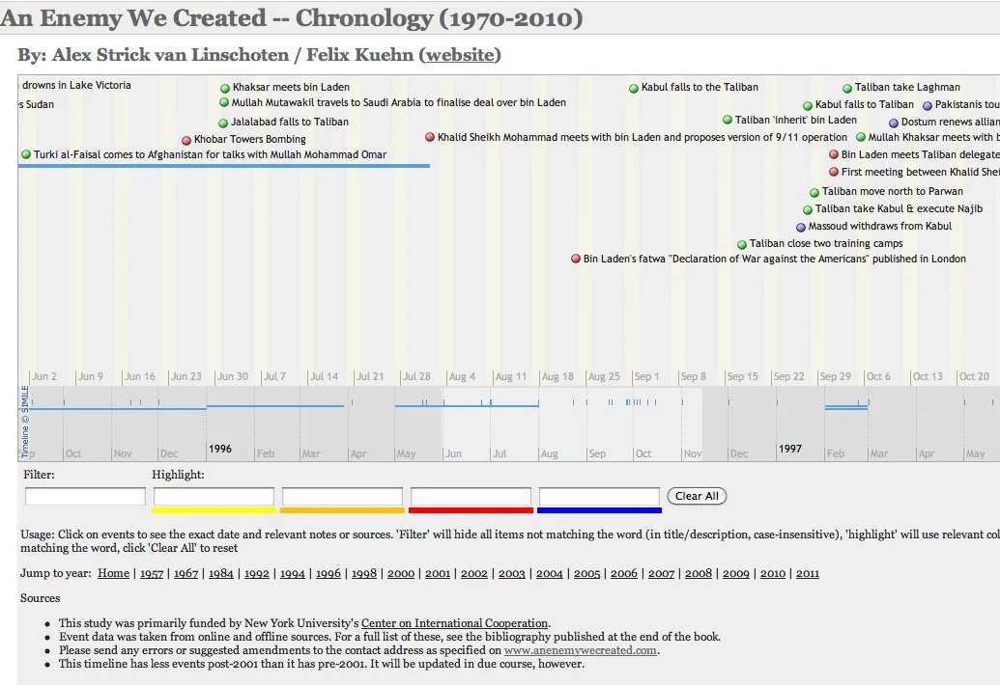

[caption id="" align="alignnone" width="1035"] An Enemy We Created - Timeline[/caption]

Long-standing readers of this blog will know that I have been working (together with my colleague, [Felix Kuehn](http://www.felixkuehn.com/)) to get to grips with the nature of the relationship between the Taliban and al-Qaeda (and the various affiliates of both). To that end, we've written a book ('[An Enemy We Created](http://www.anenemywecreated.com/)') and a [summary paper](http://www.cic.nyu.edu/afghanistan/docs/gregg_sep_tal_alqaeda.pdf) dealing with the post-2001 aspects for the [Center on International Cooperation](http://www.cic.nyu.edu/afghanistan/index.html) (who funded much of the research).

We reread most of the primary and secondary-source literature on the topic, and while going through compiled long lists of dates, names and places. The key dates from those lists made their way into this timeline. There are fewer entries post-2001 at the moment on the timeline, but I'll get round to updating that soon hopefully. Please leave any feedback on the timeline in the comments below this post, or send me an email.

You can view the timeline at: [www.anenemywecreated.com/timeline/](http://www.anenemywecreated.com/timeline/)

This timeline was created in [Tinderbox](http://www.eastgate.com/Tinderbox/), the software that I used for most of my research and database work. I have to thank [Mark Bernstein](http://www.markbernstein.org/) and particularly [Mark Anderson](http://www.shoantel.com/) for their help with some of the technical issues in coding the site. I'd strongly recommend [Tinderbox](http://www.eastgate.com/Tinderbox/) to researchers, journalists and other 'information workers'. I'd be lost without it.

For those in London, I'll be presenting on how I use Tinderbox in my day-to-day research work at a one-day event on May 28. [Register here](http://londontinderboxworkshop.eventbrite.com/) if you'd like to come along.
