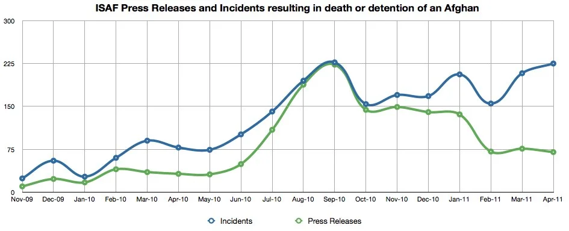

Last week [I charted the numbers](/a-different-place/2011/05/the-petraeus-effect "The Petraeus Effect") of press releases that ISAF have put out relating to "security operations" of one kind or another. I promised to split this data up into numbers of incidents mentioned in those press releases (since some press releases contain multiple incidents). The data from last week showed a decrease in the numbers of press releases (particularly in 2011). When these numbers are split up into individual incidents, however, you can see that there hasn't been a decrease in incident numbers.
Actually, April 2011 had almost as many operations as September 2010 (the highest for the data set). Of course, all of this is just a picture as presented by ISAF, but since they don't release these figures in aggregate form to the public/media it's all we have to go on. Here's the new chart:

A word on the title: the incidents here are collected from ISAF press releases that refer to an event where an Afghan (or a 'foreign fighter') was killed or captured. Sometimes this happened while troops were on patrol, but more often was the result of a targeted raid/operation.

I'm working on something longer that will go into the specifics of this data set in more detail (incident data by type/province/month etc) so this will probably be my last post on the subject until the report is released.
