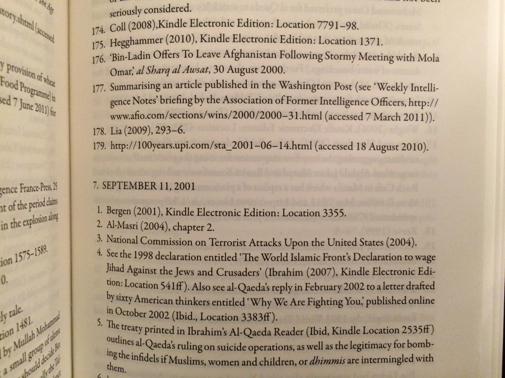
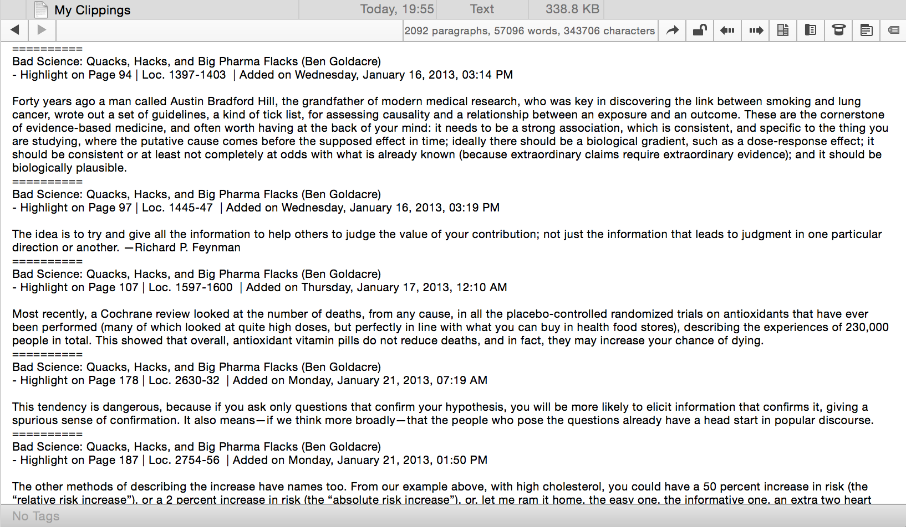
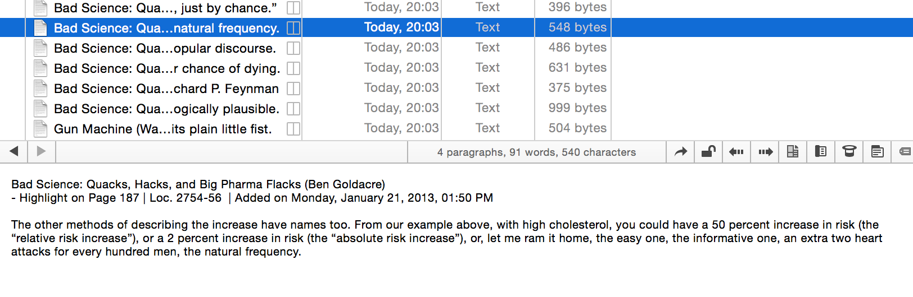
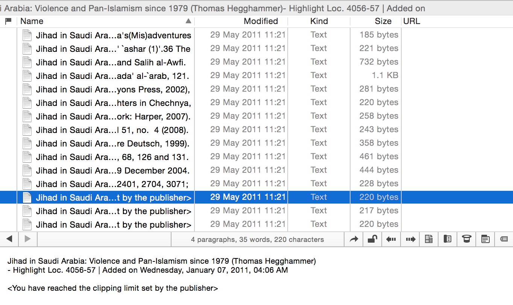
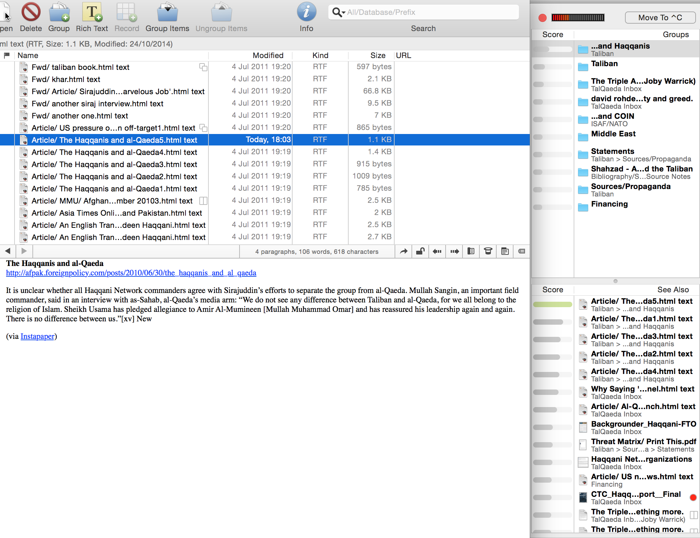
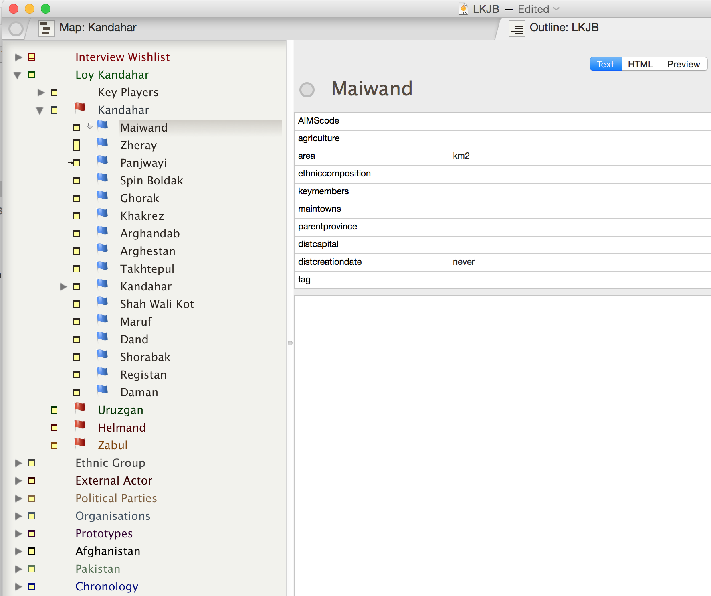
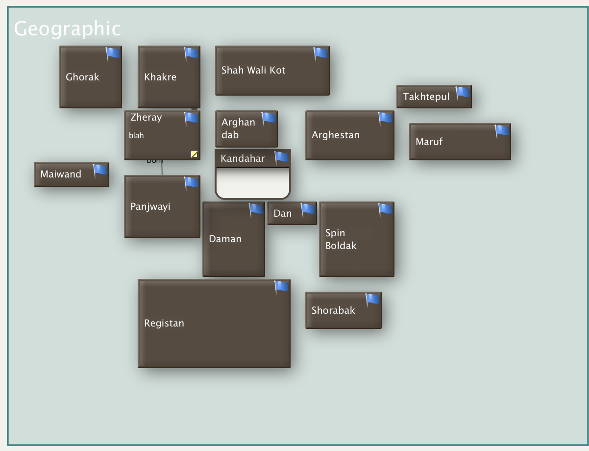
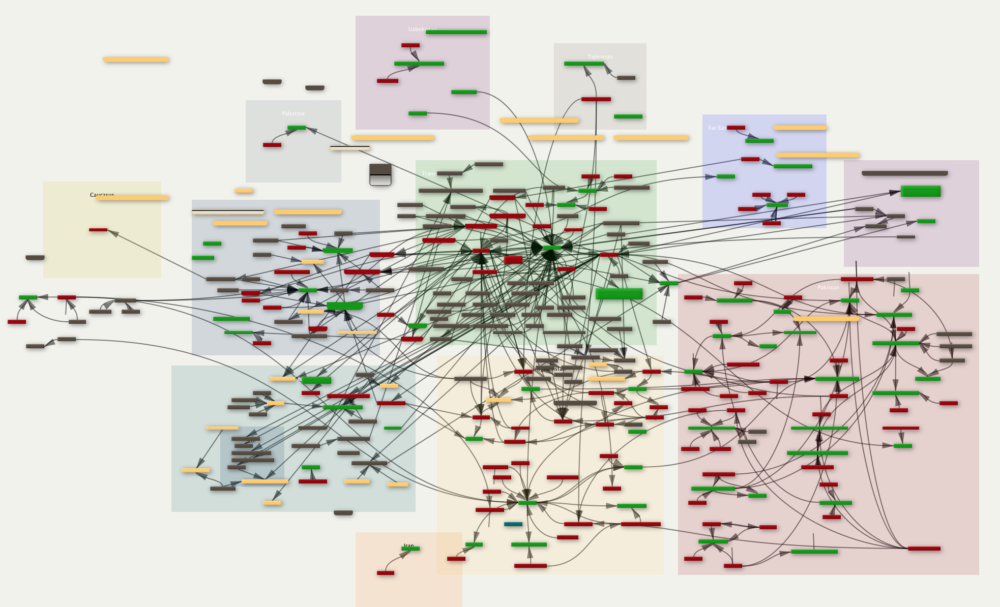

Note-taking is a problem. It's an interesting problem, but still a problem. Many people have switched over from paper books to digital copies. I am certainly one of the early adopters in this trend, having wrangled [Graeme Smith](https://twitter.com/smithkabul) and [his sister](https://twitter.com/tinyalligator) into facilitating a first iteration of Amazon's Kindle to be [delivered to my house](http://www.frontlineclub.com/kindle_in_kandahar/) in Kandahar.

My colleague [Felix Kuehn](http://felixkuehn.com) and I used Kindle versions of books heavily in our research for [*An Enemy We Created*](www.anenemywecreated.com). Using those references in footnotes was difficult at the time: the format was so new that established footnoting styles (APA/Chicago etc) hadn’t developed the standards for referencing kindle documents. All this was made harder by the fact that Kindle copies of books added a whole new problem into the mix by abandoning page numbers for ‘Kindle location numbers’. This changed a few years later, and current users probably won’t have this problem, but if you go look at the footnotes for [*An Enemy We Created*](http://www.anenemywecreated.com/), you’ll still find that many, if not most, of the references are to Kindle locations and not page numbers. In fact, I think our book was probably the first serious history work to rely so extensively on digital Kindle references in the footnotes; I remember having discussions with our publisher about it.

All this isn’t to say paper copies don't have their uses. But some books just aren't available in digital format. I'll get into the workaround for that later. The best way to make this less of a problem is to gently nudge publishers to issue their books on a kindle format.[1](#fn1) But I am already getting off track.

All this seemed to come to a head this past week, where [a podcast I hosted](http://www.sourcesandmethods.com/podcast/2014/10/17/sources-and-methods-5-mark-bernstein) together with [Matt Trevithick](https://twitter.com/MattTrevithick) took up the topic of notes and note-taking. [Mark Bernstein](www.markbernstein.org), our guest on the show, wrote a really excellent book on the topic some years ago entitled [*The Tinderbox Way*](http://www.eastgate.com/Tinderbox/TinderboxWay/index.html). I’d strongly recommend you read if you’re involved in knowledge work in any way. Here’s a short excerpt defining the importance and use patterns for notes:

> “Notes play three distinct roles in our daily work:
>
> •Notes are records, reminding us of ideas and observations that we might otherwise forget.
>
> •Shared notes are a medium, an efficient communication channel between colleagues and collaborators.
>
> •Notes are a process for clarifying thinking and for refining inchoate ideas.
>
> Understanding often emerges gradually from the accumulation of factual detail and from our growing comprehension of the relationships among isolated details. Only after examining the data, laying it out and handling it, can we feel comfortable in reaching complex decisions.”[2](#fn2)

Later in the week, Maria Popova (of [Brainpickings](http://www.brainpickings.org/) fame) was [on Tim Ferriss’ podcast](http://www.fourhourworkweek.com/2014/10/21/brain-pickings/) to talk about her website, her reading and her workflow. Both Tim and Maria expressed frustration over the lack of tools for people wanting to download and interact with their Kindle clippings:

> “I highlight in the kindle app on the iPad, and then Amazon has this function that you can basically see your kindle notes on the desktop on your computer. I go to those, I copy them from that page, and I paste them into an Evernote file to have all my notes on a specific book in one place. But sometimes I will also take a screengrab of a kindle page with my highlighted passage, and then email that screengrab into my Evernote email, because Evernote has, as you know, Optical Character Recognition, so when I search within it, it’s also going to search the text in that image. I don’t have to wait till I’ve finished the book.
>
> The formatting is kind of shitty in the kindle notes on the desktop(…) if you copy them, they paste into Evernote with this really weird formatting. (…) It’s awful. If you want to fix it you have to do it manually within Evernote. (…) There is no viable solution that I know.”[3](#fn3)

She then goes on to some more detailed points of how this doesn’t work, and Tim commiserates, suggesting that maybe they should hire some people to fix this problem. But the good thing is that there *are* solutions. The problems Maria and Tim bemoan are things that every other Kindle user has had to deal with since day one, so thankfully there are a number of workarounds that simplify the process of reading, annotating and sifting within one’s notes of a book or document.[4](#fn4)

So notes are important, we get that. But how do we use them to their utmost? How do we even gather them together and store them? How do we use them for our writing, for our thinking? These are all important questions which I don’t feel have been properly answered, and where those answers have been given, they’re buried or hidden somewhere out on the internet.

I want this post to get into the weeds about how to get your materials off a Kindle device, how to store it usefully on a Mac (my apologies, PC/Linux users), and how to repurpose those notes to be creative, to write, and to think.

This post has three parts:

1. Storage
2. Clipping & Splitting
3. Discovery & Meaning

It will by necessity be an overview of some useful tools and options for researchers, but if you leave comments I can probably expand on individual points/sections in follow-up posts if needed.

## 1. Storage

This is a problem that wasn’t explicitly raised in the things that motivated this post, but it’s something I get asked frequently. Maria and Tim both seem to be avid Evernote users, and I know many others also use this, but there are other options. It’s worth starting here because the tools will determine what you can do with your notes.

I’ve offered advice to other Mac users on what software to use for research projects that require a certain deftness in handling large quantities of sometimes disparate materials. The same applies to people who are just trying to keep track of the things they read, trying to draw together connections, and to derive meaning from it all. I’ll get into the meaning-creation in the final section, but for the moment, let me briefly describe our four options for file/note storage as I see it.[5](#fn5)

1. **Finder/[PathFinder](www.cocoatech.com/pathfinder)**. This is the lowest-tech option. Basically, once you split your files up (see section two) you store them in folders and refer to them that way. I don’t find this option very attractive or useful, because it’s like a filing cabinet. Your ability to discover connections and to remember what’s in those folders is pretty limited. I don’t recommend this at all, but from conversations with other researchers and writers, it seems this is the default option.
2. [**Evernote**](www.evernote.com). I include this here because it’s part of a workflow that we’ll cover later on. Evernote is great for all the reasons you can read about [on their site](https://evernote.com/evernote/). It syncs across all your mobile and desktop devices, it OCRs images so you can search for text captured inside photos you upload into your library of notes.
3. **[DevonThink](http://www.devontechnologies.com/products/devonthink/devonthink-pro-office.html)**. This is my default ‘bucket’ for information, documents and notes. You can read up on the many ([MANY](http://www.devontechnologies.com/products/devonthink/devonthink-pro-office.html)) things that DevonThink Pro Office or DTPO ([the version you should get](http://www.devontechnologies.com/products/devonthink/comparison.html), if you’re getting this software) does. Not only does DTPO store your documents, but it allows you to access that information in a number of extremely useful formats. There is [a mobile app](http://www.devontechnologies.com/products/devonthink/devonthink-to-go.html), too, though it could do with a bit more work. The most interesting feature of DTPO is its search and discovery functionality (using some magic sauce algorithms). They don’t make as much of this on their website as they used to, but I’d strongly recommend you check out these two articles ([one](http://www.nytimes.com/2005/01/30/books/review/30JOHNSON.html), and [two](http://www.stevenberlinjohnson.com/movabletype/archives/000230.html)) by Steve Berlin Johnson which explain a little of the wonderful things DevonThink can do for your notes. As with the next recommendation, it’s not cheap. But powerful doesn’t always come cheap. It’s a solid investment if you spend the time getting to know this piece of software.
4. **[Tinderbox](http://www.eastgate.com/Tinderbox/)**. I discussed this at some length on the [Sources & Methods podcast with Mark Bernstein](www.sourcesandmethods.com/podcast/2014/10/17/sources-and-methods-5-mark-bernstein), so I’d recommend you listen to that as your first port of call. Tinderbox is not an [everything-bucket](http://www.markbernstein.org/Feb09/EverythingBuckets.html) in the way that Evernote and DevonThink are, and I use it slightly differently, but it’s a great place to actually do the work of thinking, organising and writing once you have something (i.e. a project of some sort) for which you want to use all your notes. I’ll explain more about this in section three.

I’d recommend getting to know the different bits of software to get a sense of what they can do. DevonThink has [a handy section](http://www.devontechnologies.com/solutions.html) of their website where you can see how people use it in their work lives. Tinderbox has something similar, with [some case studies](www.eastgate.com/Tinderbox/Projects.html) of usage.

For DevonThink, it’s generally good to keep your ‘buckets’/databases of files separated by topic. I have a mix of these kinds of databases (50 in total): some are country-specific, some are project-specific (i.e. to contain the research that goes into a book or a long report), and some are topic-specific (i.e. I have one for clippings and notes relating to Mathematics, one for things relating to Cardiology etc). I’d also recommend you give Steve Berlin Johnson’s book [Where Good Ideas Come From](http://www.amazon.com/gp/product/1594485380/ref=as_li_tl?ie=UTF8&camp=1789&creative=390957&creativeASIN=1594485380&linkCode=as2&tag=soumet-20&linkId=4SNJUYK5QW2N6VPD) a read, particularly chapter 4.

Given the learning curve with some aspects of the workflow that follows, you might want to consider introducing these pieces of software one-by-one, or as needed. That way you’re using only what you understand and can implement things without being too overwhelmed by the novelty of the systems. It took me years (almost a decade) to implement and iterate the systems described below, and I’m still not finished modifying as the tools change.

## 2. Clipping & Splitting

This section is all about getting materials off mobile devices and onto your computer where you can put them into some sort of overarching database.

### Accessing Your Amazon Kindle Clippings

First let’s sort out how best to get notes from a kindle onto your Mac. Don’t use Amazon’s [website](kindle.amazon.com). It’s going to create all sorts of problems for you in terms of formatting.

First thing’s first: sync your kindle to the cloud. Just turn on the wifi/3G and select the “Sync” option. This will ensure all your highlights are backed up to the cloud.

Then plug your Kindle into your computer via USB. Then go into the “Documents” folder, and search for a file called “My Clippings.txt”. If you’ve been using your kindle for a while, it’s probably going to be quite large. Nevertheless, copy that file to your desktop. Feel free to eject your Kindle from your laptop now. We won’t be needing it any more.

[caption id="" align="alignnone" width="1634"] An example of what you might see when you open your "My Clippings.txt" file [/caption]

If you open the txt file that is now saved to your desktop, you’ll find all your clippings and annotations preserved in a useful plaintext format. This may solve your problems straightaway, in which case, congratulations: you now have all your annotations in a useful format that you can use however you wish.

If you want to take it to the next level, though, you’ll want to split this file up. At the moment, you have a very large plaintext file which contains all your notes. You’re likely to have notes from a wide variety of topics and books in here, so it doesn’t make sense for you to keep them all in a single location. The ideal solution is for you to have a single file for every clipping, a single file for every annotation.[6](#fn6)

This is where [Split-ter.scpt](https://dl.dropboxusercontent.com/u/530416/Split-ter.scpt.zip) comes in. I’m afraid I don’t know who to credit for this wonderful piece of code. I downloaded it somewhere on the internet some years back and can’t seem to find a link to the author either in the code or elsewhere online. (Whoever you are, thank you!)

This script works with another piece of software mentioned above — [DevonThink Pro Office](http://www.devontechnologies.com/products/devonthink/devonthink-pro-office.html). For now, I’ll ask you to ignore that bit, and focus on what’s happening to the file. I use the script to convert our “My Clippings.txt” file into multiple files. It goes in, finds a delimiter (any piece of text or syntax that repeats itself in the original file) and creates a new note/file every time it comes across this delimiter. In this way, you’ll quite quickly from the file shown above to something like this:

Now you have a note for every annotation and/or clipping. This is then something you can dump into Evernote, or keep in DevonThink. Again, more about the difference between these programmes in the next section. (Note, that you can use Tinderbox to split up the “MyClippings.txt” file as well using the “Explode” tool).

UPDATE (a little later on Friday night): Seb Pearce has [just let me know](https://twitter.com/_sebu_/status/525732003044683776) that there are other options available for dealing with the 'My Clippings.txt' file. [Check them out on his site](http://sebpearce.com/blog/firewood/).

The second problem raised on the [Tim Ferriss podcast](http://fourhourworkweek.com/2014/10/21/brain-pickings/) was Amazon’s limitations for clippings. This differs from publisher to publisher, it seems, so there’s no way of predicting it. An unfortunate rule of thumb: the more useful the book, the more likely the publisher has locked it down. When you’re making clippings inside the book, Amazon gives you no notification that you’ve reached the book’s limitations. But when you go to check your “My Clippings.txt” file to start using your notes, then you may find the note says:

> "<You have reached the clipping limit set by the publishers>"

All the work you’ve done selecting pieces of text are for nothing, it would seem. The publisher has prevented you from using your book.

One solution is to [remove the DRM from the book](http://www.wired.com/2011/01/how-to-strip-drm-from-kindle-e-books-and-others/) before you put it on your kindle. This is legal so long as you’re not sharing the book with other people (as this process would theoretically allow you to do).[7](#fn7) Follow this link to find out how to de-DRM your Kindle and iBooks documents. You can also visit <libgen.org> to download an already-DRMed copy of the book you’ve purchased. These will often be in .epub format so you’ll have to convert these over to a .mobi format if you want to use them on your kindle device. (To convert from .epub to .mobi, use the [free Calibre cross-platform software](calibre-ebook.com).)

If you read a de-DRMed copy of a kindle book on your kindle device, there will be no limitations as to how much you can annotate. The publishers limitations will all be gone. So that’s one option.

For those who aren’t comfortable removing the DRM on your books, you can get all your annotations out, but it comes with a little bit of hassle.

Here’s an example of what I mean (screenshot from my DevonThink library). I was reading in Hegghammer’s excellent *[Jihad in Saudi Arabia](http://www.amazon.com/gp/product/0521732360/ref=as_li_tl?ie=UTF8&camp=1789&creative=390957&creativeASIN=0521732360&linkCode=as2&tag=soumet-20&linkId=HMU6UB34V7SLYVVX)* and making highlights (at 4:06am, apparently) but at some point I hit the limit imposed by the publisher.

The workaround to bypass this limit from the publisher is to first export all your notes out of your “MyClippings.txt” file. So all your clippings are saved, even though some of them may not work. Let’s say, for the sake of argument, that the final three notes aren’t working because of the publisher’s limitatations. That’s the case in the screenshot above. What you do is (again, once you’ve backed up the clippings txt file) delete three of the earlier clippings that you already have. Then you sync your Kindle to the server and it will think that you have clipped three less quotes, so these will then become available (both in the myclippings.txt file and on [the website](kindle.amazon.com). Like I said, it’s a bit fiddly. I would much rather remove the DRM completely and not have this hassle at all, though when you do that Amazon will not sync your clippings to the cloud and to their <kindle.amazon.com> database. You’ll have to export them using the tools I mentioned above.

### Keeping Up With The Joneses, or How to Use Instapaper to Clip Web Articles

This may be something completely idiosyncratic to my own workflow, but I don’t enjoy reading articles in a web browser. I’d also prefer not to be hijacked into reading all these articles. For instance, when I’m in [Tweetbot](http://tapbots.com/software/tweetbot/mac/)/[Twitter](https://twitter.com) or [Facebook](http://facebook.com) and I see a link that I like, I will almost never read that article then and there. Rather, I’ll send it to my Instapaper queue.

First, a quick word about [Instapaper](http://instapaper.com) vs [Pocket](http://getpocket.com). I use Instapaper. I started off with them, switched over to Pocket for about two years, and now I’m back with Instapaper. They’re both more or less the same. Instapaper happens to be what I’ve chosen for myself because of their handy Kindle service. (If you have articles in your queue, you can have Instapaper send the most recent articles to your Kindle at a particular time (i.e. first thing in the morning) which you can then clip and archive to your heart’s content.) Both Pocket and Instapaper work with what follows, so just pick one and stick to it. I’d recommend Instapaper because they allow for the sharing of the full texts of articles and because of the Kindle digest feature.

I find I have so much to stay on top of and keep tracking online, I can’t just click around and read things as and when I see them online. I schedule time apart for reading of my Instapaper queue (and for reading books on my Kindle) and only read during those times. (I do the same with email, only checking and responding to email between the hours of 12-1pm and 5-6pm each day. The rest of the day email is off and disabled. I even deleted my email account on my iPhone as inspired by [this medium.com post](https://medium.com/life-hacks/my-year-with-a-distraction-free-iphone-and-how-to-start-your-own-experiment-6ff74a0e7a50).)

My workflow with web articles is to follow as much as possible via RSS. I prune the sites I’m following every three months, but in general the number is stable around 650. I use [Newsblur](https://www.newsblur.com/) as my RSS reader, and every time I find an article I’d like to read (later), I use the handy ‘send to instapaper’ bookmarklet. This sends the article to my Instapaper queue.

The same goes for twitter. [I follow enough people](https://twitter.com/strickvl/following) on Twitter for it to be impossible for me to read every post that passes through my stream. I will dip once or twice a day, however, to see what people are saying. I use two services to monitor my Twitter and Facebook streams to pick out the most-shared articles to ensure that I don’t miss the big sharks of the day. They’re both free, and I’d strongly recommend you signing up and getting their daily summaries of what people were talking about on Twitter that day. [News.me](http://news.me/) has been around for a while and I trust their article selection. [Nuzzel](http://nuzzel.com/) is newer, but it seems to have a few more options. I guess you could probably do with picking only one of the two.

After reading articles on my Kindle (or sometimes on a mobile device like my iPad or iPhone), you can clip the article if you want to save it (just like making a clipping inside a book, only the entire article is saved).

[caption id="" align="alignnone" width="2448"] This is what you see in an article when you click to "Clip This Article" on a kindle... [/caption]

Then your clippings will be captured in the ‘MyClippings.txt’ file as explained above and you can export them directly to DevonThink or Evernote or Tinderbox. (The main downside to doing things this way is that when the kindle clips it, all formatting is lost (including paragraph breaks)).

Alternatively, you can ‘Favourite’ the article. I use this setting because it then sends the article and URL to my [@stricklinks](https://twitter.com/stricklinks) twitter account, something I created to share the best things I was reading. It also saves the full text of the article to Pinboard (a service I’ve already written about on my blog [here](http://www.alexstrick.com/a-different-place/2013/01/useful-tools-pinboard)) and to Evernote. (I use [If This Then That](https://ifttt.com/) to facilitate this.)

Once I’m done reading, I can go into Evernote and all my articles are waiting for me to be sorted through. Because I use DevonThink as my everything-bucket, and because all the sorting and discoverability features are there, I have a separate stage of exporting my notes out of Evernote into DevonThink. I’ve already probably taken you a little too far down the rabbit-hole of my workflow, but this is an important stage because otherwise you can’t do anything with your notes.

Luckily, someone has written [a script](http://veritrope.com/code/evernote-to-devonthink-exporter/) which makes this possible. Many many thanks to [the good people at Veritrope](http://veritrope.com/about/) for updating the script every time updates to the software get released. It’s fairly self-explanatory. You select the notes that you want to export, choose which DevonThink folder you want to export to and then it goes to work. It can occasionally be buggy and stop half-way through, but usually a little trial-and-error will let you pinpoint which Evernote note is causing the problem and you can transport that one over manually.

I usually do an export session to bring everything from Evernote into my DevonThink inbox once a week. This way the number of clippings doesn’t get too out of control, and I’m not constantly playing around with this during the week. You might find this all is overkill, but it has become an essential part of my workflow to store the various things I’m reading on a daily basis.

### Pillaging Your Hard Copies, AKA Living the Paperless Dream

You may have hardcover copies of books that you want to use as part of this system. One way to use them is to scan the books into your DevonThink library. DevonThink Pro Office comes with an OCR package (via [ABBYY FineReader](http://finereader.abbyy.com/)) so whatever you scan can then become searchable and useful.

In the past, particularly with books I’ve purchased in Afghanistan and Pakistan that are unlikely (read: never) to be made available as electronic versions, I take a [Stanley knife](https://en.wikipedia.org/wiki/Utility_knife) to the bindings, feed the pages into my [ScanSnap scanner](http://www.fujitsu.com/us/services/computing/peripherals/scanners/scansnap/) which scans both sides and compiles all the scans into a single PDF document that is searchable on my laptop. The whole process is destructive of the book, but it gives the text inside a new life. Given how fast the new ScanSnap models work (around 25 pages per minute, both sides), this is an attractive way to get digital access to materials that are only available in paper form.

You can highlight text within the resulting PDFs and then later export your clippings from those PDFs as notes into DevonThink. There’s [another useful script](http://www.organognosi.com/export-skim-notes-according-to-their-highlight-colors/) to help with that. It only works with the free [Skim PDF reader](http://skim-app.sourceforge.net/), but that’s my default PDF reader so it works out well.

For more on paperless workflows, check out [David Sparks’](https://twitter.com/macsparky) [Field Guide on the topic](http://macsparky.com/paperless/).

## 3. Discovery & Meaning

If you made it this far, congratulations. This is the section where all the fiddling with export starts to take on some meaning. After all, we’re not reading and exporting these notes purely because we are hoarders or to fetishise the art of collection (though in some cases, that may be what’s going on). No, we are taking notes because we are trying to understand difficult topics, because we are trying to solve important problems.

### Discovering Links and Connections

The Steve Berlin Johnson articles referenced earlier are an essential first stop, particularly in demonstrating how [DevonThink](www.devontechnologies.com/products/devonthink/overview.html) can add some serendipity into how you use your individual notes. To give you an example of how this works, here’s a screenshot from my ‘TalQaeda’ database that I put together while working on [An Enemy We Created](www.anenemywecreated.com):

In the upper part you can see a bunch of notes relating to the Haqqani family. The lower left part is the contents of a note (Note: exported from [Instapaper](http://instapaper.com)). The bottom right list of documents (under “See Also”) is a list of notes that may be related to this particular quote. This is the magic algorithmic sauce I mentioned earlier that makes [DevonThink](http://www.devontechnologies.com/products/devonthink/overview.html) so powerful.

If I click through to some of those suggested notes, I’m taken to similar quotes on the same topics, two PDFs of reports (of dubious analytic value, but that’s a separate issue), three clippings from Kindle books where people are making reference to the relationship between the Haqqanis and al-Qaeda (the subject of the original note). Note that I didn’t have to pre-tag documents for this ‘see also’ functionality to work its magic. It analyses inside the text and makes its suggestions based on the similarities it identifies. (Needless to say, it’s not simply a matter of matching individual words. Some of the suggested notes don’t mention al-Qaeda or the Haqqanis by name, but they are implied; [DevonThink](http://www.devontechnologies.com/products/devonthink/overview.html) catches this all).

Once you start to build up a decent database of notes (my Afghanistan database has just under 65 million words of notes, including 12,800+ PDFs) this ‘See Also’ functionality really allows for some unexpected links to be made, especially when you’re at the stage of writing up a project/book. One note will lead to another note, which will lead to another note. If you follow these trails of notes (like breadcrumbs) you can develop a pretty idiosyncratic picture.

*I do not know of a manual method which allows for this kind of process.*

[DevonThink](http://www.devontechnologies.com/products/devonthink/overview.html) has an extremely robust search function which allows you to find things along similar principles (including a very useful ‘fuzzy spelling’ option, perfect when checking my database for notes on someone whose first name could be spelt Mohammad, Muhammad, Mohammed or any of the other variations).

### Figuring Out What It All Means

Once you have an idea of the outlines of the topic, once you’ve been taking notes for a while, your database in [DevonThink](http://www.devontechnologies.com/products/devonthink/overview.html) is probably starting to fill with useful information.

If you’re writing a book, though, you’ll want to start writing alongside this gathering process. (Check out Michael Lopp’s [overview of the process](http://randsinrepose.com/archives/how-to-write-a-book/) of writing a large research book, which, to my mind, is fairly accurate.)

I don’t find [DevonThink](www.devontechnologies.com/products/devonthink/overview.html) a particularly pleasant place to write, so I do that elsewhere. Before I write things out in long form, I usually do some outlining, particularly if it’s something where the dense collection of factual detail is important to the development of the argument (as was the case with [An Enemy We Created](anenemywecreated.com)). For this, I find Tinderbox indispensable for working up an overview of what I know, for figuring out how I’m going to structure it, and for helping me put together my first draft.

Tinderbox can display notes in a number of different ways. You can view your documents as outlines, as maps, or even as timelines:

In this image you can see the information arranged as an outline, but here (below) you see the same information organised as a map (mirroring the actual layout of the map of those districts in a particular part of Kandahar):

Just to show you that it can handle complexity, here’s a map created by [Felix](http://felixkuehn.com) to help him figure out how people involved in militant Islamism were/are connected across different geographical sectors:

[caption id="" align="alignnone" width="1966"] It's complicated... [/caption]

I’ll often use Tinderbox maps to store outlines for how I’ll write a particular section or chapter, making notes inside the document, dragging quotes in from DevonThink to supplement the argument that’s being constructed.

Getting to the point where you can actually start writing on the basis of your notes is the whole point of all of this. Technology is useful, but mainly when directed at a specific problem or goal. All the tips, tricks and software described in this post has helped me write books, reports and (coming soon!) even [my doctoral thesis/PhD](https://www.kcl.ac.uk/sspp/departments/warstudies/people/phd/strickvanlinschoten.aspx). I have encountered only a few (barely a handful) researchers who use their computers for this collation, sifting and discovery process. There’s no way to keep it all in your head. Here’s hoping more people start adopting these tools…

**Footnotes:**

1. For many years, Amazon offered users the ability to let publishers know that you wanted to see title X or Y on a Kindle format, but they failed to make this piece of interaction useful by keeping track of what you'd requested of publishers (so as then to be able to let you know when it was finally released in Kindle format). [↩](#ffn1)
2. Excerpt From: Mark Bernstein. “The Tinderbox Way.” iBooks. [↩](#ffn2)
3. Selective transcript from around the 50-minute mark in the podcast audio. Needless to say, the rest of this blogpost constitutions a ‘viable solution’. [↩](#ffn3)
4. Most of these are derived from other people, I should say. I try to give credit where I can, but sometimes I can’t remember where I first read something or who first recommended a particular tool or trick. [↩](#ffn4)
5. Yes yes, I know, I’m going to leave out some mentions for useful software here. This is an overview, and I’m just trying to describe some options for what might work in certain situations. [↩](#ffn5)
6. A clipping is when you have selected and copied a passage from the book for safe-keeping, and an annotation is when you yourself write a note connected to a particular passage. [↩](#ffn6)
7. Needless to say, don’t take legal advice from me. [↩](#ffn7)
