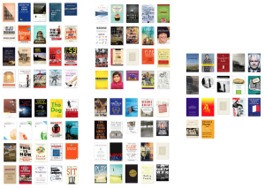
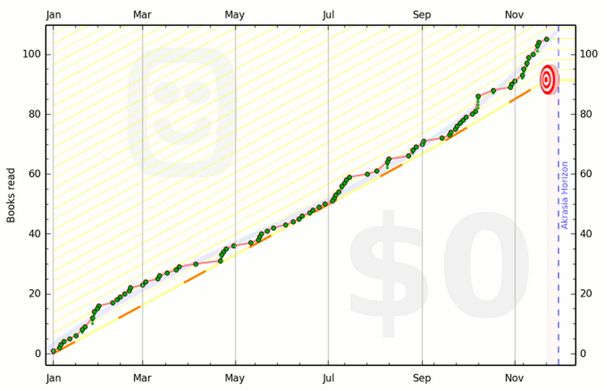
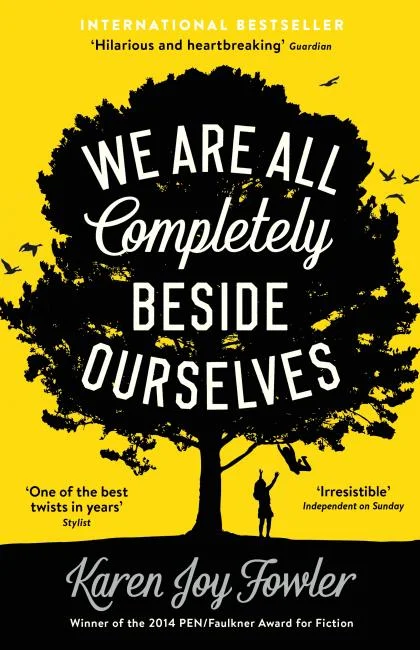
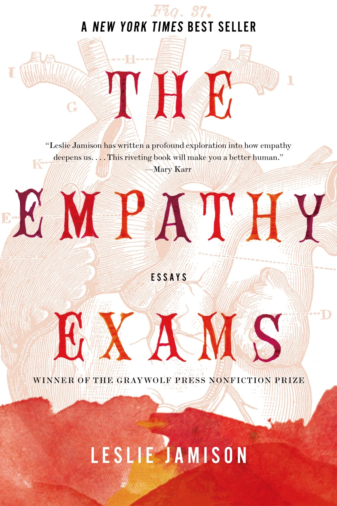
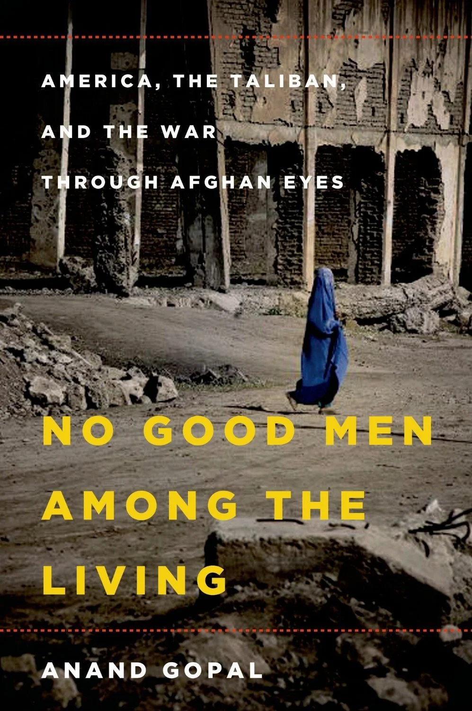
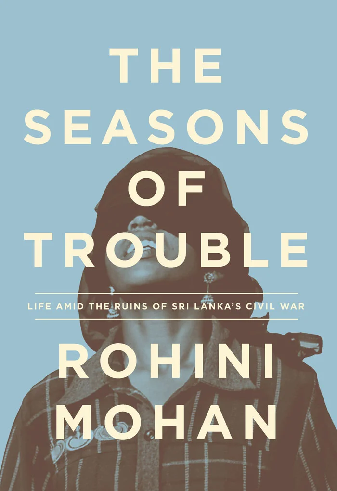
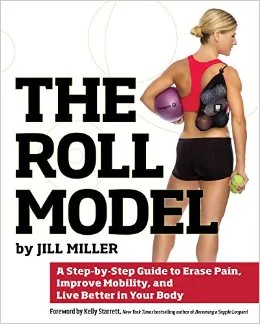
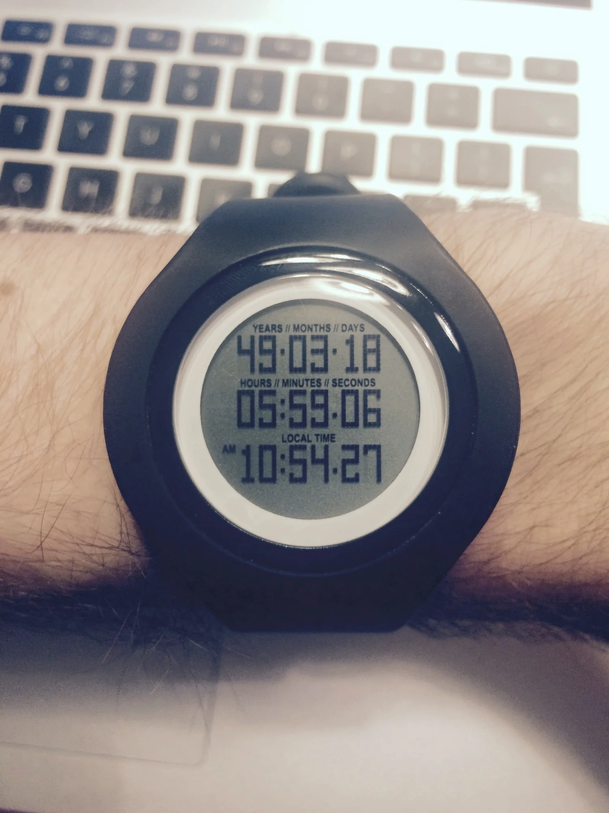

I have read 117 books so far this year. I think there are another five still likely to happen before the end of the month. [Goodreads](https://www.goodreads.com/) tells me that amounts to 28,616 pages or an average of roughly 80 pages per day. Seems like a lot, but it didn't feel that way. I set my goal for the year at 100 and it was consciously a very high number, almost unrealistically so. But in the end I never felt rushed, nor did it feel like a chore. As a result, next year I'm going to notch it up to 150. I enjoy reading books more than I fear the very occasional sense of pressure when I get behind on my reading. [Beeminder](https://www.beeminder.com/) has helped keep me honest and on track when it comes to my reading goals.

[caption id="" align="alignnone" width="1354"] My Beeminder chart c. late November. I disabled it after I hit the 100 mark... [/caption]

The breakdown of fiction:non-fiction in the books I read this year was pretty low (1:9 approx) but the gender balance was about 4:6 female-male, which isn't bad considering I was only side-glancing at that proportion as the year went on. For 2015, I will be consciously making sure to get more fiction in my reading diet, hopefully by as much as one-third or two-fifths of the total.

The only fiction book this year that really blew me away was [Karen Joy Fowler's *We Are All Completely Beside Ourselves*](http://www.amazon.com/Are-All-Completely-Beside-Ourselves-ebook/dp/B00B4FU6KE/). Imagine a cross between J.M. Coetzee, Barbara Kingsolver and A.M. Homes. That's sort of what this book is, but to try to pre-introduce you to the plot or premise would do you a disservice. I'd strongly advise you not to read any reviews, comments or synopses of the book -- even the one written by the publisher. Just go read it. It's not only extremely moving, but it will also make you think.

I read [Leslie Jamison's *The Empathy Exams*](http://www.amazon.com/Empathy-Exams-Essays-Leslie-Jamison-ebook/dp/B00FCQW7NK/) much earlier this year, and it made me think about essay writing afresh. The book is a collection of pieces examining the idea of empathy from different vantage points. The showstopper first essay (from which the collection takes its name) was originally published in *The Believer*. You can [read it here](http://www.believermag.com/issues/201402/?read=article_jamison). I suspect after reading that you'll go and get the book. Her essays combine the confessional with the abstract and overthought. It's a very attractive mix, and, with the exception of one or two pieces, the book is compulsively readable.

The second non-fiction book that, really, everyone should go read right now is by my friend and colleague, Anand Gopal. *[No Good Men Among The Living](http://www.amazon.com/No-Good-Men-Among-Living-ebook/dp/B00GVRVAXM/)* covers the conflict in Afghanistan through the voices and perspectives of three Afghans -- one man who ends up fighting for the Taliban, a urban-educated woman who ends up in Uruzgan province, and a US-backed military strongman. Just for starters, it's refreshing to read something in which the author doesn't insert him or herself into the narrative like a sore thumb. It's sad that has to be said, but this is the exception not the rule these days. Anand dismantles the evidence surrounding the resurgence of the Taliban post-2001 and what he finds -- I'll let you follow him down that path -- is extremely disturbing if not entirely unexpected. This book is certainly one of the best things written about post-2001 Afghanistan and given the amount of energy and money that has been spent, it's worth taking the time to consider what worked and what didn't.

For some books, as you near the end you speed up as the plot comes to its inevitable conclusion, eager to find out how the story ends. For others, you slow down, not only because the themes of the book have started to intertwine around and in between one another, but also because you realise that soon this book will come to an end and this companion of the past few hours or days will start becoming but a memory. [Rohini Mohan's *The Seasons of Trouble:  Life Amid the Ruins of Sri Lanka's Civil War*](http://www.amazon.com/Seasons-Trouble-Ruins-Lankas-Civil-ebook/dp/B00OXTDRI6/) is a superb book. I can hardly imagine how the author managed to put it together. It reads like a novel yet feels so immediate as well. Mohan takes a similar approach to Anand, removing herself completely from the story and choosing instead to focus on the stories of three individuals who were caught up in Sri Lanka's unfolding civil conflict. I had read Ondaatje's *Anil's Ghost* in the past, but wasn't left with a very strong sense of Sri Lanka or its history. With this book, I feel I've learnt a lot. Mohan writes beautifully and the book has a strong narrative drive, such that I was up into the early hours of the morning finishing it. Just take my word for it. Buy this book. Read it. Thank me later. You'll be better off having read it.

Not everything in life is civil war and strife, though. This year I've been reconnecting with my body in various ways: by reading, through gymnastics classes and by working on my free-standing handstand. In this vein, I really connected with two books. [Katy Bowman's *Move Your DNA*](http://www.moveyourdna.com/) approaches movement from a bio-mechanical perspective (hinges, joints, and how the body works together as a system). Once you've read it, you can't think about your body and/or how you move it the same way again. The book introduces the idea of "diseases of captivity", which is to say, diseases brought about because of biomechanically skewed or minimised movement patterns. It's a really interesting concept, and as you read you'll find yourself sufficiently freaked out ever few pages to get up, check your posture, check your feet alignment and/or go for a walk. Unfortunately, Bowman doesn't always write in the clearest manner. Part of the premise of the book is that modern people have lost touch with their bodies (how to feel, how to describe, how to move) so I was hoping she would have found a language that would allow us alienated masses to better reconnect. That said, this is a great starting place. I could have done with a book with a thousand videos for each of the exercises she describes (and 3D interactive diagrams for the anatomy lessons) but this is a minor quibble. I will have to learn all that in due course. Bowman also offers courses, which I imagine are excellent in that there is a good deal of hands-on and individual experiential aspects to this book that I didn't quite get just from a read-through. I'll be working on the exercises over the coming months (years?). Certainly one of the most interesting/challenging books I read this year.

[Jill Miller's *The Roll Model: A Step-by-Step Guide to Erase Pain, Improve Mobility, and Live Better in Your Body*](http://www.therollmodel.com/) addresses similar things as the Bowman book but from a highly practical standpoint. There is a lot of theory and anatomy explained, but the core of the text are hundreds of pages of beautifully illustrated exercises. Miller recommends rolling on somewhat-soft balls to release the fascia (basically, the connective tissue in the skin and muscles) throughout the body. If you haven't done something like this before, the first time is really instructive. As someone who spent a good part of the past decade sitting behind a computer or book, writing or researching, I can testify to the toll this has taken on my body. This book is a really excellent first step in moving away from that tension, dysfunction and inflexibility.

My movement journey wouldn't have been possible without an initial boost from the kind people of [Gold Medal Bodies](http://gmb.io/). They're all genuinely nice people and they have provided useful guidance and support in this project of reconnecting with my body that I mentioned earlier. I'd particularly like to thank [Verity Bradford](http://movelikeachild.blogspot.co.uk/) for the help she's been giving me over the past couple of months while I've been working on my free-standing handstand.

Finally, a few words about death and time. The past year has been full of confrontations with the passing of time and the inevitability of death. These confrontations have taken various shapes and forms and have been closer to home as well as further afield. This is always a useful reminder, I feel. I reread [Seneca's essay *On the Shortness of Life*](http://forumromanum.org/literature/seneca_younger/brev_e.html) this year and that helped drive the message home. But it's easy to forget. To help with that, I'm really glad to have been using a [MyTikker watch](http://mytikker.com/) for the second half of the year. It's a little bit like [that chart of a human life in weeks](http://waitbutwhy.com/2014/05/life-weeks.html) that did the rounds earlier this year. On the watch, one row of digits shows the current time, and the other two show a countdown (based on statistical estimates calculated using a questionnaire) of the time you have left in your life. Of course, things can always happen out of the blue. You can't do much to prevent that. But to push back against the passing of time, death works to jog the mind. So now, every time I look down to check the time, I'm reminded that time is passing, that our days are short.

*[Read previous year-end posts here: [2013](http://www.alexstrick.com/a-different-place/2013/12/the-best-books-i-read-in-2013), [2012](http://www.alexstrick.com/a-different-place/2012/12/some-things-i-read), and [2010](http://www.alexstrick.com/a-different-place/2010/12/the-best-books-of-2010).]*
