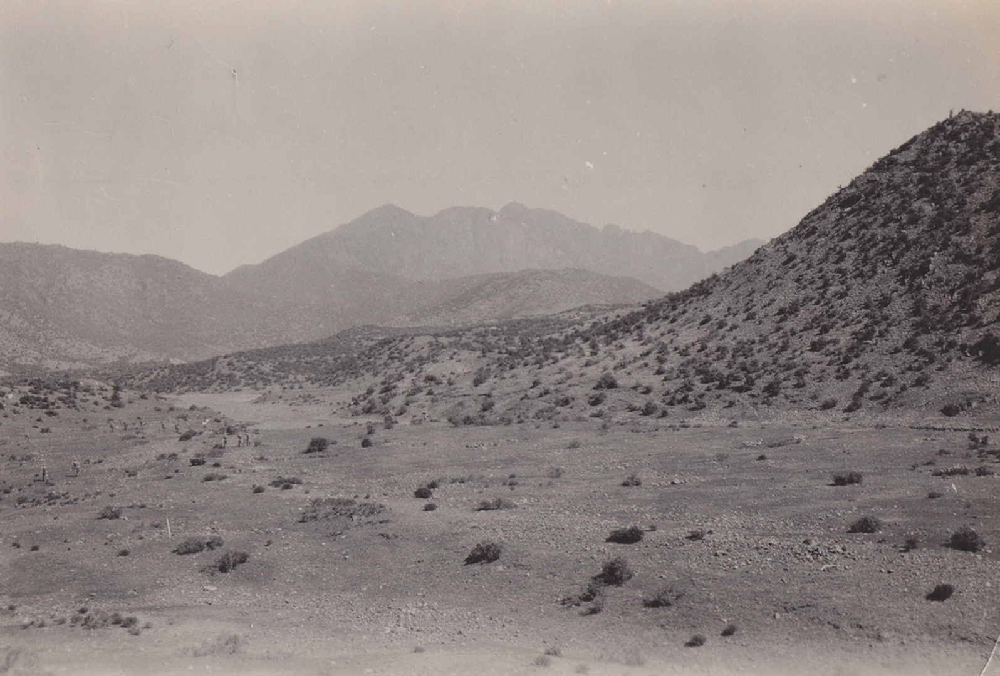

[caption id="" align="alignnone" width="1596"] Technically, this is South Waziristan... Photo credit: Drregor (via Flickr ) [/caption]

I've been doing a bit of reading about North Waziristan in the English-language sources that are available outside Pakistan. It took a bit of time to put together a decent collection that gave real information. By 'real information', I mean things that speak of names, dates, places and events. I wasn't really interested in analysis, though that forms part of what follows. I was interested in the basic factual building blocks that must precede any analysis or understanding of a place. (That, and actually going there yourself). Most of these sources have are filled with stories and little details, all of which need triangulating with one another and with interviews on the ground.

I can't vouch for the veracity of any of it -- my experience in Afghanistan has given me an innate distrust for anything I read in a report, particularly if it was assembled outside the country -- yet this is what we have. There are, of course, thousands if not hundreds of thousands of news articles in the databases of Pakistan's media outlets, but I didn't trawl those yet. Needless to say, this is a work in progress and I will continue to update as and when I read more. It seems the area is also missing a well-sourced chronology akin to something like what I [did for Kandahar](http://www.alexstrick.com/a-different-place/2010/06/kandahar-timeline-1979-2010) or [for the Taliban/Al-Qaeda relationship](http://www.alexstrick.com/a-different-place/2011/05/talqaeda-the-timeline). I don't have the time at the moment to do this myself, but perhaps someone will be inspired to work on it. If you have any suggestions for additions to this list, please [let me know](/contact-alex-1).

## **Books (Core)**

- Hassan Abbas (2014), *[The Taliban Revival: Violence and Extremism on the Pakistan-Afghanistan Frontier](http://www.amazon.com/Taliban-Revival-Hassan-Abbas-ebook/dp/B00K1FXOMK)*
- Shahzad Bashir and Robert D. Crews (2012), [*Under the Drones: Modern Lives in the Afghanistan-Pakistan Borderlands*](http://www.amazon.com/Under-Drones-Modern-Afghanistan-Pakistan-Borderlands-ebook/dp/B008GUCDWY/)
- Vahid Brown & Don Rassler (2013), *[Fountainhead of Jihad: The Haqqani Nexus, 1973-2012](http://www.amazon.com/Fountainhead-Jihad-Haqqani-Nexus-1973-2012-ebook/dp/B00ET38FNS/)*
- Imtiaz Gul (2010), *[The Most Dangerous Place: Pakistan's Lawless Frontier](http://www.amazon.com/Most-Dangerous-Place-Pakistans-Frontier-ebook/dp/B003NX7NCY/)*
- Sana Haroon (2011), [*Frontier of Faith: Islam in the Indo-Afghan Borderland*](http://www.amazon.com/Frontier-Faith-Sana-Haroon/dp/1849041830)
- Khan Idris (2013), [The Pakistan-Afghan Borderland: Pashtun Tribes Descending into Extremism](http://www.amazon.com/Pakistan-Afghan-Borderland-Pashtun-Descending-Extremism-ebook/dp/B00GZMILC6/)
- Basil Muhammad (1991), *al-Ansar al-Arab fi Afghanistan* (in Arabic)
- Muhammad Amir Rana (2004), [*A-Z of Jehadi Organizations in Pakistan*](http://www.amazon.com/Z-JEHADI-ORGANIZATIONS-PAKISTAN/dp/B003R3QEMK/)
- Ahmed Rashid (2009), *[Descent into Chaos: The U.S. and the Disaster in Pakistan, Afghanistan, and Central Asia](http://www.amazon.com/Descent-into-Chaos-Disaster-Afghanistan/dp/014311557X/).*
- Saleem Shahzad (2011), [*Inside Al-Qaeda and the Taliban*](http://www.amazon.com/Inside-Al-Qaeda-Taliban-Beyond-Laden/dp/0745331017) (along with his whole series of [articles for Asia Times](http://goo.gl/vemoSC))

## **Books (Supplementary / Tangential)**

- Mariam Abou-Zahab and Olivier Roy (2006), [*Islamist Networks: The Afghan-Pakistan Connection*](http://www.amazon.com/Islamist-Networks-Afghan-Pakistan-Comparative-International/dp/0231133650/)
- Akbar Ahmed (2013), [*The Thistle and the Drone*](http://www.amazon.com/Thistle-Drone-Americas-Terror-Became-ebook/dp/B00B7PB2A4/)
- Peter Bergen & Katherine Tiedemann (*eds.*) (2012), *[Talibanistan: Negotiating the Borders Between Terror, Politics, and Religion](http://www.amazon.com/Talibanistan-Negotiating-Borders-Politics-Religion-ebook/dp/B009R3X9SG/)*
- Claudio Franco (2009), "The Tehrik-e-Taliban Pakistan," in ed. Antonio Giustozzi, [*Decoding the New Taliban*](http://www.amazon.com/Decoding-New-Taliban-Insights-Columbia/dp/0231701128/)
- Benedicte Grima (2004), [*Secrets from the Field: An Ethnographer's Notes from North Western Pakistan*](http://www.amazon.com/Secrets-Field-Ethnographers-Western-Pakistan/dp/1420806742/)
- Arif Jamal (2009), [*Shadow War: The Untold Story of Jihad in Kashmir*](http://www.amazon.com/Shadow-War-Untold-Story-Kashmir/dp/193363359X/)
- Thomas Ruttig (2009), “Loya Paktiya’s Insurgency: The Haqqani Network as an Autonomous Entity” in ed. Antonio Giustozzi, [*Decoding the New Taliban*](http://www.amazon.com/Decoding-New-Taliban-Insights-Columbia/dp/0231701128/)
- David Rohde (2010), [*A Rope and a Prayer: The Story of a Kidnapping*](http://www.amazon.com/Rope-Prayer-Story-Kidnapping-ebook/dp/B0040SYIZQ)
- Abubakar Siddique (2014), *[The Pashtun Question: The Unresolved Key to the Future of Pakistan and Afghanistan](http://www.amazon.com/Pashtun-Question-Unresolved-Pakistan-Afghanistan-ebook/dp/B00N2WMC0O)*
- Stephen Tankel (2011), [*Storming the World Stage: The Story of Lashkar-e-Taiba*](http://www.amazon.com/Storming-World-Stage-Story-Lashkar-e-Taiba-ebook/dp/B00ND50N5G)
- Various (2010), [*Granta 112: Pakistan*](http://www.amazon.com/Granta-112-Pakistan-Magazine-Writing-ebook/dp/B005OWFTDW/)

## **Reports**

- Amnesty International (2012), [*The Hands of Cruelty: Abuses by Armed Forces and Taliban in Pakistan's Tribal Areas*](http://www.amnesty.org/en/library/asset/ASA33/019/2012/en/a38b1e69-afee-4e73-bcf2-1405fa0c71fc/asa330192012en.pdf)
- Laila Bokhari (2006), [*Waziristan: Impact on the Taliban Insurgency and the Stability of Pakistan*](http://rapporter.ffi.no/rapporter/2006/02894.pdf)
- CAMP, *Understanding FATA*
  - [volume 1](http://waterinfo.net.pk/sites/default/files/knowledge/Understanding%20FATA%20-%20Volume%20I%20-%20CAMP%202007_0.pdf)
  - [volume 2](http://waterinfo.net.pk/sites/default/files/knowledge/Understanding%20FATA%20-%20Volume%20II%20-%20CAMP%202008_0.pdf)
  - [volume 3](http://waterinfo.net.pk/sites/default/files/knowledge/Understanding%20FATA%20-%20Volume%20III%20-%20CAMP%202009.pdf)
  - volume 4 (not sure where it is)
  - [volume 5](https://db.tt/ALjkmkBa)
- CSIS (2013), [*Trends in Militancy across South Asia*](http://csis.org/files/publication/130408_Sanderson_TrendsMilitancySouthAsia_Web.pdf)
- Christine Fair (2008), [*Who are Pakistan's Militants and their families?*](https://home.comcast.net/~christine_fair/pubs/Fair_TPV_08.pdf)
- FOI / Magnus Norell (2010), [*Militancy in the Pakistani Federally Administered Tribal Areas (FATA) and Afghanistan*](http://www.foi.se/ReportFiles/foir_2727.pdf)
- Anand Gopal, Mansur Khan Mahsud and Brian Fishman (2010), [*Militancy and Conflict in North Waziristan*](http://www.newamerica.net/sites/newamerica.net/files/policydocs/northwaziristan.pdf) (New America Foundation)
- International Crisis Group (2006), [*Pakistan's Tribal Areas: Appeasing the Militants*](http://www.crisisgroup.org/~/media/Files/asia/south-asia/pakistan/125_pakistans_tribal_areas___appeasing_the_militants)
- Sana Jamal (2014), [*Tehrik-e-Taliban Pakistan – Analyzing the Network of Terror*](http://www.ir-ia.com/reports/IRIA-TTP.pdf)
- Jinnah Institute (2011), [*Extremism Watch*](http://jinnah-institute.org/wp-content/uploads/2013/11/EW1.pdf)
- Sabina Khan (2012), *[North Waziristan: The Ground Realities](http://jtsa.syr.edu/wp-content/uploads/2012/10/SATSA-Journal-Final-III.pdf)*(Journal on Terrorism and Security Analysis)
- Shuja Nawaz (2009), [*FATA - A Most Dangerous Place*](http://csis.org/files/media/csis/pubs/081218_nawaz_fata_web.pdf)
- Gretchen Peters (2010), [*Crime and Insurgency in the Tribal Areas of Afghanistan and Pakistan*](https://www.ctc.usma.edu/v2/wp-content/uploads/2010/10/Crime-and-Insurgency_Final.pdf) (CTC)
- Gretchen Peters (2012), [*Haqqani Network Financing: The Evolution of an Industry*](https://www.ctc.usma.edu/posts/haqqani-network-financing) (CTC)
- Qandeel Siddique (2008), *[The Red Mosque Operation and its Impact on the Growth of the Pakistani Taliban](http://rapporter.ffi.no/rapporter/2008/01915.pdf)*(FFI)
- Qandeel Siddique (2010), *[Tehrik-e-Taliban Pakistan: An Attempt to Deconstruct the Umbrella Organization and the Reasons for Its Growth in Pakistan's North-West](http://www.diis.dk/files/media/publications/import/extra/rp2010-12-tehrik-e-taliban_web_1.pdf)* (DSIS)
- Anne Stenersen (2010), [*Al-Qaeda's Allies: Explaining the Relationship Between Al-Qaeda and Various Factions of the Taliban After 2001*](http://counterterrorism.newamerica.net/sites/newamerica.net/files/policydocs/stenersen2.pdf) (New America Foundation)

## **Articles**

- Hassan Abbas (2008), [*A Profile of Tehrik-e-Taliban Pakistan*](http://belfercenter.ksg.harvard.edu/files/CTC%20Sentinel%20-%20Profile%20of%20Tehrik-i-Taliban%20Pakistan.pdf)
- All the [Jamestown Terrorism Monitor articles](https://encrypted.google.com/search?hl=en&q=site%3Awww.jamestown.org%2Fprograms%2Ftm%2F%20waziristan)
- Sadia Sulaiman (2009), [*Hafiz Gul Bahadur: A Profile of the Leader of the North Waziristan Taliban*](http://www.jamestown.org/programs/tm/single/?tx_ttnews%5Btt_news%5D=34839)
- Various (2013), [*Pakistan’s Tribal Militants: A Militant Leadership Monitor Special Report*](http://www.jamestown.org/store/mlm/?tx_jamquickstore_quickstore%5BstoreItem%5D=2&tx_jamquickstore_quickstore%5Baction%5D=show&tx_jamquickstore_quickstore%5Bcontroller%5D=StoreItem&cHash=2ef9108b52975c8264734f95a1ad7ab3) (Jamestown)
- Rahimullah Yusufzai (2008), *Who's Who of NWFP* - [part 1](http://www.jamestown.org/single/?tx_ttnews%5Btt_news%5D=5169&no_cache=1) and [part 2](http://www.jamestown.org/single/?no_cache=1&tx_ttnews%5Btt_news%5D=34574&tx_ttnews%5BbackPid%5D=7&cHash=1544c6b89b)
- Rahimullah Yusufzai (2008), *[The Impact of Pashtun Tribal Differences on the Pakistani Taliban](http://www.jamestown.org/single/?tx_ttnews%5Btt_news%5D=4712&no_cache=1)*

## Websites

- [Brookings Pakistan Index](http://www.brookings.edu/about/programs/foreign-policy/pakistan-index) (2009-2011)

UPDATE: This continues to be added to as recommendations come in from various places here and there. (Last Update: January 3, 2015)
