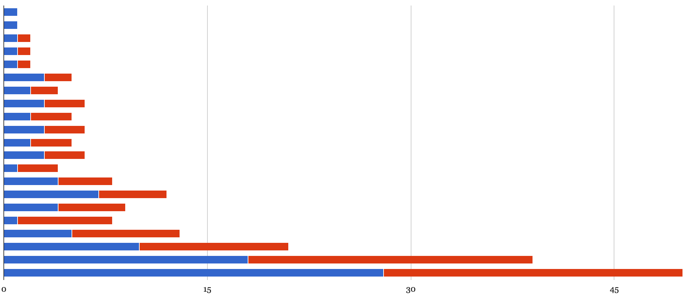

Executions are a recurrent motif in how historians, journalists and analysts have chosen to write about the Afghan Taliban. See the opening to [Dexter Filkins’ *The Forever War*](http://www.amazon.com/Forever-War-Dexter-Filkins-ebook/dp/B0018QSO0S/ref=sr_1_1_twi_kin_2?sr=8-1&ie=UTF8&keywords=forever%2Bwar%2Bfilkins&tag=soumet-20&qid=1443075711) as one example, or [this Reuters piece](http://www.afghanistannewscenter.com/news/1999/may/may5e1999.htm) from May 1999. I wanted to study the role of executions and public punishments in the Taliban’s government for a while, but lacked data to place the anecdotes into some sort of context.

This short overview is a compilation of sources relating to the Taliban’s public punishments, 1996–2001. It is compiled from publicly available sources as well as from the materials gathered as part of [the Taliban Sources Project](http://www.alexstrick.com/a-different-place/2015/8/afp-covers-the-taliban-sources-project). I think it is as complete an overview as is possible to get from these public sources, given that the Taliban weren’t shy about publicising their ‘public justice project’ – indeed, for them, the publicity was the point – and that we have multiple complete newspaper runs for the time they were in power. This was collated and triangulated with sources from Associated Press, Agence France Presse, BBC Monitoring and the [Afghan Islamic Press news agency](http://www.afghanislamicpress.com/en/index.php).

As a brief summary, I was able to find 101 incidents in total that chronicled the deaths of 119 individuals. I included some instances of public punishment not resulting in death, but this wasn’t really the focus of my search so their numbers may be underrepresented in the list. As another caveat, I was of course only looking at *public* executions, not anything that went on in secret as part of intelligence or domestic security operations and so on. Kabul, Kandahar and Herat were the most prominent locations for incidents and executions, with over half the total numbers coming from those three provinces alone. (Note that this may reflect a bias in whether incidents were reported from the provinces or not).

In any case, I wanted to present the raw data here alongside a timeline and another chart or two in case this is useful for other researchers/analysts. If you find I’ve missed an event, please drop me a line via [email](/contact-alex-1) or [on twitter](https://twitter.com/strickvl) and I’ll be sure to add it to the database.

Now head over [here](/talibanexecutions) for an interactive timeline, charts and the raw data...
