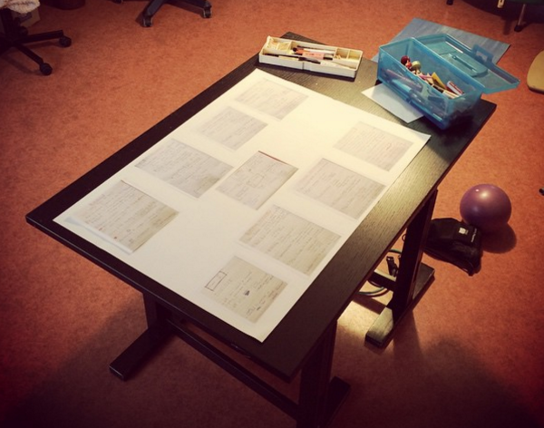

I hereby commit to doing a maniac week. This is inspired by [Nick Winter](http://blog.nickwinter.net/the-120-hour-workweek-epic-coding-time-lapse) and the good people at [Beeminder](https://www.beeminder.com/), namely [Bethany Soule](http://blog.beeminder.com/qs2015/) and [Daniel Reeves](https://www.youtube.com/watch?v=giBIJW-2hro&feature=youtu.be). The idea is as follows (borrowing heavily from a format over [here](https://byorgey.wordpress.com/2014/08/04/maniac-week/)):

- I will begin at 6am on Sunday December 6.
- I will continue until 6pm on Saturday December 13th.
- I will not be checking my email at all during the week. I will also be turning off and/or disabling all chat programmes and my phone.
- I will not use any social media websites or check RSS news. (This block will be handled by the [StayFocused](https://chrome.google.com/webstore/detail/stayfocusd/laankejkbhbdhmipfmgcngdelahlfoji) plugin and [RescueTime’s Get Focused mode](http://blog.rescuetime.com/2009/08/19/turning-off-the-distracting-parts-of-the-internet/).
- I will ensure I am in bed for 7 hours every night. This will be tracked via Fitbit.
- I am allowed 3.5 hours every day for things which aren’t work (showers, preparing meals, eating, rest, meditation and walks outdoors). This will be tracked using [TagTime](http://messymatters.com/tagtime/) using the tag “notwork”.
- The remaining time will be for my work. This will be tracked using TagTime and RescueTime, and my main focus during this week will be my PhD dissertation.
- As with [others’ maniac weeks](file:///Users/strickvl/Library/Application%20Support/DEVONthink%20Pro%202/Inbox/blog.nickwinter.net/maniacs-minimalists-and-mega-hike), I’ll be recording the whole week using time-lapse photography, though I’ll see how much hassle it is to assemble a video after the week is finished. Also, part of my work will involve me away from the computer, writing and outlining things by hand, and anything involving interview transcripts etc will obviously have to be blurred out or blacked out. Thus, I’m not committing to posting a video, but I will publish a post-maniac-week blogpost during the week that follows.
- I reserve the right to tweak these rules (by editing this post) up until the evening of December 5. After that point it’s time to work, and I cannot change the rules any more.

No, I am not crazy. Yes, you can do one too.
