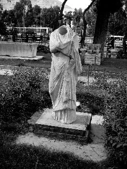

[caption id="" align="alignnone" width="351"] Some old photos from when I used to live in Damascus [/caption]

How do we figure out what is going on in a country like Syria, when journalists, researchers and civilians alike are targeted with frustrating ease? Is it enough to track what is being posted on social media outlets? These two questions are at the core of a fascinating recent(ish) study published by the [United States Institute for Peace (USIP)](http://www.usip.org/).

[*Syria’s Socially Mediated Civil War*](http://www.usip.org/sites/default/files/PW91-Syrias%20Socially%20Mediated%20Civil%20War.pdf) – by Marc Lynch, Deen Freelon and Sean Aday – came out in January 2014 and analyses an Arabic-and-English-language data set spanning a few years. It offers a useful overview of the social media trends as they relate to the ongoing conflict in Syria. It is especially relevant for those of us who aren’t inside Syria right now, and who are trying to understand things at one remove, whether that is through following social media output or talking to those who have left the country. (This means journalists, researchers and the like.)

Some stark conclusions emerge from the report. The ones I’m choosing to highlight here relate to how international media and research outlets have often been blind to structural issues that obscure their ability to understand Syria from outside the country.

> “Social media create a dangerous illusion of unmediated information flows.” [5]

The role of translation or the importance of having research teams that are competent in both English and Arabic comes out very strongly from the research.

> “The rapid growth in Arabic social media use poses serious problems for any research that draws only on English-language sources.” [page 3]

The report details how tweets about Syria in Arabic and English came to be different universes, how the discourse rarely overlapped between the two and that to monitor one was to have no idea of what was going on in the other:

> “Arabic-language tweets quickly came to dominate the online discourse. Early in the Arab Spring, English-language social media played a crucial role in transmitting the regional uprisings to a Western audience. By June 2011, Arabic had overtaken English as the dominant language, and social media increasingly focused inward on local and identity-based communities. Studies using English-only datasets can no longer be considered acceptable.” [6]

Also:

> “The English-language Twitter conversation about Syria is particularly insular and increasingly interacts only with itself, creating a badly skewed impression of the broader Arabic discourse. It focused on different topics, emphasized different themes, and circulated different imagery. This has important implications for understanding mainstream media’s limitations in covering Syria and other non-Western foreign crises and raises troubling questions about the skewed image that coverage might be presenting to audiences.” [6]

Also:

> “researchers using only English-language tweets would be significantly misreading the content and nature of the online Twitter discourse.” [17]

And:

> “These findings demonstrate once again the insularity of English-language journalists and the rapid growth of the Arabic- speaking networks. Both findings are potentially troubling for at least two reasons. First, they imply a journalistic community whose coverage may be influenced more by its cultural and professional biases than by the myriad constituencies within Syria and across the region. Second, they point to the power of social media to draw people into like-minded networks that interpret the news through the prism of their own information bubbles.” [26]

The general ideas in here won’t necessarily come as a surprise but I found it instructive to see just how different those two discourse universes are in the report.

In a separate but not-unrelated note, I have been thinking of ways that I can stay engaged in what’s going on in Syria beyond just consuming reports at one step removed. I’m working with a beta-testing team using a piece of software called [Bridge](https://meedan.com/en/bridge/) – made by the lovely team at [Meedan](https://meedan.com/en/) – which allows for the translation of social media and the use of those translations as part of an embedded presentation online. I will be translating strands and snippets from certain parts of Syria’s social media universe in Arabic. More on this soon, I hope.
