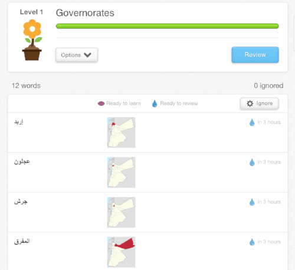

I arrived in Jordan this morning and am beginning my attempts to get to know the lay of the land. First thing is always geography. If I don't have those mental hooks to know that someone is talking about a particular *muhafadha*  / governorate, I can't properly engage in the conversation / information, so the only way to do this at the beginning is to learn a bunch of those initial hooks in a more deliberate fashion. Later on, you can learn things naturally, incorporating new pieces of information as you hear it, but at the beginning you need that initial scaffolding.

To that end, I'm starting off with Memrise's [*Governorates of Jordan* course](http://www.memrise.com/course/311471/governorates-of-jordan/), which teaches you all the names, plus their administrative capital town. I'll be doing the same with Amman's geography over the coming days, too, though no pre-written course exists so I will have to make one myself. For Amman, I can combine the more abstract map-work with travelling to see the various places with my own eyes. Then I can combine the two together for a solid grasp of the geography and different neighborhoods. In due course I will also be travelling around the various parts of Jordan for myself, but for now I have to content myself with learning all their names.
