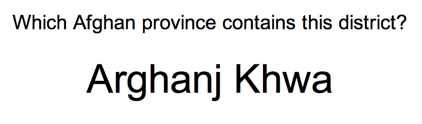
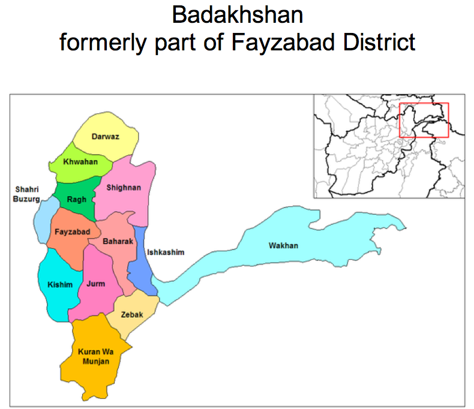

A friend was asking about using [Anki](http://ankisrs.net/) to learn to recognise the districts of Afghanistan so I made her a deck that provides tests in the following way;

On the front of the card the question is presented along with a computer-generated audio pronunciation of the district name:

Then if you know it, you'll answer Badakhshan and then you'll click/tap through to the next screen to see if you got it right. You'll see this:

Then you can mark whether you got it right or not. There are around 400 districts to learn, so if you learn 13-15 new cards each day you'll finish the whole lot in a month.

Why learn all the districts of Afghanistan? Sometimes you'll hear someone talking about a particular place or part of the country, and without knowing which province they're talking about you might not understand the context or the conversation. Plus, a little bit of geography never hurt anyone.

Give it a try. And let me know if you manage to complete the deck. You can download [the full Anki file here](https://dl.dropboxusercontent.com/u/530416/AfghanDistricts.apkg). Enjoy!
