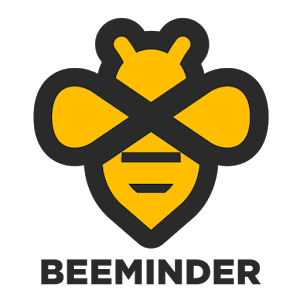

*[This is part of a series on the tools I used to write my PhD. Check out the [other parts here](/blog?tag=phdtoolsseries).]*

I feel like I've mentioned the end of the PhD several times in recent posts (PHD IS OVER!). It occurred to me that it might be useful to go through some of the tools and principles that I found most useful in completing the doctoral thesis, the research and the work in general. Part of this is by way of giving thanks to the application or methodological creators, and the other part is me thinking that others (future / current PhD students?) might find this useful.

It took me many years to finally settle on these tools. It would probably be unwise to adopt my entire writing style and process for yourself, because everyone's unique. I read a lot of books, blogposts and discussed things in forums and at meetings with others. This is all the product of a lot of procrastination (some active, some just resulting from hanging out on twitter or subscribing to a bunch of productivity-related blogs in my [RSS reader](https://www.newsblur.com/)).

Each post will vary in size. For some I'll go into a bit more detail because the principle will be somewhat unknown. Others are mega-players in the tech world so I'll just tip my hat in their direction.

## Minding the Bees

My first pick is, of course, [Beeminder](https://www.beeminder.com/). (I've written about Beeminder before [here](http://www.alexstrick.com/search?q=beeminder&f_collectionId=544a2abfe4b017ad0e2a476a).) The principle behind this service is pretty simple: you commit to doing a certain thing (or things) by a certain date (or regularly each day etc) and if you don't do them, you're penalised with money taken from your credit/debit card. The amount of money taken depends on whether you're a first-time offender (free, or $5), but then it increases exponentially. Pretty soon you'll be facing $270 or even higher fines.

Needless to say, this is a pretty strong motivator. You can hear about some of the nitty-gritty details in [a podcast interview](http://www.sourcesandmethods.com/podcast/2015/12/2/sources-and-methods-23-beeminder) I did with [Matt Trevithick](https://twitter.com/MattTrevithick) and [the founders of Beeminder](https://www.beeminder.com/aboutus), Bethany Soule and Daniel Reeves.

I have used Beeminder for a really wide variety of things -- not just for my work but for my personal life, too -- but in terms of my PhD, I had three main goals it supported:

1) tracking the amount of time I spent writing. You can hook up [RescueTime](https://www.rescuetime.com/) (a passive activity tracker on your laptop) to [feed into](https://www.beeminder.com/rescuetime) Beeminder. I can then say that I want to make sure I do a minimum of 1 hour of writing in Scrivener each day (for example), and Beeminder keeps track of the rest. This is a good thing to track because, ultimately, the PhD is all about keeping writing. You can get lost in the research, but after a certain point you just have to deliver it and ship the damn thing. This keeps you honest about the writing part, the sitting down in the chair and putting words on the page.

2) words drafted -- this one's a bit more delicate, since often when you're starting out, drafting a new section or chapter, the words that come out are useless drivel (or replace with a far less charitable way of describing their quality, and say hi to my inner voice while you're there!). At the beginning, doing basic drafting, it's hard to get started because you feel everything has to be perfect. The best antidote to this is to work on a '[shitty first draft](https://www.brainpickings.org/2013/11/22/bird-by-bird-anne-lamott/)'. Here, the idea is simply to churn out enough thoughts to fill the blank space in the outline, or book, or chapter or wherever.  
A specific example: I flew to Karachi in late 2012 to hammer out the first draft of my dissertation. I setup a Beeminder goal of having 100,000 words of text (approx the maximum word count allowed for submission to the university) and a date 6 weeks in the future, and I got writing. Beeminder calculates and tells you how many words you have to get done each day in order to stay ahead of the curve. (There are [graphs](https://www.beeminder.com/featured). They are awesome). As long as you keep writing, you're ok. And I did it. Most was horrible, and some of it was inner conversations between myself and myself about the subject under consideration, almost all of which I had to rewrite in some shape or form later on. But... it was words on the page, and it was me thinking through the issues. It was essential.

3) Sources Read -- this might be unique to me, but at some point I had to return to the newly-gathered sources of the [Taliban Sources Project](http://www.alexstrick.com/blog/2015/8/afp-covers-the-taliban-sources-project). I looked in my [DevonThink](http://www.devontechnologies.com/products/devonthink/overview.html) database (about which, more to come in a future post) and saw I'd flagged 1000+ articles to reread, catalogue/tag and integrate into the main thesis argument. So I plugged those numbers into Beeminder, gave myself a workable daily rate (50 or 100, I think) and then it calculated the rest and kept me honest.

So, to sum up:

- Beeminder forces you think backwards from your goal if you have a specific endpoint in mind. This is extremely valuable as it makes sure you're not being overambitious.
- Beeminder gives you accountability. It keeps you honest. This is what I initially found was most valuable, but later on I needed this less. [YMMV](https://www.urbandictionary.com/define.php?term=ymmv).
- The community of Beeminder users is wonderful. The [forum](http://forum.beeminder.com/) is a great place to get ideas, discuss approaches / failures etc.
- It works! [Many people](https://www.beeminder.com/testimonials) have had great results using Beeminder.

I'm not going to say I couldn't have written my PhD without Beeminder, but I'm almost saying it. Go [check it out](https://www.beeminder.com/)!
