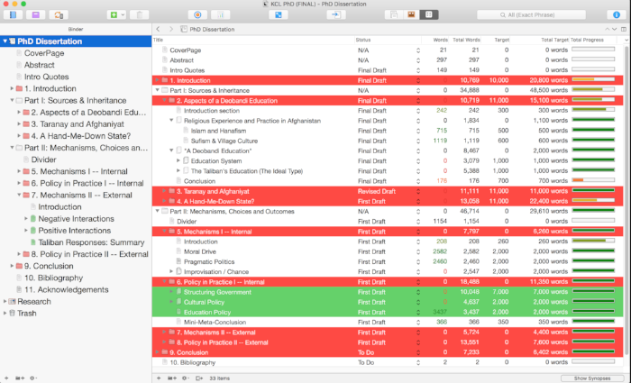

*[This is part of a series on the tools I used to write my PhD. Check out the [other parts here](/blog?tag=phdtoolsseries).]*

[caption id="" align="alignnone" width="700"] I spent several years with this particular file... [/caption]

[Scrivener](https://www.literatureandlatte.com/) is the go-to tool for anyone working on longer structured pieces of fiction or non-fiction. It's great for structuring your work as well as the writing itself.

When you write a PhD, it's important to keep word counts in mind from the beginning, otherwise you'll be left with hundreds of thousands of words and only 80,000 permitted to submit to the university and your examining committee. Scrivener allows you to manage the word counts of individual sections and their sub-sections (see the image above). It offers a variety of ways of displaying these word counts, setting goals and generally staying on top of this important metric. Of course, PhDs are more than just the number of words you manage to type, but I've met enough people who wrote too much to know that this is a common problem.

Scrivener also excels at structuring texts. You have 80,000 or maybe 100,000 words to write, so you split it up into chapters, but then those chapters must be split into chunks of roughly 500-1000 words as well. You can do this structuring using a corkboard-style visual interface (that I never use much and don't particularly like, but am fully willing to concede that some people do like and use it) or a more standard outline tool.

(Note, too, that there are 1001 other bells and whistles that come along with these core functions. It's highly customisable and adaptable to your specific needs. You can tag, show selective views of your text etc etc to your heart's content. There is also an [iOS version](https://www.literatureandlatte.com/scrivener_ios.php) for your iPhone / iPad that some people who are more mobile might find useful).

Another thing that PhDs seem to involve is references and footnotes. Scrivener works beautifully together with the major bibliographical reference managers ([Bookends](http://www.sonnysoftware.com/bookends/bookends.html), [Sente](http://www.thirdstreetsoftware.com/site/SenteForMac.html) etc) so you can rest assured that you won't have any trouble there.

Finally, it's easy to get things out of Scrivener, when the time comes. Sometimes you just want a copy of a single chapter to show to your supervisor, minus incomplete footnotes and in-text notes or annotations to yourself. Such a custom export is easy to set up. Similarly, when you're finished with the drafting and want to work on the presentation (more on [Mellel](http://www.mellel.com/) in a separate post) somewhere else, it's easy to export exactly as you want.
