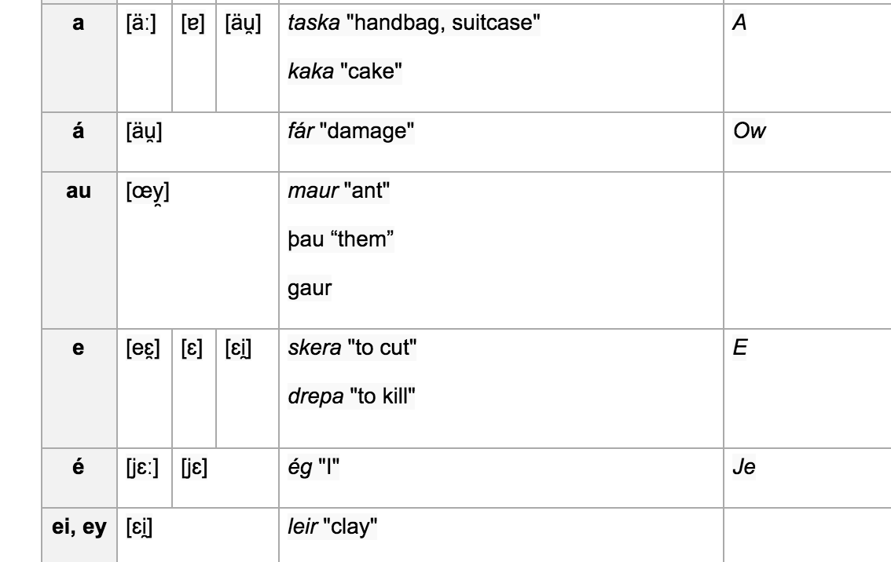
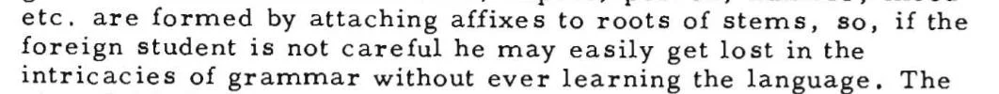

[caption id="" align="alignnone" width="1134"] Some pronunciation rules for vowels [/caption]

Yesterday, mostly out of curiosity, I took my first lesson in Icelandic. I’m not anticipating this becoming a major driving force in my life, but I was provoked by someone’s explanation of the language’s pronunciation weirdnesses to learn more.

The alphabet is the same as English (mostly), though there are some new combinations of letters as well as some tricksters that look like you know what they should sound like but that come out as something completely different. Some letters change sounds depending on where they are in a sentence.

The combination of two Ls comes out as a sort of clicking sound. When the two Ls are derived from a foreign word, then it sounds like it might in English. But for everything else – and I’m quoting from my excellent teacher, [Thor the Tutor](https://www.italki.com/teacher/1722884) over at [iTalki](https://www.italki.com/i/fHDd6) – you want a “wet sound in which the sound of air escapes from underneath and from both sides of the tongue when it’s low in the mouth”. It’s a bit like the combination “TL” in English, except not really.

I also learnt that inhabitants of Iceland have not developed the skill of hearing foreigners speaking their language with bad pronunciation. So while in France or Germany perhaps local / mother-tongue speakers will be able to figure out what you’re saying even if you are butchering the pronunciation, that isn’t the case for Iceland. Luckily, that sets the bar high for pronunciation, which I’ve always held is important to get right from an early stage.

I’d read [a little online](http://grapevine.is/mag/articles/2013/01/09/learning-icelandic/) about the complexities of learning Icelandic:

> “The difficulty of different languages manifests at different stages,” Jóhanna says. In Icelandic’s case, taking that first crack at the grammar is daunting. In Icelandic, verbs are conjugated variously for tense, mood, person, number and voice—active, passive or middle. Heavy inflection generates a staggering list of possible ways to say, in one well-known example, the numbers one through four. And although the Icelandic vocabulary has far fewer lexemes than that of a language like English, a single Icelandic word can have a phenomenal range of meanings depending on the particles with which it is used. Consider “halda,” literally “to keep,” which can become “halda fram” for “claim/maintain,” “halda upp á” for “celebrate,” “halda uppi” for “support” and so on.

A textbook I found online had the following caveat to those who sought to embark on a programme of study:

None of this bothers me *too* much. My teacher said something similar, that the faster we get speaking without necessarily allowing ourselves to fall into the abyss of inflection and grammar then the faster we can progress to the level that it makes sense to add in all the complexity.

By the end of the lesson I was sounding out commonly-used phrases and the trick vowels were catching me out less and less. Now, my task is to learn those phrases and internalise the pronunciation rules through practice. Then I’ll be ready for my next lesson.

Oh, and the meaning of the blog title? *My hovercraft is full of eels*.
