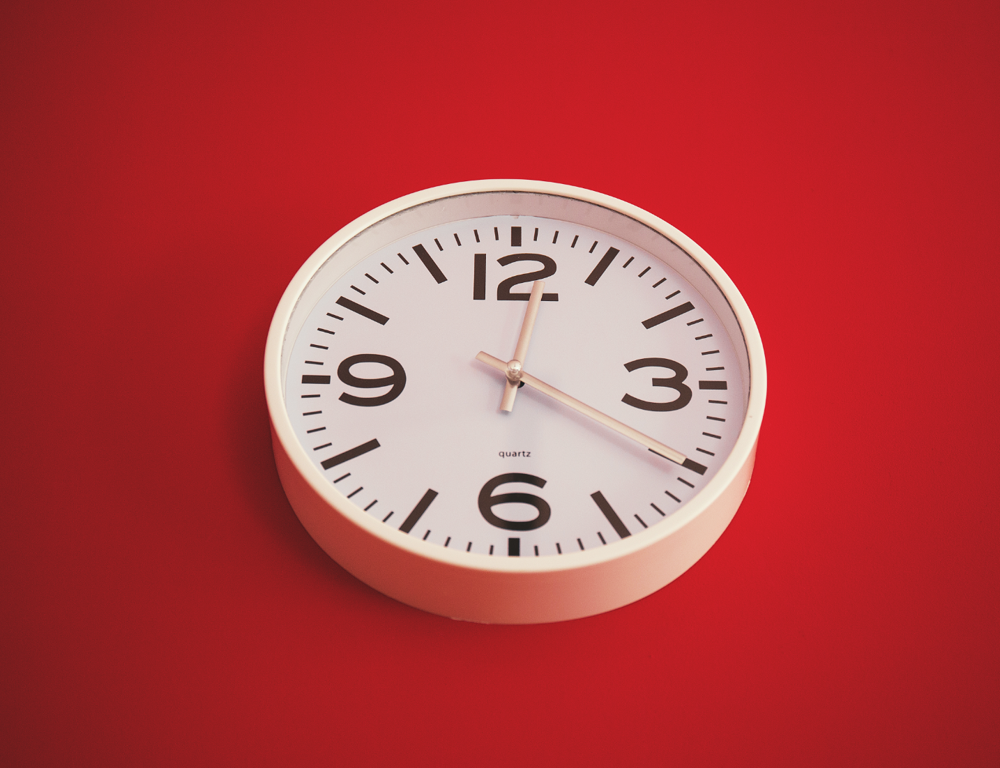

*[This is part of a series on the tools I used to write my PhD. Check out [the other parts here](/blog?tag=phdtoolsseries).]*

Four Perfect Hours. Repeat every day for two and a half months, and you have your PhD.

At least, that's how it worked for me. I was in Holland, living near a little town called [Delft](https://en.wikipedia.org/wiki/Delft), full of picturesque waterways, bridges and historical buildings, and I had a deadline to finish my PhD. The previous months hadn't been too great in terms of sitting down to write. There had been quite a few distractions outside my control, some entirely within my control, and I hadn't managed to sit down and focus. Worse still, the times when I did focus would be offset by days (sometimes weeks) where nothing happened. So each time I rededicated myself to the PhD writeup I had to refamiliarise myself with sources and even the structure of what I was writing itself.

Cal Newport's book [Deep Work](https://www.amazon.com/Deep-Work-Focused-Success-Distracted-ebook/dp/B00X47ZVXM/ref=sr_1_1_twi_kin_2?sr=8-1&ie=UTF8&keywords=deep%2Bwork&tag=soumet-20&qid=1473159602) happened to be released around that time, and while none of the ideas he was suggesting were wholly original, the combination and explanation hit me just in the right place and at the right time. (The book is excellent, by the way, and I'd recommend giving it a read, particularly if you have some sort of big project that you've been finding hard to make progress on, though I will try to outline some of the key principles below).

Newport's argument runs as follows: the ability to focus, to apply yourself to a particular creative task in a deep way, is a valuable skill. If you can manage to do this, you'll deliver better work, become more valuable a commodity to employers or to your community, and you'll feel more fulfilled.

The ways he suggests to reach that point are a collection of 'golden oldies' from the productivity world. Block off time specifically for your core work. [Turn off the internet](/blog?tag=freedomapp) and anything that will distract you. Maybe try for a change of scenery. Don't think you have an unlimited capacity for work -- four hours is probably the limit. Take breaks, and take them regularly. (And so on).

I was glad [Newport](http://calnewport.com/) takes time in his book to tackle the 'always-on' expectation that many employers and people in general have. If you're not careful, you spend all your time replying to emails (and each email generates another email in response etc) or instant messages or pings on Slack or Facebook and so on. It's not hard to imagine this scenario, particularly if you're juggling a number of different projects or responsibilities. An increasingly connected world brings benefits, but you need to take efforts so that you don't find yourself becoming hostage to the demands of the system. And I don't use the word hostage lightly. Sometimes it really does feel like there is this responsibility to be continually 'on', to be responsive to all the requests coming your way -- requests on your time, requests on your emotional energy, requests on your skills.

The solution Newport is prescribing -- sometimes in a slightly preachy / curmudgeonly fashion, I'll admit -- is to abstract yourself out of this world. Not forever, and not as a non-negotiable proposition, but at certain times, for certain activities and to serve certain goals.

Hardly a week goes by without the announcement of some new study assessing the damage that comes from switching attention. I wouldn't stake anything particularly valuable on the accuracy of the specific numbers they propose (i.e. [the 23 minutes proposed](https://www.fastcompany.com/944128/worker-interrupted-cost-task-switching) as the cost of disruptions before you return to a state of focus), but my personal experience and anecdotal evidence does strongly suggest that there *is* a cost to switching your attention from one thing to another. If you're writing about a complex issue, you're going to find it much harder if your phone is ringing or pinging messages the whole time. (For this reason, I've turned off almost all notifications on my phones. If someone messages me on Signal or Whatsapp, I want to see that message when I'm ready to see it. I usually don't want to be disturbed while I'm in the middle of something else. Obviously, this level of disconnection may be impossible for people with responsibilities, families etc, but consider employing it for specific times..)

Everyone tells you this when you start your PhD, and probably at every moment during, but it is true: the business of doing a PhD is connected with putting words down on a page. The more you do that, the closer (usually) you'll get towards that end point. Even if those words are just initial thoughts or reflections to yourself, they will still be useful. You'll be thinking on paper. And 'writing' doesn't need to be paragraphs of prose. I'm a big outliner -- though I concede that this may not fit with everyone's work style -- so I consider sitting down on a couch and drawing some diagrams of how ideas connect together, or doing a more structured ordered outline, to be useful work. With all these things, it's possible to spend *too* much time on them, but in general they are useful and contribute to the overall work at hand.

As a corollary to this, anything which takes you away from writing is something which is detracting from your ability to complete your project. You need data, of course, and you need to read and fill your head with ideas, and to become familiar with a number of different domains etc. But it's easy to get sidetracked into this 'work', since it is often exciting and interesting, even though it may not directly contribute to you finishing your thesis. Most of the time, the internet functions as a sort of crutch (emotional or otherwise) in many people's writing workflow. Every time you need to look something up, you go to Google (or, better yet, [DuckDuckGo](https://duckduckgo.com/)!) and then perhaps you get lost in a 30-minute black hole of discovery and cat gifs.

I'm a firm believer in separating out these processes. Writing is when you write. If you find there's some fact you don't know, you write a little comment to yourself in square brackets ([like this -- look something up about x or y]) and then you know to look that up later when your internet comes back. But in the meanwhile, you can continue your train of thought, you can keep writing, keep thinking on the page. Your internet excursions may be useful in some sense, but most of the time they are highly inefficient. If you separate the two processes (writing and internet research) you'll make *much* more progress with the former and streamline how much time you're taking on the latter.

The routine I settled on after reading *Deep Work* was as follows:

- I'd arrive at the coffee shop at 8am on my bike, just as the doors opened. I'd order a tea, settle downstairs and unpack whatever notebooks or papers I'd brought with me.

- At 8:15 on the dot, I'd begin writing.

- [Freedom app](http://www.alexstrick.com/blog/phd-tools-freedom) has turned off the internet from 8am-12pm in any case, so there's no way I can use it, though the cafe does offer free wifi. I have no way out. I just have to write.

- I write for 45 minutes until my alarm tells me the session is over, and I have 15 minutes of break. In my break, I try to do things that refresh my body and my mind. I'll get up, perhaps walk around a bit. I'll do some light stretching to undo the fixed chair position I've been stuck in. Maybe I'll chat briefly with the cafe staff upstairs. But I'll be keeping an eye on the clock because at 9:15...

- I start another session. (Note that some people might prefer a 25 mins writing : 5 mins break setup to their work. I prefer to write for longer and take a slightly longer break. But each to his/her own). I work until 10am, then take another break.

- At this point I get another tea. (I'll be writing more about tea later, but for now know that I've noticed I have certain tolerances to how much caffeine or [theine](http://www.lautrethe.com/caffeine-or-theine-what-s-the-difference.htm) I can drink and still think usefully, so this is ideally calibrated to my body. YMMV.) At 10:15 I begin another session until 11.

- By this point, I'm nearing the limits of what I can usefully do in a day. Newport suggests the same in his book, that most people have around 3-5 hours of 'deep work' capacity per day. 4 was a stretch for me, but I just about managed. In the break before the final session, I make sure to be conscious of how my body and mind are feeling, take stock of where my energy level is at, and perhaps calibrate the task or section to be tackled in that final session accordingly. Thus, I'm more likely to save a difficult new topic for the start of a new day, when I'm fresh, rather than try to start it at the end of the morning.

- At 12pm, my work day is over. I sit back, feel good about what I've achieved (a little gratitude is often a good thing) and know that I don't have anything else to do for the rest of the day.

The deal I made with myself was this: if I sit in the chair and have my "Four Perfect Hours" in the morning, then the afternoons are mine to do with as I wish. Of course, these were often taken up with things like shopping, paying bills, washing clothes etc, though just as often I'd take my bike and ride around town in the sunshine, listening to podcasts. Or I'd go climbing in Delft's bouldering centre. Or I'd go see a film at the cinema.

The one work-related task I'd allow myself to do in the afternoon was reading or anything relating to outlining. I usually found that any work I do to prepare myself for the writing process the next day was useful. This could be as simple as making a list of the key sources I'd need to refer to, or a brief list of points that I'd do well to write about, or it could be something like selecting quotes to highlight from a certain source. Usually it was something that that wouldn't take more than 30-60 minutes, and it was never really 'difficult' mental work. But if I did that kind of work the day before, then I'd always find it valuable. (The problem was that I didn't always do it, or find the time, or have the energy, so this wasn't something I always managed to do, by any means).

I'd make sure to sleep at a reasonable time -- since if I didn't get enough sleep, the knock-on effect for my ability to write the next day would be significant. So sleep (as I'll write about in a later post) was key. This meant setting an alarm to start getting ready for bed at around 9pm. By 9.30 or 10 I was usually in bed and I'd either listen to a bit of a podcast or an audiobook for 15 or 20 minutes, or perhaps read in a novel or something completely unrelated to work. More often than not, I'd skip that entirely and just sleep. Deep work is tiring, and demands a lot of your inner resources. Luckily, it is extremely rewarding, too.

I hope I've made the case for having fixed times where you are writing. This applies in particular to those who are in the write-up phase of their PhD or writing project. The idea that you should wait to be somehow 'inspired' is less common in technical disciplines like non-fiction, but nevertheless it's worth a reminder that writing is work of some kind. The more you can do to preserve that time as a core protected space, the more you'll produce.

As a final side-note, post-PhD I am not in such a regimented routine. The six-days-per-week schedule of four perfect hours (Sunday was always completely 'off'; rest is important) helped me complete my draft and make the final corrections to get the text ready to submit to the examination board. Nowadays, I'm still writing, though less as part of a structured single project. I know, though, that when I take 2 or 3 core hours and I spend them in a focused way, I usually find this time to be of value. For this reason, I [started the Amman chapter](https://www.meetup.com/Shut-Up-and-Write-Amman/) of the Shut Up and Write meetup group (it's sort of part of [a wider, though unconnected, network](https://thesiswhisperer.com/shut-up-and-write/) of 'Shut Up and Write' groups around the world), where I get three hours to work on producing thoughts on paper. I think no matter what I end up working on, whether it's research or blog posts or fiction or even my language studies, writing is always something that will bring value to my life and make it richer, so anything that keeps me regularly doing that is useful for me.

[UPDATE: I currently do part-time work as a coach to help people working through big projects like learning new skills, large writing projects like PhDs and learning new languages. Please feel free to [get in touch with me](https://incrementalelephant.org/contact/) for more information.]
