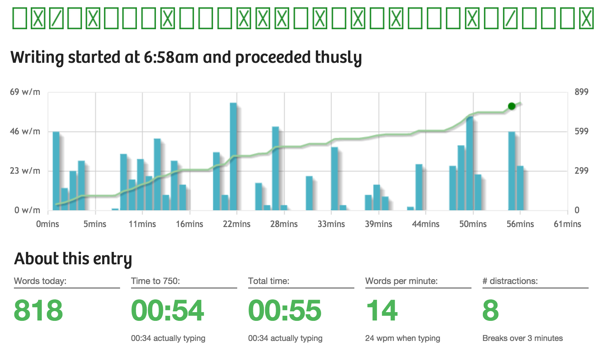

*[This is part of a series on the tools I used to write my PhD. Check out [the other parts here](/blog?tag=phdtoolsseries).]*

A few years back, I read a book with the (intentionally) provocative title, [Write Your Dissertation in 15 Minutes A Day](https://www.amazon.com/Writing-Your-Dissertation-Fifteen-Minutes-ebook/dp/B003E74BPG?tag=soumet-20). I was travelling back to Afghanistan from a short stay in Europe, and I was sat in Istanbul airport, waiting for my connecting flight. I remember the moment quite clearly, because a long wait time plus a delay didn't phase me. I was sucked into the book and the idea that the author presented. (There's also another good one along a similar theme: [How to Write a Lot: A Practical Guide to Productive Academic Writing](https://www.amazon.com/How-Write-Lot-Practical-Productive-ebook/dp/B001Y35G60/ref=dp_kinw_strp_1?tag=soumet-20) by Paul Silvia.

Basically, she explained how writing for a very short amount of time each day, taking the time to think through whatever was going on with your research, but on paper instead of your head -- was a trick that would really help your work. It's not a new idea, this technique of freewriting. When you take this time, these 15 or 20 minutes, you aren't writing a section of your thesis itself, you're writing almost a note to yourself about how it is going, what you think are important things you  need to consider, whether this is a useful line of inquiry and so on.

Since that day, I've incorporated this kind of writing much more often as a general practice. There's a great service run by all-round make-useful-things-for-everyone-to-benefit-from person [Buster Benson](http://busterbenson.com/) called [750Words](http://750words.com/). It sends you a friendly reminder every day to write 750 words on its site. There's all sorts of gamification and encouragement of writing streaks etc, and while writing the middle sections of my PhD, I would check in to 750words.com every day at the start of the morning to journal out my current research position and think through whatever problems I was about to face in my work that coming day.

It may feel a bit redundant at times, but I've found the practice really useful. Give it a try. You might find that it works for you.
