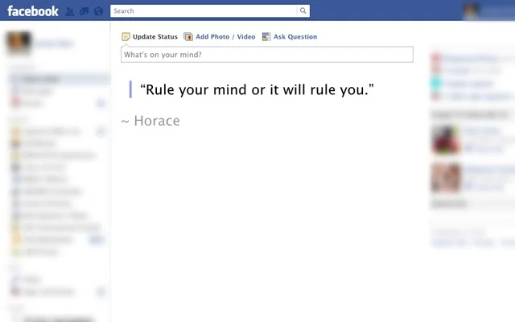

[caption id="" align="alignnone" width="640"] http://static1.squarespace.com/static/55e7927fe4b0a4a21bb6869b/t/5628e6b9e4b0126c0335864d/1445521081699/ [/caption]

Judging by the stats generated by Google Analytics and Squarespace’s own tool, over 40% of those who read my blog come here from Facebook. I’m slightly astounded by that number. It also means if I left Facebook (as I’m sometimes wont to do), I’d presumably lose all of those Facebook readers since most don’t seem to use RSS readers or anything else similar.

All of this is just by way of preamble to point you towards a neat little tool called [News Feed Eradicator](https://chrome.google.com/webstore/detail/news-feed-eradicator-for/fjcldmjmjhkklehbacihaiopjklihlgg). I’ve been using it for the past 5 or 6 months, and it has delivered many benefits. Its function is pretty simple: turn off the News Feed in Facebook. The only thing you’re left with is the bar on the top with the little red glowy number indicator (that you won’t be seeing as a red if you turned your screen to greyscale [as I previously suggested](http://www.alexstrick.com/blog/2016/8/remove-your-colour)) for all the millions of notifications Facebook seems to think are important.

I only use Facebook as a sort of broadcasting platform since I do know that some people exclusively use it as a source of news and reading material. But if I have to log in to post something, I don’t want to be confronted by my News Feed and its temptations (or dissatisfactions), then I have this Chrome extension to switch everything off.

So I write this now to encourage you all to turn off your News Feeds with the extension, even though I realise this might mean you might not see the next time I post something. (There are, in any case, many other ways to follow my writings/blog: [RSS](http://www.alexstrick.com/pageURL?format=rss), [twitter](https://twitter.com/strickvl) and via [email newsletter](http://alexstrick.us2.list-manage.com/subscribe?u=95ede971ea04215e1c027c6cb&id=2acaad0357), for instance).
