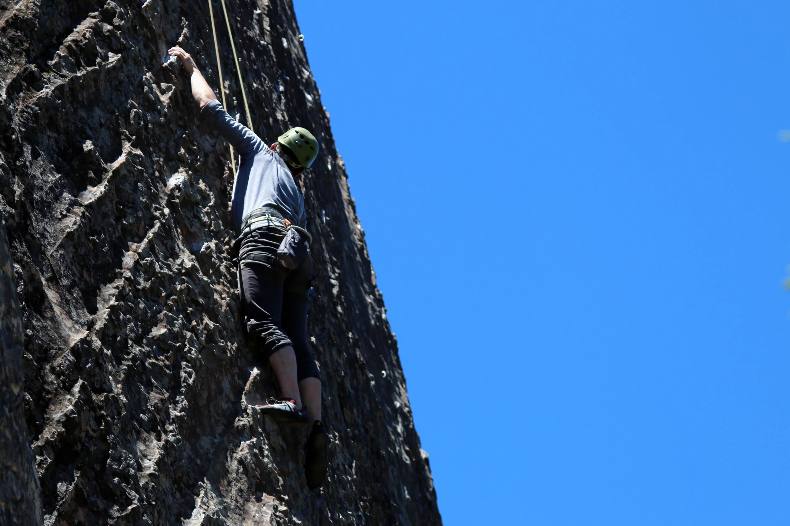

There was a moment, three-quarters of the way up the wall yesterday, where I started to think. I was starting to slip off the wall, and the holds were starting to become slippy with sweat from my palms. My arms were both tense, holding the weight of my body in a way that was tiring them out. I was doing everything wrong -- holding myself onto the wall instead of finding a way to keep my arms long and straight, the rest position that climbers are encouraged to take.

At this point, my mind moves in different directions simultaneously. I think about the next move -- something I've tried to reach for or figure out just beforehand -- and come up with nothing. I think about quitting, "because you've come so far" (!). I try to ignore that voice, though sometimes when your arms are screaming at you it's a fairly seductive call. Then I think about how I'm starting to slip off. I feel the initial tentacles of panic. Panic is an exponentially increasing phenomenon, I've found. You start with just letting a little in, and before you know it (in less than a second) you're sharing the wall with this monster who seeks to throw you off the wall. I shut the door on panic just in time, though it's only a matter of minutes before he shows up again.

And then I think to myself that maybe it's better I just keep climbing. Keep moving. One of the reasons why my arms are tired is because I'm on the wall for so long. The route is tougher than what I'm used to and it's designed to make it harder to take moments of rest, so I'm less worried about needing to use my arms so much. Sometimes that's just what the route calls for.

Also, the less time I spend on a particular step or move, the less likely my sweaty hands are to find a chance to slip off a hold.

I try to keep that in mind and find a rhythm of movement that aligns with my breath. Breathe, move hand, move foot, step up, move hand, move foot. Repeat. It doesn't last forever; at some point I'll be stymied by some tricky part of the climb, and then I'll have to go through the whole learning cycle again.

But this seemed to me one of those lessons that the wall teaches you in climbing that are applicable to life outside: sometimes it's better just to keep moving. Focus and reflection on your route or your goals is useful, but perhaps not best done while you're mid-route. There are usually inflection points at staggered intervals (when you finish a shorter project, when you do a weekly or monthly review of your activities and so on) when it's good to stop and reflect. But when you're mid-flow, exerting the effort and starting to slip off the wall, this isn't the time for reflection. In fact, reflection will sap your ability to keep moving forward. You just need to keep pushing on, keep delivering, keep pushing out the words, or whatever it is that you're doing.
