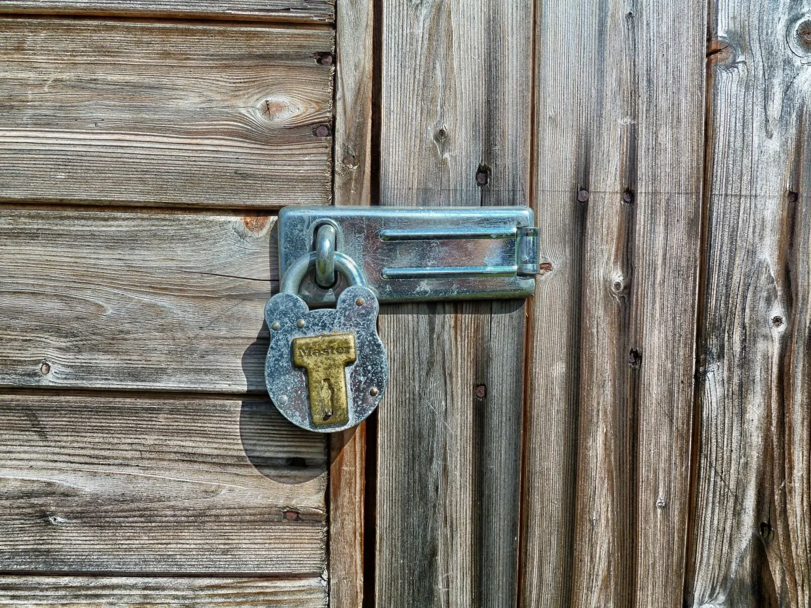

This news is a few days old, but it's worth restating. Squarespace is the name of the comapny that hosts this blog and most of the other websites that I currently manage. A few days ago, [they announced](https://blog.squarespace.com/blog/were-securing-millions-of-websites-with-ssl) that they'd be offering SSL for all Squarespace sites:

> Secure Sockets Layer, or SSL, is a technology that secures the connection between your browser and the website you’re visiting. It allows you and your website visitors to feel confident that their information is secure. And we believe that confidence is an important part of your online identity. So, starting today, we’re proud to offer free SSL on all Squarespace websites. Website owners should not have to pay extra or wrestle with complex technical issues to offer this basic security to their users. Every website can enable SSL, which will automatically direct users and search engines to a secure version of that site. The result is that millions of more domains on the Internet will be secured via SSL, our customers can take advantage of the confidence that secure websites bring users, and we will have helped the Internet take a huge step forward in promoting security by default. As an added benefit, websites hosted on Squarespace may enjoy a [boost in search rankings](https://security.googleblog.com/2014/08/https-as-ranking-signal_6.html). Squarespace is taking care of almost everything, making this an easy transition for customers. To seamlessly manage SSL certificates for all of our websites, we’ve partnered with [Let’s Encrypt](https://letsencrypt.org/), a free and open certificate authority (CA) run for the public’s benefit that provides free SSL certificates.

This is great news, and they deserve some credit for rolling this out. Google is making a push to encourage most websites to be secured in this way -- not doing so may even harm your search rankings -- so it's probably a trend that's coming for most people eventually. In any case, if you're using Squarespace as your host, make sure you turn it on!
