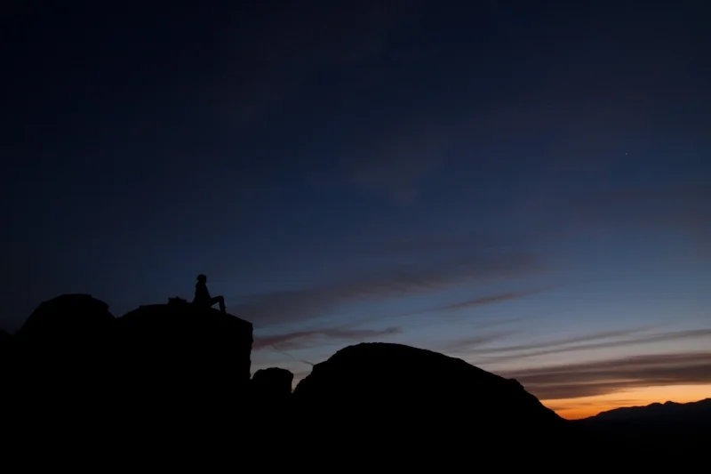

On Wednesday I climbed up an ungraded route. The [indoor climbing centre](https://www.facebook.com/climbatamman) where I go once or twice a week has been updating and renewing the different holds they bolt to the wall. We arrived before they had printed out the little square reference signs that run along the bottom of the wall.

In the place of my longtime-favourite warm-up route, a nice yellow-coloured 5A, was a new route populated with deep black [jugs](http://www.elementclimbing.com/Jug-Climbing-Holds-s/1833.htm). It looked easy from the bottom, but there was no confirmation of this from the grading at the bottom.

Even routes in mountains — particularly in areas where lots of climbers visit — will often have been graded, but I found that I enjoyed climbing up the route without the grade. It returned me to that feeling — one I’ve been struggling to recreate — early on in my time climbing when it wasn’t always about doing the next level or the higher difficulty progression: it was just about enjoying the climbing, enjoying moving my body and whatever thoughts come up when you’re ten or fifteen metres above the ground.

I’ll be trying to pay less attention to the numbers in future sessions and more to the felt and sensed experience of climbing.
