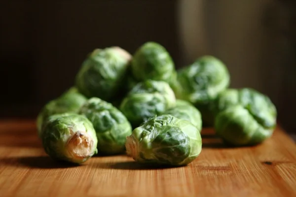

[I wrote a few weeks back](https://www.alexstrick.com/blog/fundamentals-versus-hacks) about how fundamentals are often superior to hacks. It seems it’s a useful mental model to employ as I’ve encountered various other expressions of more or less the same thing.

In the context of food and nutrition science, the call for [nutritional density](http://theness.com/neurologicablog/index.php/nutrient-density-of-crops-over-time/) has become commonplace. This either takes the form of warnings against eating ‘empty’ food — i.e. foods with little broad-spectrum nutritional value even if they pack a caloric punch — or at the other end it is the Kale brigade.

I think there are a lot worse things we could do than strive for nutritional density in dietary choices, and I’ve also been thinking more about how it probably applies to the kinds of information we consume. This could mean choosing books that are perhaps older, but are less ephemeral or have stood the test of time. For language-learning, perhaps it means really diving deep in one text to really suck the marrow from each and every sentence (if you’ll excuse the carnivorous image). I’ve been slowly weaning myself off the output of social and non-social media for this very reason, though perhaps now I’ve only started to gain the vocabulary to describe what I was doing. In any case, food for thought for a Thursday evening.
