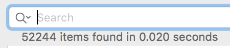

I’m late to the [Highlights](http://highlightsapp.net/) party, but I’m glad I got here.

Like many readers of this blog, I get sent (and occasionally read) a lot of PDFs. In fact, I did a quick search in [DevonThink](http://www.devontechnologies.com/products/devonthink/devonthink-pro-office.html), and I am informed that I have 52,244 PDFs in my library. These are a mix of reports, archived copies of websites, scanned-and-OCRed photos and a thousand-and-one things in between.

Thus far, my workflow has been to read PDFs on my Mac. Any notes I took while reading the file were written up manually in separate files. I would laboriously copy and paste whatever text snippet or quotation I wanted to preserve along with its page reference. These would be fed into DevonThink’s AI engine and magic would happen.

Now, post-Highlights-installation, my workflow is much less laborious. I can take highlights in-app, export all the quotations as separate text or HTML files and have have DevonThink go do its thing without all the intermediary hassle. If you’re  [a professional researcher or writer using DevonThink](http://www.devontechnologies.com/solutions.html) as your notes database — and quite frankly, if not, why not? — [the Highlights app](http://highlightsapp.net/) will probably please you.
