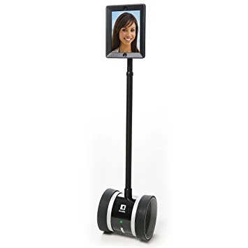

I just finished listening to [a fascinating episode](http://www.nerdsondraft.com/podcast/2016/12/3/american-sour-ale-and-daddybot) of Nerds on Draft podcast. Gabe and Jeff, the usual cohosts, spoke with Erik Hess about how he set up a telepresence robot (as pictured) in his house while he was deployed halfway around the world.

It’s worth [listening to the whole podcast](http://www.nerdsondraft.com/podcast/2016/12/3/american-sour-ale-and-daddybot) to get a sense of how this worked out. Erik talks of the initial weirdness of being present in his house in the US while actually being in Qatar. It was fascinating to learn how quickly that turned into the new baseline — i.e. to his children, it became as if he was actually there.

For families or situations where parents have to be away from children on any kind of regular basis — or whatever particular configuration your life takes — it seems that this is a really intriguing idea. It certainly isn’t cheap, but it’s also impossible to get back that time with your children either.
