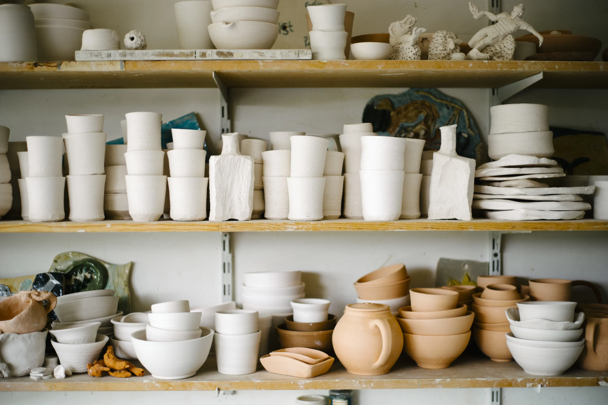

Kintsugi or kintsukuroi is the Japanese art of rebuilding a broken pot or other ceramic in a way so as to make it more beautiful than it was before. This is sometimes done with gold or silver, or other materials to join the broken pieces together.

There are some great images of this if you [search Google Images](https://www.google.com/search?site=&tbm=isch&source=hp&biw=1435&bih=780&q=Kintsugi&oq=Kintsugi&gs_l=img.3...1643.6659.0.6855.2.2.0.0.0.0.272.272.2-1.1.0....0...1ac.2.64.img..1.0.0.F9CvE7ulfqg).

Anab Jan [also has written something](https://medium.com/@anabjain/making-as-an-act-of-caring-6a8ec70cebed#.3y7pasre8) on the way that repairing bikes with a kintsugi approach means the history of repair remains visible in the bike even after the repair is finished.
