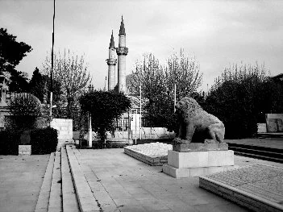

[caption id="" align="alignnone" width="351"] A photo taken back when I lived in Damascus [/caption]

I haven’t been following events in Syria that closely. ‘[*Burning Country: Syrians in Revolution and War*](https://www.amazon.com/Burning-Country-Syrians-Revolution-War-ebook/dp/B01A5OJTDO/ref=sr_1_1_twi_kin_2?sr=8-1&ie=UTF8&keywords=burning%2Bcountry&tag=soumet-20&qid=1482526234)’ (by Robin Yassin-Kassab, Leila Al-Shami) is only one among several books that have been written in the midst of the ongoing conflict, but I’d heard consistently good things about it since its release at the beginning of 2016. It doesn’t disappoint. I started it yesterday, lulled by the conclusion of a large project and a thousand pictures of Christmas dinner preparations on twitter. I woke up this morning and finished the rest.

*Burning Country* is compellingly written, not only on a structural level but also on account of its interspersed interview and other oral history-type testimony. This is the book’s primary strength, I felt. It’s hard enough to write accurate and compelling history after the fact. Doing so while events are still unfolding makes the job even harder. Thankfully, *Burning Country* delivers the goods.

After introducing Syria and Syrians as if to set the stage, Yassin-Kassab and al-Shami launch into an account of the Syrian uprising’s early days, told through a diversity of sources from a variety of backgrounds. They make a strong case for the initial moments of the revolution as being less co-opted by one group or another, even as later chapters show how a variety of forces pushed and pulled that initial impulse in unintended directions. I learnt a lot from the accounts of initial organisational strategies, the way different groups responded to similar kinds of threats from the state and how the logic of violent escalation started to take on more prominence. The chapter on cultural shifts (or expressions) brought about by the revolution (chapter eight) was also excellent. The end of the book falls a little short, if only because the conflict is ongoing and you had the sense that it is an unfinished project.

As a one-stop shop introduction and opening-out to some important parts of Syrian society, history and current affairs, *Burning Country* is well worth your time. The book ends with a note on thinking about and understanding Syria:

> *“In order to truly think globally – rather than to hide from thought behind clumsy globalising paradigms – it is necessary to act locally. We ask the reader, rather than applying the usual grand narratives, to attend to voices from the ground.”*

I hope we get to read other histories of Syria (and other countries) that employ the same logic.
