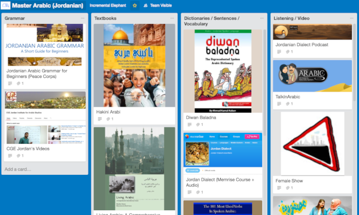
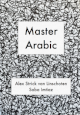
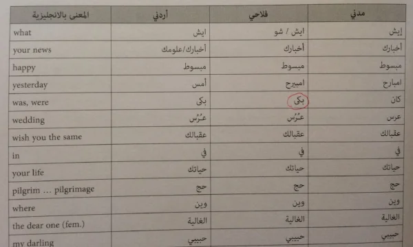
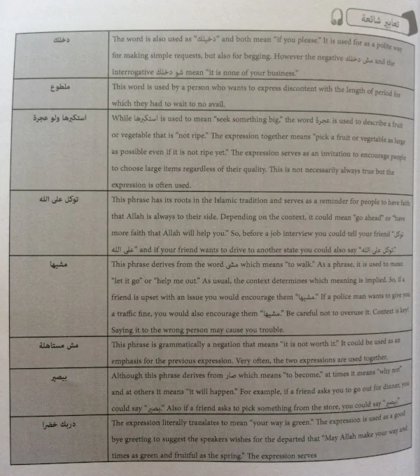
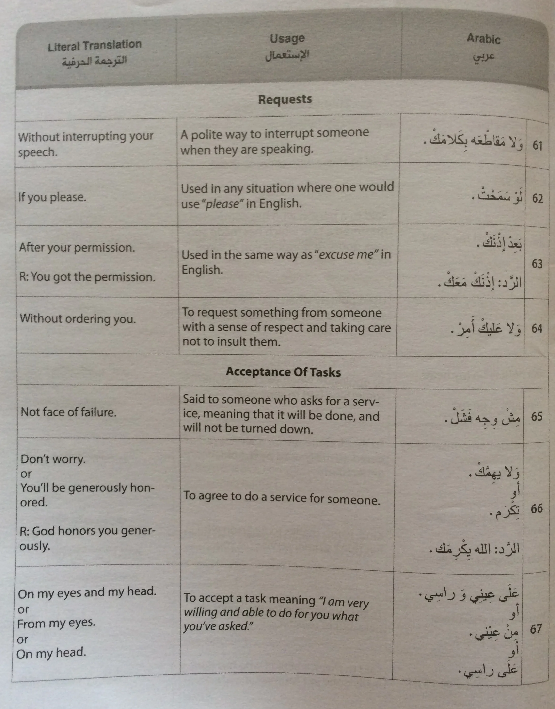
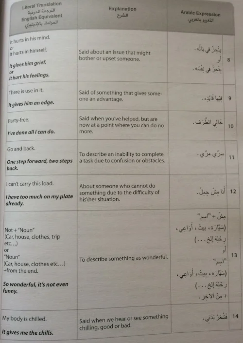
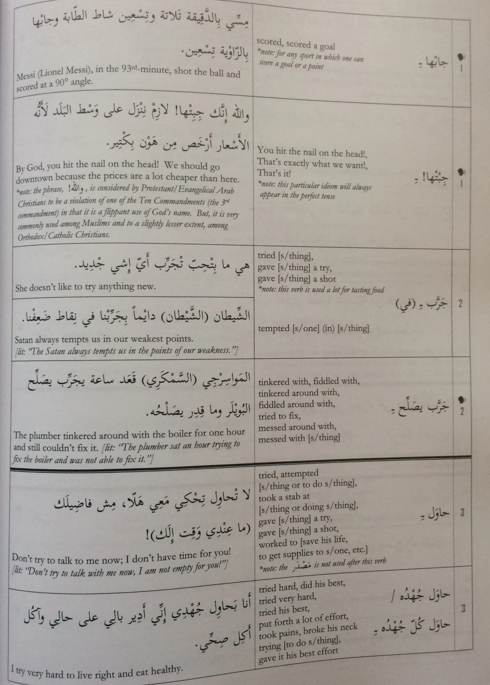
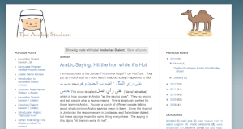
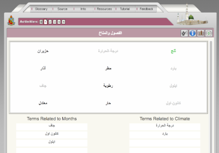

I've been living in Jordan for a little over four months, and I'm pleased to say that I seem to have converted what Syrian/Lebanese colloquial Arabic I learnt in the past into the Jordanian dialect.

Along the way, I've used various resources and watched various materials that have really helped. This blog post will be my review of what is available for the student of the Jordanian dialect.

Lots of people say that you can just choose 'Levantine' and that's enough. "You don't need to specialise any further than that," I've heard on a number of occasions. My experience is that the country-level distinctions between Jordanian, Syrian and Lebanese Arabic actually *do* matter, particularly once you get past the pure basics and want to have more natural conversations.

For various reasons, Jordanian dialect resources are under-represented in the market for books and audio resources. They're either subsumed under the 'Levantine' bracket or books generally tend to offer Syrian or Lebanese flavours. It is for this reason that I think it's worth taking stock and gathering together all the resources available for students hoping to travel to Jordan or make a study of the specific dialect spoken here.

Being the last somewhat-calm country in the non-Gulf non-north-African Arab-speaking world, it's a preferred destination for year-abroad students mid-university. If that's you, I think you'll find this post really useful.

## **How to Use These Resources**

There are a lot of books and resources listed below. The expectation is not that you'll go through them all, but that you should rather be aware of what is out there. There aren't really many options for textbooks, so you're basically stuck with *Hakini Arabi*. (Good thing it's a well-designed course, with lots of dialogue and practice). I'd recommend the serious student of Jordanian Arabic get hold of both Tiedemann's *101 Verbs* book and *Diwan Baladna*. Both are filled with material you'll find nowhere else. (See below for details on these books).

As for the rest, pick and choose: watch a comedy show; do some listening practice exercises; take an iTalki lesson with someone from Jordan. Those final steps are up to you, and depend a lot more on your goals and how fast you want to go.

If you'd like one-on-one mentoring/coaching in your journey to learn Jordanian dialect (and/or standard written Arabic), have a read of what I offer and [get in touch with me](http://languagecoach.io/coaching).

For a one-stop-shop guide to improving your Arabic and getting beyond the intermediate level, particularly for students who've studied for a year or two already, read my new book, [Master Arabic](http://languagecoach.io/masterarabic).

## **Grammar**

- [**Jordanian Arabic Grammar: A Short Guide for Beginners (Peace Corps)**](https://www.livelingua.com/peace-corps/Arabic-Jordanian/Jordanian%20Arabic%20Grammar%20for%20Beginners.pdf)

This is a useful overview of the main grammatical features of the language. The grammar covered is very basic, but it is nice to have it all in one place.

- [**CGE Jordan's Videos (YouTube)**](https://www.youtube.com/channel/UCN18MCgv7znfUbyqNUOcbaw)

[CGE Jordan Institute for Arabic Studies](http://cgejordan.com/) have also published an indispensable book (see below), but these are their videos. They teach the kinds of things you'll never find in a book, and they also practice them in pairs. They also have material for intermediate and advanced students, like this video in which Fred teaches how to intensify your sentences:

If you learn best from watching videos and have the time to wade through hours and hours of short lessons, this is probably an excellent place to start. I spoke with the director of CGE, in many of the videos, for the [premium edition](http://gum.co/masterarabic-premium) of 'Master Arabic'.

## **Textbooks**

- [**Hakini Arabi: Palestinian and Jordanian Colloquial for Beginners**](https://www.amazon.com/Hakini-Arabi-Palestinian-Jordanian-Colloquial/dp/1514274795/ref=sr_1_1?sr=8-1&qid=1483420896&keywords=jordanian%252Barabic&tag=soumet-20&ie=UTF8)

This is your only option for a full textbook covering Jordanian dialect for beginners. It is taught as if you haven't necessarily studied any other Arabic before, so parts of it move a little slow, but that's a minor quibble. The book comes with a link to audio files that you download online, and these are essential for working through the dialogues and listening exercises. There are lots of group role-playing exercises suggested in the book, but even if you're studying on your own this is a valuable one-stop shop to work through.

Different parts of Jordan speak slightly different sub-dialects, and this book offers options for three varieties: 'Jordanian', 'Palestinian-Rural' and 'Jordanian and Palestinian-Urban'. For an idea of the kinds of materials contained within, here's an example of a vocabulary list from early on:

and here's an example of a context/phrasal explainer from towards the end of the book:

For a total beginner, I would certainly start with *Hakini Arabi*. One of the first things I did after moving to Amman was to go through this book.

- [**Living Arabic: A Comprehensive Introductory Course**](https://www.amazon.com/gp/product/0974484342/ref=as_li_qf_sp_asin_il_tl?creative=9325&creativeASIN=0974484342&camp=1789&linkCode=as2&tag=soumet-20&ie=UTF8)

Living Arabic is part of the Munther Younes [Arabic-tuition empire](https://www.amazon.com/s/ref=dp_byline_sr_book_1?ie=UTF8&field-author=Munther%2BYounes&tag=soumet-20&search-alias=books&sort=relevancerank&text=Munther%2BYounes). He generally produces solid materials and though I've never seen a copy of this book, I've been told by a number of students that it contains useful materials for Jordanian Arabic. The text teaches MSA alongside colloquial, so this may not be totally suited to your goals. Perhaps the best scenario for this is if you get a chance to use it in a library. You can probably work your way through the Jordanian Arabic sections in a few days/weeks.

## **Words and Sentences**

- [**Diwan Baladna: The Unprecedented Spoken Arabic Dictionary**](http://www.diwanbaladna.com/book-2-language.html)

This is a thematic dictionary and phrasebook for Jordanian Arabic. I hesitated to buy this for a long time on account of its cover, but I saw it in a bookshop and the content is really excellent. It comes with an audio CD, though that is problematic since few computers come with CD readers; I hope the authors will make the data available for download as well in the near future.

The first part of the book is filled with expressions, phrases, phrase + answer combinations and other materials that you don't usually find, even in books specialising in colloquial readers. Here is an example of phrases that come with certain responses:

and here are some expressions from their very rich selection, also showing the explanations and how the book makes them very easy to use/pick up:

The rest of the book is filled with thematically-organised vocab lists (sorted into Arabic / translation / Arabic plural columns). It's useful to have them all in one place, I suppose, and to know that these are what Jordanians use (as opposed to Lebanese or Syrian speakers of Arabic), but the real value of the book is the expressions and phrases contained in the first half.

- [**Jordan Dialect (Memrise Course + Audio)**](http://www.memrise.com/course/515305/jordan-dialect/)

I include this not because the word selection is particularly amazing but simply because it seems to be the only course on Memrise (the vocabulary-learning platform) that teaches Jordanian dialect alongside the audio files. There are lots of other courses offered, including some by students currently in Amman, but none of them offer audio files as well. There are only 736 words available to learn, but it's all Jordanian dialect. To my mind, this course is low-hanging fruit. Someone's made a great selection of vocabulary, most of which you'll use at some point, so I'd recommend just working your way through it relatively quickly.

- [**The 101 Most Used Verbs in Spoken Arabic: Jordan & Palestine**](https://www.facebook.com/the101book/)

This book is more than just a guide to using verbs in Jordanian Arabic. It's a repository of sentences and their translations that comes with a CD filled with pronunciation. (As with other books, I *really* wish CGE would offer the files as digital downloads, since I and most others don't have a CD reader/drive).

The title is actually really deceptive, and I held off getting a copy for far too long because I thought it was just lists of verbs. It *is*, but at the same time it's a rich trove of sentences, phrases and associated vocabulary. I'd say this book is pretty much essential for anyone who wants to learn Jordanian Arabic. Take a look at this page, for example, to see the kind of thing *101 Verbs* contains:

It's a fantastic mix of phrases, sentences, vocabulary and literal translation or explanation. There are also useful appendices and introductory materials about the grammar of the Arabic verb, lists of broken plurals and various indexes so you can look things up as well.

I spoke with the author of the book (and director of CGE) for the [premium edition](http://gum.co/masterarabic-premium) of 'Master Arabic'.

- [**Basic Phrasebook - Jordanian Arabic (WikiTravel)**](http://wikitravel.org/en/Jordanian_Arabic_phrasebook)

This is nothing more than a list of useful phrases, but as a way to pick up some essentials, this is a free and easy option.

- [**Pre-Departure Arabic Materials (PeaceCorps)**](https://www.livelingua.com/peace-corps/Arabic-Jordanian/JO_Arabic_Language_Lessons.pdf)

There are also [audio files](https://www.livelingua.com/project/peace-corps/Arabic/Jordanian/) associated with this document. This is a basic overview of some situations that an English-speaker might encounter in Amman, and offers some basic grammar and vocabulary alongside phrases and cultural explanation. Nothing advanced here, but ideal for total beginners or visitors.

- [**Conversational Arabic Quick and Easy: Jordanian Dialect**](https://www.amazon.com/Conversational-Arabic-Quick-Easy-colloquial-ebook/dp/B017CMOTSC/ref=sr_1_2?sr=8-2&qid=1483420896&keywords=jordanian%252Barabic&tag=soumet-20&ie=UTF8)

I'd advise you to stay away from this book. It's sold on Amazon and seems to be frequently suggested as a 'suggested purchase' when you buy anything else relating to Jordanian Arabic. Unfortunately, the contents are not very useful. The book also does not use Arabic script; it is all transliterated. *Caveat emptor*.

- [**The Arabic Student: Jordanian Arabic**](http://www.thearabicstudent.com/search/label/Jordanian%20Dialect)

These are all the posts from 'The Arabic Student's blog relating to the Jordanian dialect. It was last updated in 2013, but as a resource it's extremely useful, and he covers a numbers of explanations of phrases, grammar and other interesting features of the dialect. Posts often discuss specific videos (or sections of videos) in detail, so it's a great place to get a taste for the unique features of the dialect alongside some entertainment and comedy.

## **Listening / Video**

- [**Jordanian Dialect Podcast (Soundcloud)**](https://soundcloud.com/ma-wara-al-logha/sets/jordanian-arabic-dialect)

I co-host this podcast together with Lina Obeidat. We discuss a new topic each week. Show notes include translations of difficult words. The idea behind this podcast was to have some materials available for intermediate students that weren't too difficult, but at the same time didn't dumb things down by using too much English and so on. Details on how to subscribe are [available here](https://www.alexstrick.com/blog/2017/1/new-year-new-arabic-language-podcast), or just follow us on Soundcloud.

- [**Talk In Arabic**](http://www.talkinarabic.com/)

Talk In Arabic is a great resource for those who want spoken materials in the various dialects of the Arab-speaking world. The Levantine Dialect section contains a few dozen videos and audio lessons in Jordanian dialect alongside [thematically-organised vocabulary lists](https://www.youtube.com/watch?v=BoOub9lUm2g). Everything is available as audio files (with transcripts and translations) so this is a useful service. Note that the site isn't updated *that* often, so you might find you can make use of all the materials in a month or two.

- [**Female Show (Roya)**](https://www.youtube.com/user/FemaleShow)

This is a fun comedy starring comedy superstars, Tima Shomali and Raja'ee Qawwas. I've watched the three seasons of this show through from start to finish and learnt a lot in the process. The level is suitable for an intermediate-level speaker. I'd recommend starting at with [season 1, episode 1](https://www.youtube.com/watch?v=unmUYwUATGY), to give it a try:

- [**Usfuriyya (Roya)**](https://www.youtube.com/playlist?list=PLxFFMaDM0xYK38zWyMcF1vWhpsVM9CfCI)

This is a medical comedy set in Jordan. Think [Scrubs](https://en.wikipedia.org/wiki/Scrubs_%28TV_series%29), or think someone trying to imitate Scrubs in the Middle East. The Arabic is also at an appropriate level for someone who has a year or two under their belt.

- [**Roya TV**](https://www.youtube.com/user/RoyaTV)

Roya is Jordan's preeminent contemporary TV channel. They commission most of the new dramas, comedies and other shows coming out of the country. There's always something interesting to watch here. To watch only their news click [here](https://www.youtube.com/user/RoyaNews). For their comedy shows, click [here](https://www.youtube.com/user/RoyaComedy). For drama shows, click [here](https://www.youtube.com/user/RoyaDrama). Highly recommended as a way to get exposure to the sound of the dialect.

- [**Jordan TV**](https://www.youtube.com/user/JRTVChannel/)

This is the YouTube channel for Jordan's state-run TV station. You can view news broadcasts and more traditional dramas. The content is much more staid in comparison to Roya, but it exposes you to a different style of speech and local culture, so perhaps find a way to intersperse this in with your Roya comedies and dramas.

- [**LangMedia Arabic**](http://langmedia.fivecolleges.edu/arabic)

There are a number of different links on this page (to CultureTalk or to their page of Jordanian/Palestinian dialect resources). This is a real treasure trove of materials, much of which is provided with audio, video and full transcripts/translations.

There are also some exercises to go through to test your comprehension. [Here's two Jordanians](http://langmedia.fivecolleges.edu/culturetalk-subtopics/Arab-Levant/187/Schools-in-Jordan) talking about the education system using dialect. Note the transcripts and translations below.

- [**N20 Comedy**](https://www.youtube.com/user/N2OComedy/)

More Jordanian comedy shows. If you watch enough locally-produced TV and comedy you will notice that the same faces show up in many different programmes. Note that N20 has branched out to include other dialects, but it should be fairly easy to distinguish which is which. Lots of material here.

- [**Accents Library (DLIFLC)**](http://accents.dliflc.edu/)

Select Arabic. You'll be presented with a number of stories read by people from different countries. Jordan is one of them. Compare and contrast with the other dialects. This is more a resource to sharpen your ear. Mother-tongue Arabic speakers grew up among this diversity and so are attuned to the tonal and phrasal differences between dialects. This is a resource that can help you improve this skill on your own.

- [**Phone Conversations**](http://phone.dliflc.edu/)

This is a great database and resource of authentic spoken materials in the form of recorded (and transcribed) phone conversations.

Select Arabic and then Levantine. It'll (mostly) be clear when items relate to Jordan. Each conversation comes with a transcription, translation and study plan. The recordings usually last around ten minutes, so it's perfect for a quick study session. Use this to get exposure to authentic natural language.

- [**GLOSS (DLIFLC)**](https://gloss.dliflc.edu/)

GLOSS is a resource developed by the US military. You can select the dialect for which you see materials (Levantine, in this case) and it'll show you different exercises to complete. There were over 240 unique items as of January 2017.

Once you go into the individual items, it states which country the dialect is from. I really like that you can choose whether you want the questions and instructions in Arabic, though the interface itself is really horrible. Here's one of the exercises where you pair off words to two columns, depending on the meaning:

Despite the issues with the interface, there's loads of really useful material to work your way through here. This is a great resource.

- [**Aamiya Arabic (YouTube)**](https://www.youtube.com/user/AamiyaArabic/)

This YouTube channel covers a number of dialects, but you can click through to [the playlists](https://www.youtube.com/user/AamiyaArabic/playlists?sort=dd&view=1&shelf_id=0) to choose Jordan-specific materials. These videos aren't specifically designed for students, but they provide lots of authentic dialogue and dialect appropriate for intermediate students. In this video, for example, sisters Hiba and Lynn talk between themselves about what they're selling at a market stall:

THere's lots to explore in this YouTube channel, and lots of phrases and unique Jordanian expressions to file away in your personal language notebook. Wade in!

- [**Kharabish Comedy**](https://www.youtube.com/channel/UCp8q7iSGCbVKP3C4iTPUjPw)

A mix of dialects here, but Kharabish are originally a Jordanian outfit, so lots of their older material uses that. As with earlier comedy channels, you'll recognise many of the actors and some of the skit premises.

- [**Ex in the City**](https://www.youtube.com/watch?v=ndOCQQxTbvA&list=PLzjR5Hg5xW61h33VjZYauv7ax094NPw-M&index=1)

This is mostly in English, so probably too basic for intermediate students, but the series covers a number of different expressions and culturally-relevant context. The host explains a new expression each episode.

## **Teachers /** [**iTalki**](https://www.italki.com/i/fHDd6)

There are currently, as of my writing in January 2017, only three tutors from Jordan on [iTalki](https://www.italki.com/i/fHDd6). I've only studied with one, so I'll recommend her highly. You'll recognise her from the Jordanian dialect podcast that we recently started together. [Lina Obeidat](https://www.italki.com/teacher/1139916) works with beginners and intermediate students alike, and makes Skype lessons fun by combining free-flow conversation with a variety of other exercises and challenges along the way. I credit Lina with the lion's share of improving my spoken Arabic, so I'd highly recommend you work with her to blast through any difficulties you may have.

## **Institutes / Study Abroad**

I haven't studied at either of these institutes, so I can't attest to the quality of the programmes they offer etc, but I do know that many people in Amman study at these two schools. [CGE](http://cgejordan.com/) is founded by Fred Tiedemann, who wrote the essential *101 Verbs* I mentioned above and produced many of the videos on their indispensable YouTube channel. They (seem to) take a colloquial-first approach.

[Qasid](http://www.qasid.com/) is the other main alternative, and many universities in Europe and the US send their year-abroad language students there for tuition. Both institutes come highly recommended by people who've studied there, but as always with study-abroad programmes, a lot depends on what you put into them.

*[NOTE: This list of materials is adapted and drawn from the premium materials available alongside my new book, '[Master Arabic](http://languagecoach.io/masterarabic)'. For the full resource guide covering other dialects as well as tried-and-tested advice from experts and others who've made it to an advanced level, [get the premium edition](http://gum.co/masterarabic-premium).]*
