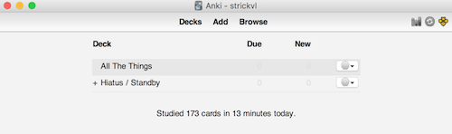

Scientists of various stripes have been studying how best to learn for many years. We can draw a variety of conclusions from this academic literature, but one of the more surprising results is that randomised practice is better than when you focus on a particular topic to the exclusion of everything else.

This means that when you're revising for end-of-year exams covering a number of subjects, it helps to test yourself on all the subjects at the same time, randomly switching between the different areas, instead of picking just one subject and working through each one individually.

The same applies to language learning. More and more people are choosing to use [spaced-repetition](http://www.gwern.net/Spaced%20repetition) applications like [Anki](http://ankisrs.net/), but most times I look at how the decks are organised, I see cards and information organised by topic.

This misses out on the opportunity to 'interleave' (the term used by the literature.) The benefit from interleaving your testing of cards probably comes from the fact that it's slightly harder to switch from a French vocabulary context into Japanese or Arabic. Your brain has to work a little harder to recall the information, so the network connections are stronger than if you'd studied all the words from the same language together.

When I open up Anki, I see the following:

I have one deck (called "All The Things") which contains all my cards. There is a lot you can do with in-built and plugin support for tags so I'm able to dice and segment the cards as I wish. This means when I'm reviewing my decks, I'll get one card with Arabic vocabulary one minute, then something testing me on shark anatomy the next, followed by some Python coding-related knowledge I'm learning.

Reviews are harder, but the concepts and facts also stick much better in my mind. Try interleaving your study and see if it helps.

To read more on this, check out this wonderful meta-review: "[Improving Students’ Learning With Effective Learning Techniques: Promising Directions From Cognitive and Educational Psychology](http://journals.sagepub.com/doi/abs/10.1177/1529100612453266)" by John Dunlosky, Katherine A. Rawson, Elizabeth J. Marsh, Mitchell J. Nathan, and Daniel T. Willingham in the journal 'Psychological Science in the Public Interest'.
