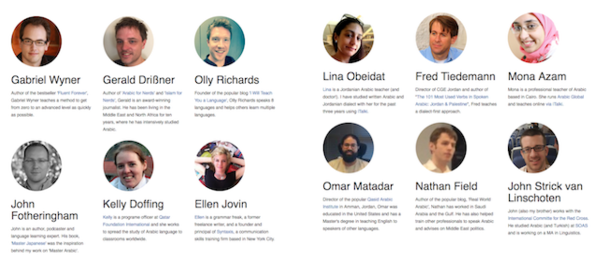

*Master Arabic* is the book I wish I'd had when I got the end of my university programme studying Arabic. I'm really happy with how it's turned out, especially the resource list. I discovered all sorts of new books and online materials that I'll be using in my own studies going forward.

I've updated the page for *Master Arabic* to more accurately reflect the differences between the basic and premium edition. Here's what you get when you order the premium edition.

- [13 Expert Interviews](http://languagecoach.io/masterarabic#interviews) - You'll receive a link to download MP3 files for you to listen at your own convenience. I chose people who have been through the challenges associated with intermediate learning plateaus, and they each offer unique tips to break through to more advanced levels.
- [Discount Codes](http://languagecoach.io/masterarabic#discounts) - Exclusive discount codes from some useful language services and publishers. Language learning can be expensive; these codes offer some respite.
- Online Resource List - I've scoured the web and physical bookstores to pick out the best resources available for the intermediate language learner. This is a 'living document', continually updated as I come across new materials. The resources are organised into topics / areas, and there are dialect-specific sections as well.
- Cheat Sheet - Most Common 1000 Words - learning this list will make more of the things you read and listen to comprehensible.
- Cheat Sheet - [Tim Ferriss' Deconstruction Dozen](http://fourhourworkweek.com/2007/11/07/how-to-learn-but-not-master-any-language-in-1-hour-plus-a-favor/) - Twelve sentences that reveal the core grammatical structures and principles at work in the Arabic language.
- Cheat Sheet - Tool Overview - An overview of some of the main tools and tricks you can use to work on specific skills or areas of your study.
- Cheat Sheet - Goal-Setting Worksheet - a one-page chart to help you think about the goals you set. (Corresponds to a section in the book on goal-setting.)
- Cheat Sheet - Arabizi - a one-page quick reference chart for the symbols and letters used to type unique Arabic letters using English script. Essential for txting and chatting with friends!
- Access to the exclusive [Incremental Elephant](http://incrementalelephant.org/) forum to discuss language learning and your Arabic progress
- Sample Study Plans - I've included suggested activities you can use to customise your own plan. Includes samples for those who only have 30 minutes each day as well as someone working on an intensive study programme (either in-country or at a university)
- [Spread the Learning!](http://languagecoach.io/masterarabic#copyforfriend) - Buy the premium edition and I'll send a PDF copy of the book to a friend, free of charge!
- Lifetime updates - Receive lifetime updates to the book's text. I continue to work on the text and when a new release is available, premium customers can download the update for free.

You can view a list of the thirteen people I interviewed [here](http://languagecoach.io/masterarabic#interviews).

There are also six discount codes offered with the premium package:

- [Bliu Bliu](https://bliubliu.com/) - Get 3 months Premium for free when you enroll in the Arabic Challenge.
- [iTalki](https://www.italki.com/i/fHDd6) - Get $10 of language classes for free with your first purchase and the exclusive premium code. (PRE-ORDER ONLY)
- [Glossika](https://glossika.com/) - 25% off for purchases in their online store
- [Foreigncy](http://foreigncy.us/) - Get a 10% discount on six-month and annual subscriptions with the exclusive premium code. (PRE-ORDER ONLY)
- [Talk in Arabic](http://talkinarabic.com/) - Discounted subscriptions.
- [Beeminder](https://www.beeminder.com/) - Get a 20% discount on all premium plans with the exclusive premium code.

(Note, two of the premium codes are only valid if you pre-order the book.)
