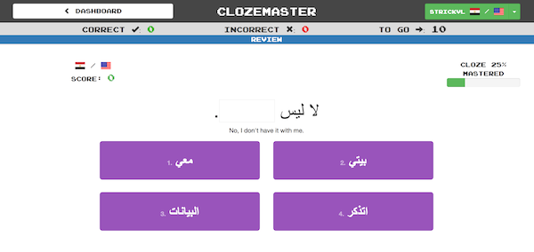

[Clozemaster](https://www.clozemaster.com/) is a service I discovered recently while researching the resource guide for my new book, [Master Arabic](http://languagecoach.io/masterarabic). Clozemaster is intended to be a next step for students who have mastered some of the basics of their language of study. It teaches the language through a game where you identify the missing word. Here's what one of their tests look like, for example:

You can see that it has a space where a word is blocked out. Four options are available below, from which you have to choose. Of course, number two is the correct option and by clicking it you move onto the next question.

The sentences are taken from a wonderful open-source project called [Tatoeba](http://tatoeba.org/). Tatoeba is a collection of sentences and translations which are curated and gathered through crowd-sourcing.

Clozemaster hooks into the corpus of sentences available in Tatoeba and serves up tests ordered by how commonly the word is found (i.e. its frequency ranking).

If you're wondering why this is useful, it helps to know a little about how we best learn vocabulary. The gold standard of vocabulary acquisition happens through context. You learn the word when it is used in a real sentence or scenario, and where you derive all sorts of clues from the words around it. This is how we learn words when we're growing up, and it's how we continue to learn words and concepts in adulthood.

Clozemaster, therefore, is a great tool for someone who has mastered the basics of grammar in their language of study but who wants to grow their vocabulary further. At that stage, it doesn't help to learn words in isolation like services like Memrise have you doing. Instead, learn through reading, or learn through services like Clozemaster. The service is free and would be ideal for someone who's just finished Duolingo in a particular language (for example).
