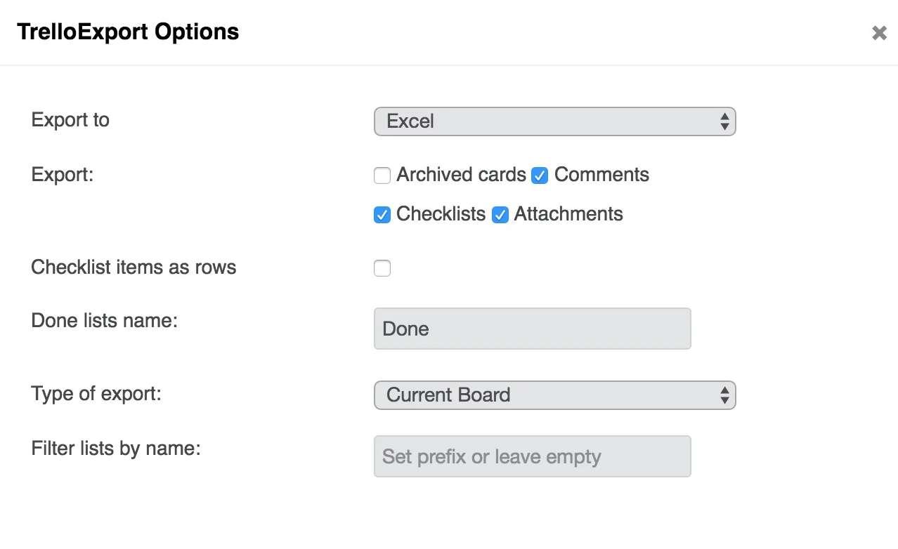

Turns out, whenever you need something on the internet, someone else has already made it.

I was looking around for a way to get several hundred Trello notes (and their descriptions) into a format where I could work on the texts in an offline format. (Trello doesn't have an offline mode.)

I found this excellent extension (made by '[Trapias](https://github.com/trapias)') which allows you to get your data out of Trello. Click [here](https://chrome.google.com/webstore/detail/trelloexport/kmmnaeamjfdnbhljpedgfchjbkbomahp) for the Chrome extension itself and [here](https://github.com/trapias/TrelloExport) for the source code over on Github. You can export to HTML, Markdown, Excel and OPML. This is a great set of options, and there are all sorts of advanced selections you can make.

**To use:**

(1) Go to the board menu -> more -> print and export

(2) a new button will appear called TrelloExport. (Previously there would just have been a JSON export option).
