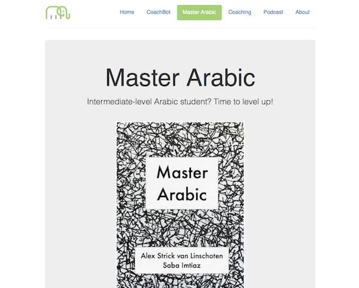

I'm very pleased to announce that 'Master Arabic' is (finally) released and available for direct download. I've been busy finalising various small details relating to the text throughout January and it's great to have it finally out and in the world.

If you haven't already had a chance to check it out, visit [this link](http://languagecoach.io/masterarabic) to learn more about what the book contains and what extra materials come alongside the book as part of the premium edition.

I'm particularly pleased with how the online resource guide turned out (with over 300 resources listed). I continue to add to it each day, too, so this is a ever-growing resource in and of itself.

As always, if you have any questions about learning Arabic or about the book, please do get in touch [on twitter](https://twitter.com/strickvl) or [via email](https://incrementalelephant.org/contact/).
