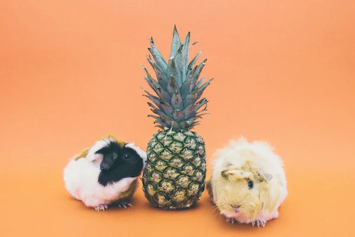

Followers of my Goodreads account will recently have noticed a flurry of activity: I read six books about guinea pigs over a period of two or three days.

The reason for this is that I'm staying in a house that has recently come into possession of a guinea pig and I became curious. What kind of an animal was this? Where did it come from? How smart was it? What were the key points to bear in mind when looking after a guinea pig as a pet?

What follows are some notes on the various books I picked up. I am unaware of a synoptic guides or bibliographies of guinea pig care practices. I looked for them online a few days back, but nothing stood out. I've ordered the books here by how complete I found them.

- Sharon Lynn Vanderlip - "[The Guinea Pig Handbook](https://www.amazon.com/Guinea-Pig-Handbook-Barrons-Handbooks-ebook/dp/B017J7YX54/ref=sr_1_2?ie=UTF8&sr=1-2&s=digital-text&keywords=guinea%2Bpig&tag=soumet-20&qid=1488293067)"

Probably the best handbook for guinea pig care (formatted for Kindle) available on the market. I can't speak to books that are only available in paperback. In any case, this is an extensive guide to food, behaviours, and even a history of the various breeds. Highly recommended as a one-stop shop for anyone who has just brought a guinea-pig into their lives.

- Gerry Bucsis & Barbara Somerville - "[Training Your Guinea Pig](https://www.amazon.com/Training-Your-Guinea-Pig-Pet-ebook/dp/B0087YNL8E/ref=sr_1_8?ie=UTF8&sr=1-8&s=digital-text&keywords=guinea%2Bpig&tag=soumet-20&qid=1488293067)"

A strong overview of how to train guinea pigs. First half of the book is a pretty extensive how-to / first-time owner information, so it's nice to have that all in one place.

- Holly Lloyd - "[Guinea Pig Care Secrets: Kids Guide to a Happy Guinea Pig](https://www.amazon.com/Guinea-Pig-Care-Secrets-Guides-ebook/dp/B00KRJLD0A/ref=pd_typ_k_sp_1_6/165-1219508-5959422?refRID=13BYYS6PQZ4FSSEVW0FY&tag=soumet-20&psc=1&_encoding=UTF8)"

Useful tips, despite the length. Sensible advice for a first-timer. Written for children to be able to read as well as adults.

- Kate H. Pellham - "[Guinea Pigs: The Essential Guide To Ownership, Care, & Training For Your Pet](https://www.amazon.com/Guinea-Pigs-Essential-Ownership-Training-ebook/dp/B011A5KO0O/ref=sr_1_1?ie=UTF8&sr=1-1&s=digital-text&keywords=guinea%2Bpig&tag=soumet-20&qid=1488293067)"

Quick but to the point.

- Sarah Yee - "[Guinea Pigs Owner Handbook: The Complete Beginner's Guide to Guinea Pig Care and Facts](https://www.amazon.com/Guinea-Pigs-Owner-Handbook-Beginners-ebook/dp/B00UYZJZFM/ref=pd_typ_k_sp_1_1/165-1219508-5959422?refRID=13BYYS6PQZ4FSSEVW0FY&tag=soumet-20&psc=1&_encoding=UTF8)"

Useful. Didn't blow my mind. Very basic and short.

- Julie Rach Mancini - "[Guinea Pigs](https://www.amazon.com/Guinea-Pigs-Animal-Planet%C2%AE-Library-ebook/dp/B00BBXPN8O/ref=pd_typ_k_sp_1_4/165-1219508-5959422?refRID=0CEFFQSFSKBEN2RR90E4&tag=soumet-20&psc=1&_encoding=UTF8)"

Short. Simple. Basic overview. No depth to it. Suitable for children, perhaps.
