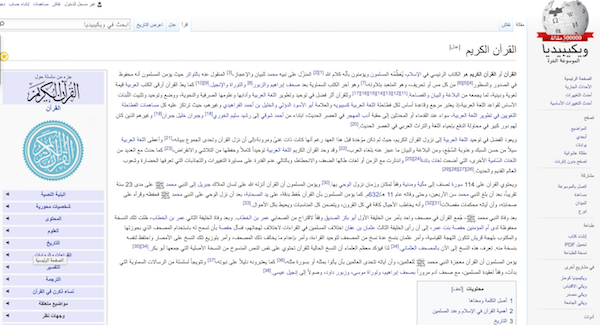
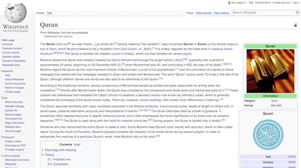

[caption id="" align="alignnone" width="600"] This is what a Wikipedia site looks like in Arabic [/caption]

Anyone who's ever studied Arabic and attempted to increase their exposure to the language through the internet will have encountered this problem: Arabic fonts are always two or three sizes smaller than their English/Roman alphabet equivalent. This can make navigating the web a dispiriting experience. Most big websites take a lot of time and effort to get their browsing experience just right, with fonts that are appropriately scaled and optimised for reading. (Get a sense of how much thought goes into typefaces [here](https://www.quora.com/Which-typefaces-does-The-New-York-Times-use), for example, at the New York Times.)

So why does this happen? At first I thought it was just a case of Arabic fonts being very much a sideshow in the what-doesn't-everyone-else-speak-english show that encompasses so much of Silicon Valley's design mentality. The most-used products are generally designed for an English-speaking audience, with people writing from left-to-right. Apple and Android's operating systems both work and function much better / logically when set to a Roman alphabet / layout. I happen to have my phones and computers set to an Arabic alphabet, and it's blindingly obvious that less thought went into designing the experience for such Arabic-speaking users. (For a more detailed explanation of some of the deficiencies of Arabic fonts, [read this](http://www.arabictype.com/blog/articles/problems-of-arabic-typefaces/) and [this](https://www.wired.com/2015/10/why-its-so-hard-to-design-arabic-typefaces/).)

What's worse, the consistency is subject to random change. To give one small example, iOS's 'Save to Evernote' dialogue box allows me to save articles from [Instapaper](https://www.instapaper.com/) into [Evernote](https://www.evernote.com/). (This is part of my somewhat laborious workflow for getting articles into [DevonThink](http://www.devontechnologies.com/products/devonthink/overview.html). [Read here](https://www.alexstrick.com/blog/2014/10/note-taking-jujitsu-or-how-i-make-sense-of-what-i-read) for more.) For years, I clicked a button in the right-hand corner to 'save', but a few months back they switched all the boxes around and now I have to click in the left-hand corner. The muscle memory is such that this is a hard one to fix. It's not the end of the world, but it still is an indication (along with the many other times this happens, seemingly without plan) of how little thought goes into this design and user interface work.

[caption id="" align="alignnone" width="600"] This is what the English version of Wikipedia looks like [/caption]

Coming back to fonts, the real reason for why this happens has to do with the amount of vertical space that letters take up. Thomas Phinney of FontLab [explained it clearly](https://www.quora.com/Why-are-default-Arabic-fonts-so-small) over on Quora when he wrote:

*"Arabic letters have a smaller body relative to the extenders above and below, so the most common elements are smaller relative to everything else. Because the height of the font needs to more-or-less fit within the body size, Arabic looks smaller than Latin at the same point size."*

There are three main approaches to solving this problem:

1. Deal with it. A lot of internet 'advice' tends towards this attitude. It's probably wise, but not especially practical for those early on in their studies of Arabic, nor even particularly practical for general audiences who want a pleasant reading experience.
2. Zoom in on the page. CTRL+ or CMD+ will do this on most browsers. Unfortunately, it messes with the rest of the design and functionality of the page, so you'll usually have a pretty unpleasant experience if you do this.
3. Install something to make the Arabic letters bigger. There are some scripts that will do this for you that you can have [Greasemonkey](https://en.wikipedia.org/wiki/Greasemonkey) (in Firefox) or [Tampermonkey](https://tampermonkey.net/) (in Chrome) handle. These two ([here](https://www.reddit.com/r/learn_arabic/comments/1h3zte/arabic_font_too_small/) and [here](https://www.reddit.com/r/csshelp/comments/13itgs/is_there_anyway_to_increase_the_font_size_of_text/)) seem to be the best known. I have tried both and couldn't get them to work. Needless to say, this is pretty fiddly and not at all ideal.

For now, it seems we're stuck with a poor browser and operating system experience.

UPDATE: Gerald Drißner (of '[Arabic for Nerds](http://www.arabic-for-nerds.com/)') suggested a Chrome extension, [Huruf](https://chrome.google.com/webstore/detail/huruf/lhdifindchogekmjooeiolmjdlheilae), which I have now installed and seems to work pretty well. Try that if you use Chrome!
