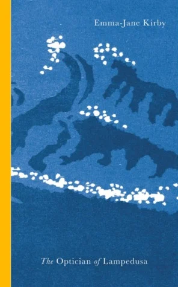

> "How naive he'd been, thought the optician, how naive. Because there would always be greater sorrow, deeper and more unfathomable than any of us could ever imagine.” (p. 83)

Bad things happen all the time. Suffering is a feature of life for many people. When this suffering happens on our doorstep, an initial flurry of interest is followed by a long steady wane as what was the extraordinary becomes routine. So it is with the boatloads of people making their way towards Europe. For a brief moment, Europe seemed to care. The passage of time saw even these tragic stories become absorbed into the fabric of ‘normal life’.

Emma Jane Kirby’s book, [*The Optician of Lampedusa*](https://www.bookfinder.com/search/?ac=sl&st=sl&ref=bf_s2_a1_t1_1&qi=0cn2JjkMiH,I5O3MZ6aijiObYE4_1496574461_1:1:4&bq=author%3Demma-jane%2520kirby%26title%3Doptician%2520of%2520lampedusa) hits the pause button on our collective forgetting. This is an Italian optician’s story, a short tale of his coming into contact with the raw human tragedy occurring with regularity on Europe’s southern shores. The optician is sailing with friends when he comes across hundreds of drowning Eritreans (among others). The book chronicles the moments before, during and after their rescue.

Kirby’s strength is to stick to detailed observations, relaying what was going through the Italian optician’s mind, what he was seeing and hearing. It (re)connects the reader with the unvarnished reality of those being smuggled into Europe. It’s a unique account in its directness, and was a sober reminder of something that I had started to forget.

If I have one criticism of the book, it is the perspective. I would far rather have read a book by one of the survivors, or at least to hear the story in their words. I understand that European publishers feel like they need a white face to relay the stories of ‘the other’, I just wish it wasn’t the case. Nevertheless, this was a sensitively written account and one I will be recommending to friends and family.
