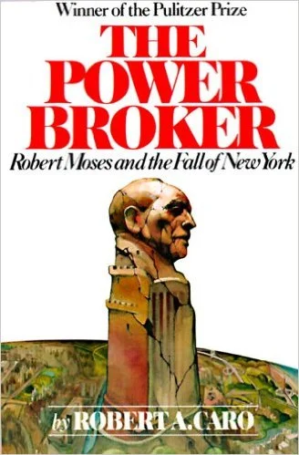

One million words. More.

The Power Broker is the kind of book you see in a bookshop, pick it up, put it back down again because its weight is a physical assault on your wrist.

It isn't available as a digital edition for Kindle, so you're stuck with lugging the physical copy around with you. I started this book in February, [setting up a Beeminder goal](https://www.beeminder.com/strickvl/caro-powerbroker) to keep me on track. The pages are large and the type small, so even a goal of reading twenty pages a day took 30-45 minutes.

I persevered, despite some weeks where I was travelling and therefore separated from the 1.3 kilogramme tome.

It was worth it. At over a million words, Caro obviously has the space to include a good deal of detail.

Robert Moses, if you're still reading by this point, is the subject of this biography. Moses worked in city planning, transportation and huge building projects in the New York state area (and some other big ones elsewhere in the United States). Caro's book details his life story, showing how Moses' drive 'got things done' in and around the city. Whether it was building roads or huge buildings, Moses was a force to be reckoned with in political as well as administrative terms.

Caro approaches his subject from a number of different perspectives. He appears to have read a huge amount of the raw primary source material in the public domain as well as interviewed 522 individuals close to or involved in Moses' work. That he managed to keep the book so readable is almost a miracle in and of itself. Every page draws you in, details and stories and glimpses that make Moses and the times in which he live come to life.

There are so many amazing details and sections to this book that picking any one would detract from the whole. If you have the time (and the stamina), give this book a read, even if you have no prior interest in urban planning. Highly recommended.
