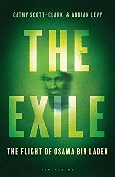

There is [no shortage of books](https://www.goodreads.com/shelf/show/9-11) on the September 11 attacks and their aftermath. Some stand back to analyse it in terms of trends and networks, seeking to explain the 'why' through abstractions. Others have written participant accounts or their histories from the sidelines. [The Exile](https://www.amazon.com/Exile-Stunning-Inside-Story-Flight-ebook/dp/B06XBQ7ZL8/ref=sr_tnr_p_2_156628011_1_twi_kin_1?sr=8-2&ie=UTF8&keywords=the%2Bexile&tag=soumet-20&qid=1494056669) offers a fulsome corrective to this trend towards abstraction. Curious what life was like for bin Laden, his commanders and their families? Cathy Scott-Clark and Adrian Levy deliver in spades.

The beating heart of this book are the stories of bin Laden's wives, their children and their life in 'exile'. The authors seem to have managed to achieve as yet unparalleled access to the wives and some other family members of Osama bin Laden, and their tale is both gripping and believable. The second important contribution that the book makes is to reveal Iran's role in hosting the bin Laden families (and commanders) post-2001. The rich detail goes a long way to giving the reader a sense of the day-to-day frustrations of their lives in Tehran (and other places) as well as their interactions with Iranian military and government officials. The book would be worth its price just for these sections alone.

Chapter Eleven tells the story of the night bin Laden died, to a large extent from the perspective of his wives and family members. They also weave in accounts from US soldiers participating in the raid, but this is a perspective we have been denied till now and I think it is an important one. Indeed, the trauma faced by the children on that night (and throughout the years prior, for the most part unable to leave their home) is one of the understated but crucial themes that stand out from 'The Exile'.

Every account of bin Laden's time post-2001 has to grapple with the question of Pakistan's role. The authors take a smart position throughout the book, which is to abstain from abstraction and a strong analytic voice. There are some claims of Pakistani ISI involvement and meetings here and there, but they step back a little before charging the government or senior officials with a state-level conspiracy. Whatever happened, this account holds, was much more an affair of bit players.

The book had the feeling of being rushed to press. It must have cost a lot to research the book, so perhaps the authors simply ran out of funds, but it seemed like there were so many other lines of enquiry that could have been started. The hardcover copy I read still had a fairly large number of typos, and it's a shame that the authors use the word "Afghanis" to refer to Afghans.

The book is extremely readable -- it kept me up until two in the morning as I finished it -- and this is in large part because of the use of dialogue and building up narrative tension through conversations. Unfortunately, the handling of some of these conversations -- reported through interviews with participants -- strains credulity. Study of memory and oral history has shown how these kinds of memories degrade or get reshaped with each telling, and I wish there were more caveats throughout the book that what we're reading is an approximation of what happened in order to better imaginatively enter the situation.

All in all, though, The Exile is an important book, an engrossing read and hopefully the beginning of more enquiries as others follow up on leads and side-stories raised in the telling. I took copious notes and will be digesting its various contents for a while, I think. It seems that scholars of September 11 and its aftermath are doomed to eternally reading and retelling the same events in slightly different contortions as new facts and witnesses emerge. If all the books were as good as this one, I wouldn't mind so so much.
