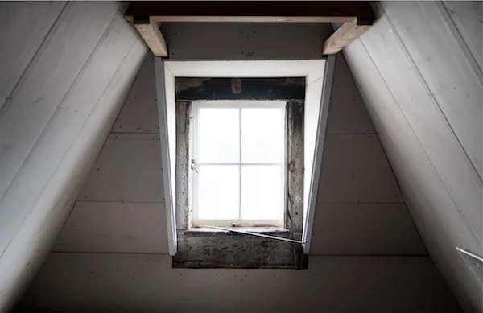

*[This is a continuation of Taylor's blog series where she details some of the week-in-week-out lessons that she learns through her Arabic studies and* [*coaching work*](http://languagecoach.io/coaching)*together with me. For other posts in the series,*[*click here.*](https://www.alexstrick.com/blog/?tag=taylorjournal#show-archive)*]*

My first time around with immersive language learning (studying for a semester in Brazil ten years ago), it was a no-brainer that I would do a homestay. I was a college student, I had no local networks to tap into to find housing, and forgoing a degree of privacy and independence felt not so different from the dorm life I was living the rest of the year. Furthermore, an employee of my school coordinated an apartment for me from the start, and back then I wasn’t as intentional, organized, and proactive about my learning as I am now.  
  
By the time I got to Amman to bump up my Arabic studies last December, I only briefly considered doing a homestay. I wanted my own place or to at least live with other young people like me — I’d have guests visiting, I like to do yoga in my home, spend long times in the kitchen making vegetarian food and listening to podcasts, stay up late laughing with my mom on skype, etc. I also work part-time remotely each day, and I needed to make sure I’d have a quiet place appropriate for that.  
  
About six months into studying, however, I started to think about a homestay seriously for the first time. I had a persistent feeling that my ability to read native texts and understand a newscast was beyond my ability to make small talk or say “Excuse me, I need to go brush my teeth.”   
  
I had a home in Amman and wasn’t going to force a homestay to happen, but I also began laying out feelers for families of all women interested in hosting a 30-year-old journalist. I had a happening Amman social life by half a year into my stay in the city, with morning yoga, friends who’d pick me up for running groups, dinner parties out, and meetings at coffee shops with my language partner. If I was going to stay with a family, it would ideally be one that understood my educational goals in Amman and how those various parts of my daily life fit into it.  
  
I lucked out. A friend who coaches a track team broached the idea with a student who lives with her three sisters, parents and grandmother. The sisters range from kindergarten to college-aged and are a lively pack that zips around the city for their own activities each day, be it shopping, going to a sports team practice, or all the daughters going to the *balad* for a sisters meal out. Their home also had an open-door policy for all the neighbourhood youth, and throughout the day I’d have a smiley primary school girl telling me about the barbecue she ate the day before with her family or an Iraqi pharmaceutical student telling me about the *farsi* words he uses in dialect back home.    
  
Alex has emphasized to me the importance of speaking to a variety of people, since it can be deceptive to feel so confident speaking with language teachers and then, say, find groups of old people really challenging. The times when I was speaking with the grandmother of the family and the kindergarten daughter were indeed my hardest moments, but also fun, no-pressure ones *Tayta* usually wanted to know my whereabouts throughout the day and my travel plans. The little girl generally liked talking about her dog or the puppy show we saw in the circus together.  
  
My favourite time of day was bedtime, when myself and the oldest and youngest daughter all went to bed together in the same room, chattering until we drifted off to sleep. I realized I had never needed to learn to say “Shall I turn off the light?” to anyone in all of my classes (بطفي الضوء؟)  
  
I wish I had worked more with a notebook to write down new words and phrases I was hearing, but that house was full of life, and I floated between rooms and conversations and meals and situations throughout the day. Their conversations amongst themselves were often too fast for me, and sometimes I knew only the main outlines of what they were discussing and missed what specific point was funny or surprising. There was a huge difference between having a one-on-one conversation versus participating in the group chat – the former was a speaking exercise, whereas the latter was largely a listening one. I was once very lost in a conversation about food that involved peals of laughter until I recognized one word I knew (كبد) and realized they were talking about eating the internal organs of animals.   
  
Even if I hadn’t learned a single new word (thankfully, I did), it was a valuable booster shot to my confidence to be able to know that yes, I can live amongst a family and handle myself in day-to-day situations. I brought up basic things that I wanted to resolve in Amman with them, like explaining I wanted to find a quality and affordable dentist (they took me to a great one) and that I had Brazilian friends looking for an affordable way to send money abroad (hence many discussions about bank accounts and foreign currencies and a final group trip to MoneyGram).

In the end, I stayed about two very happy weeks with them. I could always have done more toward a laser-focus goal of learning Arabic – I could have stayed with them from day one, I could have refused to speak with anyone in English all of my time in Amman, I could have lived in more remote parts of the country where I would be a rare foreigner. But one takeaway I have from my Brazil years is that, for me as a journalist, an immersive experience in a new place is a big-tent one: the gringos are part of it, the English-speaking locals with a foot abroad are a part of it, my bilingual running group and morning yoga are parts of it, the other language students working toward the same goals that I am are a part of it. The college-aged daughter who took me under the wing for my weeks in her home was about to study abroad in Germany, which I think is why she got my loosely defined “spend time with a family” goal so well. My next hope is that I’ll be able to open my doors to the sisters and offer them a home abroad someday.
