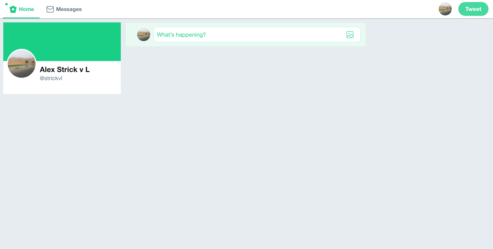

I've [previously written](https://www.alexstrick.com/blog/turn-off-facebook) about how I turned off Facebook's news feed. I keep an account with Facebook because people occasionally contact me there. It is also an unfortunate truth that many companies in Jordan (where I live) or in the wider Middle East *only* have representation on Facebook instead of their own website. (Why they insist on doing this baffles me and is perhaps a topic for a future post).

I have long preferred Twitter as a medium for filtering through or touching -- however obliquely -- things going on at any particular moment. I have no pretensions to actively follow every single tweet to pass through my feed. Rather, it's something I dip into every now and then.

Increasingly in recent months, I found myself growing dissatisfied with the pull it often has on me. It has become something of a truism to state that 'twitter isn't what it once was', but there's less and less long-term benefit in following discussions as and when they happen.

[RescueTime](https://www.rescuetime.com/) tells me that I spent 86 hours and 16 minutes on Twitter in 2017 -- just under quarter of an hour each day. That feels like a lot to me.

Enter '[Tweet to the Void](https://chrome.google.com/webstore/detail/tweet-to-the-void/jicdanpdmekcldpgdkmlmffgfoafgckh)'. This is a Chrome extension. (For Firefox and other browsers, I have to imagine things like this exist.) When I visit twitter.com, the feed is not visible. All I see is somewhere to post a tweet if that's what I want to do. (There is still some value in posting blogposts and articles there, since I know some people don't use RSS). Of course, I can always turn off the extension with ease, but adding this extra step has effectively neutralised Twitter for me.

Try it; see how you feel about having something standing in the way of your social media fix. Let me know how you get on.
