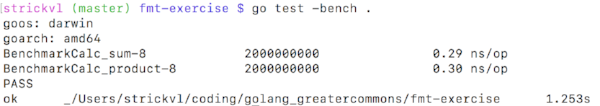

I've been trying to figure out a way to work my way into increasingly complex Go explorations. I thought I'd start at the most simple and expand from there.

I thought I'd start off with a simple **fmt****.****Println** command. I loaded up [GoLand](https://www.jetbrains.com/go/) only to find that I had 2 days left in my trial for the software. Open-source software is much more my scene, so I downloaded [Atom](https://atom.io/) and continued my coding there.

At first I wrote a basic draft of my code. I couldn't figure out how to test it, however, perhaps because my function wasn't **return**ing anything, so I switched gears. No point getting distracted by these details. I wrote a function that definetely did return something: the sum of two integers.

[My code is all available [here](https://github.com/strickvl/golang_greatercommons/tree/master/fmt-exercise).]

I wrote examples for all my functions using the ExampleFunctionname syntax [as described](https://golang.org/pkg/testing/#hdr-Examples) in the golang spec / documentation but I couldn't seem to get that to work. I'll have to return to that in due course.

Benchmarking worked fine. Go's benchmarking tools figure out how many times they need to run a particular function in order to properly test it. In my case, each function ran two billion times for an average of 0.29 and 0.3 nanoseconds per iteration. Pretty fast! I have no baseline for knowing how fast that is, but it seems fast to me. Of course, the function isn't doing anything particularly taxing.

My next task will be to figure out table testing so that instead of my current setup where I have the values for each test written out manually, and just one test per function, I want to have many different sets of values to test.
