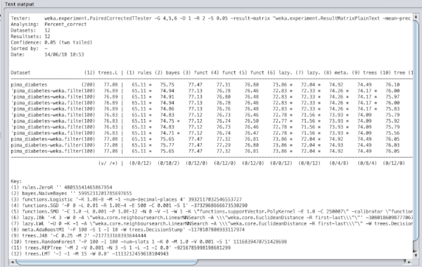
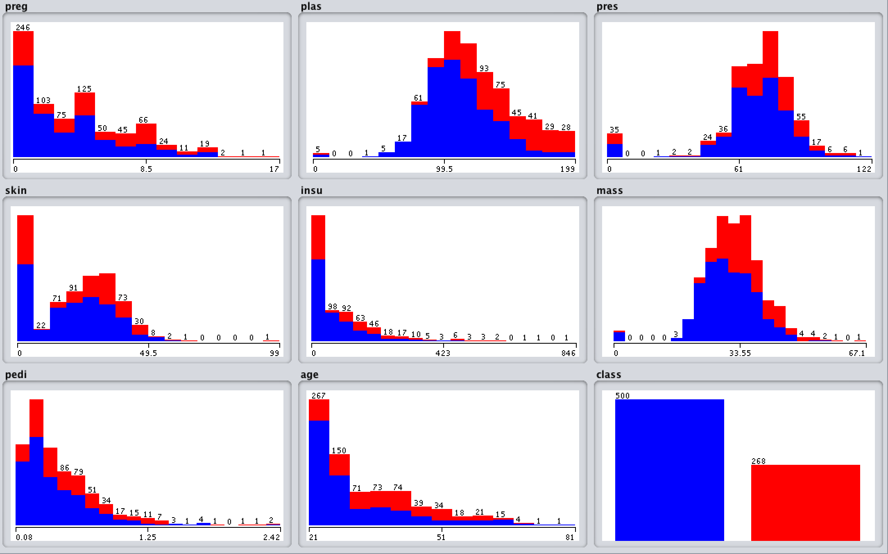
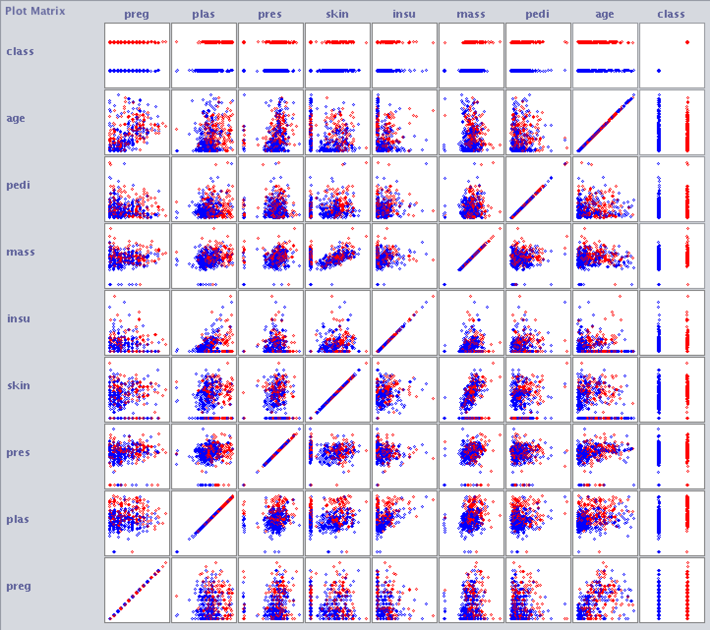
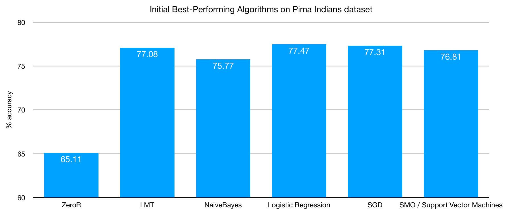
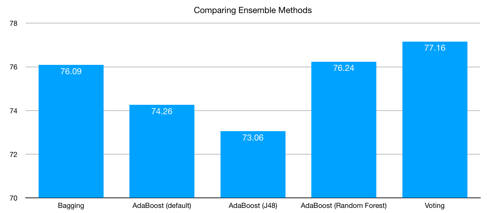

*[I [mentioned two weeks ago](https://www.alexstrick.com/blog/ml-with-weka) that I was working to dive into the practical uses of machine learning algorithms. This is the first of a series of posts where I show what I’ve been working on.]*

The [Pima Indians dataset](https://www.kaggle.com/uciml/pima-indians-diabetes-database) is well-known among beginners to machine learning because it is a binary classification problem and has nice, clean data. The simplicity made it an attractive option. In what follows I’ll be mostly following [a process outlined by Jason Brownlee](https://machinelearningmastery.com/process-for-working-through-machine-learning-problems/) on his blog.

The Pima Indian population are based near Phoenix, Arizona (USA). They have been heavily studied since 1965 on account of high rates of diabetes. This dataset contains measurements for 768 female subjects, all aged 21 years and above. The attributes are as follows, and I list them here since they weren’t explicitly stated in the version of the data that came with Weka and I only found them after a bit of digging online:

- **preg** - the number of times the subject had been pregnant
- **plan** - the concentration of blood plasma glucose (two hours after drinking a glucose solution)
- **pres** - diastolic blood pressure in mmHg
- **skin** - triceps skin fold thickness in mm
- **insu** - serum insulin (two hours after drinking glucose solution)
- **mass** - body mass index ((weight/height)\*\*2)
- **pedi** - ‘diabetes pedigree function’ (a measurement I didn’t quite understand but it relates to the extent to which an individual has some kind of hereditary or genetic risk of diabetes higher than the norm)
- **age** - in years

This video gives a bit of helpful context to the data and the test subjects:

<https://www.youtube.com/watch?v=pN4HqWRybwk>

I also came across a book by David H. DeJong called “[Stealing the Gila: The Pima Agricultural Economy and Water Deprivation, 1848-1921](https://www.amazon.com/Stealing-Gila-Agricultural-Deprivation-1848-1921-ebook/dp/B01MRP56BQ/ref=sr_1_11?sr=8-11&ie=UTF8&keywords=pima%2Bindians&tag=soumet-20&qid=1529241393)” which describes how the diverting of water and other policies “reduced [the Pima] to cycles of poverty, their lives destroyed by greed and disrespect for the law, as well as legal decisions made for personal gain.” It looks like a really interesting read.

## The Problem

The idea with this data set is to take the attributes listed above, combine them with the labelling (i.e. we know who has been diagnosed with diabetes and who hasn’t) and figure out the pattern as much as we can. Can we figure out if someone is likely to have diabetes just by taking a few of these measurements?

The promise of machine learning and other related statistical tools is that we can learn from the data that we have to make testing more useful. Perhaps we only need your height, genetic risk factor and skin thickness to make such a prediction? (Unlikely, but still, perhaps…). If we emerge from our study with a statistical model, how well does it perform? How much can we generalise from the data? What would be an acceptable error rate in the medical context? Is it 80% or is it 99.99%? The former would save millions of dollars in test costs but would throw lots of errors; the latter would be highly accurate but it might be expensive to calculate the model.

The use case for this specific case would maybe be to identify at-risk individuals who are *on the way* to a diagnosis of diabetes and intervene somehow. Our motivation here is clear: people don’t want to be diabetic, so how early can we catch this transition? It would save governments money, expose fewer people to unnecessary tests and improve their quality of life.

I’m not a doctor, but to solve this problem manually would seem to require monitoring of blood tests (glucose and insulin levels), perhaps looking at exercise and diet, and also weight. At scale across the population of an entire country, for example, this seems like it might get expensive and/or too much for one person to process in their head. The data isn’t *too* large or complex, but it still seems to be useful you’d want to automate it to some extent.

There are some potential ethical issues around the data. Everything offered as part of the table of data is anonymised, but there are some outliers (see below) that I have to believe wouldn’t be too hard to find. The applicability of whatever model comes from this data will likely only have a limited application — the data is drawn only from women, after all. I also noticed that while the data is no longer available on the [UCI Machine Learning Repository](https://archive.ics.uci.edu/ml/datasets.html) website, it still comes packaged with Weka. There was a notice on the UCI site (which I can no longer seem to be able to locate) stating that the permission to host the data had expired. It is unclear to me what’s going on with the permission there.

## Data Preparation

Exploring the data using Weka’s explorer tool plus the attribute list above we can see that we have some blood test data, some non-blood body measurements and this genetic marker (presumably achieved through either blood tests or interview questions about family history). As I was working to understand the various attributes, it occurred to me that for this to be really useful, we’d want our model to work on data that wasn’t derived from blood tests; they’re expensive and they’re invasive. I didn’t get round to doing that for this round of exploration but it’d be high up on my wishlist next time I return to this data.

There are only 768 instances, so it’s still quite a small data set, especially in the context of machine learning examples. This is probably explained by the fact that it’s real medical data (so there are consent issues) plus the fact that it is several decades old and the processing power available then didn’t lend itself to processing mega-huge sets.

Thinking about what attributes might be removed to make a simpler model, I first thought that maybe the number-of-pregnancies might be dispensable, but then I thought to the number of hormonal and other changes that happen and I guess actually it is probably quite important.

There were some outliers in the data that I identified as needing further consideration / processing before we get our model trained:

- There were some women who had been pregnant 16 or 17 times. They were on the far edge of the long tail, but I ended up leaving them in for the model rather than deleting them completely.
- There were 5 people who had 0 as their result for ‘plus’, which seems to be an error. I decided to remove these.
- There were 35 people who had 0 as their blood pressure, which seems to be an error.
- There were 227 people with 0mm skin thickness. This is *possible*, but I think it’s more likely that no measurement was taken, at least for a lot of them.
- There were 11 people who are listed as weighing 0kg. That seems to be an error.

After I’d identified these various outliers I decided to make a series of transformations to the whole set. From this I’d emerge with three broad versions of the data:

1. the baseline dataset, with nothing removed or changed
2. the outliers removed completely and replaced with *NaN* values
3. the outliers replaced with mean averages for each particular attribute

For each of these broad versions, moreover, I prepared three separate versions:

1. all values normalised (ranges and values for all attributes transformed to being from 0-1 instead of being in their original ranges. i.e. maximum weight as 1 and minimum weight as 0 etc)
2. all values standardised (set the mean for the data as being zero and the standard deviation to 1)
3. all values normalised *and* standardised (i.e. both transformations applied)

Producing these various versions of the data was something I learned from Brownlee’s book, “[Machine Learning Mastery With Weka](https://machinelearningmastery.com/machine-learning-mastery-weka/)”. It turned out to be somewhat fiddly to do in Weka. In particular, every time you want to open up a file to apply transformations the default folder it remembers is often several folders down in the folder hierarchy. By the ninth transformation (there were nine sets in total, by the end of this process) I was ready for a more functional / automated approach to these data conversions!

Weka does offer some nice tools for the initial exploration of the data. Here you can see two charts that are generated in the ‘explorer’ application. First we have a series of simple bar charts visualising all the individual attributes. Then we have a plot matrix showing how all the various attributes correlate to each other (or not, as was mostly the case for this data set).

[caption id="" align="alignnone" width="2168"] Visualisation of Pima Indians dataset attributes (auto-generated in Weka) [/caption]
[caption id="" align="alignnone" width="1444"] Plot matrix showing visualisation of correlations between all attributes (auto-generated using Weka) [/caption]

## Choosing Algorithms and Training the Model

Given that I’m very much at the beginning of my machine learning journey, I don’t have any strong sense of which algorithms might be more appropriate or not for this particular data set. I knew that this is a classification problem and not regression (i.e. we’re trying to decide whether people have diabetes or not — two categories — instead of predicting where people fall on a scale / spectrum) so that ruled out a few options, but really the field was wide open.

Jason Brownlee advises taking a sample of around ten different algorithm families to get an initial sense of whether there are any clear outliers (either over-performers or under-performers). Once I have a better sense of the overall space, I can then tweak things, or double down on a particular algorithm family to select a more limited feature set perhaps.

For this algorithmic spot-check I chose 12 algorithms, sampling from all the main families as I currently understand them. Running this set, I immediately came across an error message: Weka was telling me that the function.LinearRegression algorithm doesn’t function for classification algorithms. I removed that and reran the tests.

When doing this kind of test, it helps to have a baseline accuracy figure against which you can compare how much these fancy algorithms are improving predictions. In Weka, this is called a ZeroR algorithm and I think it basically says that everyone has no diabetes. For this dataset, it got 65.11% accuracy, which isn’t bad all things considered!

(Note that everything here is being run through k-fold cross-validation where training and test data are kept separately, and then this is repeated ten times. The final results are averaged out between them. Weka does this all with great ease, making it pleasant to conform to best practices when it comes to data science).

This figure shows how logistic regression was the best performing algorithm out of the box at 77.47% accuracy. I read somewhere that it often performs well on binary classification problems, so this didn’t surprise me. Support Vector Machines (listed as SMO in the Weka GUI) are also supposedly quite good for binary problems and it was only two-thirds of a percent behind logistic regression. Using Weka’s tools for statistical analysis of the result, I came to the conclusion that LMT, logistic regression, SGD and SMO were all worth further exploration and tinkering.

For example, I tried the following with the Support Vector Machines algorithm:

- tweaking the value of c (complexity) to see if 0.25 performed better than 0.75, for example. It turned out that 0.5 was the sweet spot for the c value.
- trying different kernels - I tried most of the options listed in Weka and they all performed pretty poorly. In particular, RBF (radial basis) was really poor.

None of my tweaks really seemed to improve the accuracy of the model. I imagine that some of the algorithms function better with more data, but I am not in a position to generate more.

The next step was to try some ensemble methods where the predictions made by multiple models are combined. In particular, bagging/bootstrap, boosting and voting were all recommended as options to try out.

You can see here that ultimately none of those outperformed logistic regression, which was surprising to me. I’m not at a place where my statistical understanding can explain why that’s the case — ensemble methods seemed to offer the best of many worlds — but I can’t really argue against the results.

Finally, I tried the MultiLayerPerceptron to throw one possible implementation of Deep Learning at the problem. This performed pretty poorly as per default configuration.

## Findings / Conclusions

The best accuracy I was able to achieve on this data set was using a logistic regression model. This performed with 77.47% accuracy (standard deviation of 4.39%). We can restate this as an accuracy of between 68.96% and 86.25% accuracy on unseen data. This is slightly disappointing since it isn’t *that* much better than the ZeroR algorithm.

Towards the latter stages of my work on this problem, I came across [a blog post](https://datanonymous.wordpress.com/using-a-neural-network-to-predict-diabetes-in-pima-indians/) by someone who used a neural network to reach results of 95% accuracy on this same data set, showing that there *are* models that bring dramatically improved performance. I don’t understand neural networks enough to be able to evaluate what he did (i.e. to know whether this is simply overfitting or actually a performant / real improvement on my results). Nevertheless, it seems like a significant improvement.

As my first big push to work on a real data set using machine learning tools, this process was instructional in the following ways:

- Weka is easy to use and it makes some of the best practices in data science no-brainers to implement
- Constructing the various data sets, implementing the experiments to compare the algorithms and so on was made slightly tedious by the GUI interface. If I wanted to run through many more variations it would have been prohibitively tiresome to have to manually click through all the options.
- Weka is slow (or maybe my linux laptop is slow). Some of the algorithm sets I tried (Support Vector Machines, for example, or ensemble methods using SVMs) took 20+ minutes to run. The data set wasn’t huge at all, so I have to imagine that a real ‘big data’ set would make this kind of quick incremental exploration and iteration difficult to practice. Weka is, of course, a Java app and I’m running that on my Mac. I suspect that if I were to run similar algorithms through Python (or even better, C) on my Mac I’d get significant performance improvements.
- I have very little sense of the variation between the various algorithms, what each one does and where the strengths and weaknesses lie. I want to tackle this from two directions: improving my baseline understanding of statistics and also just getting more experience implementing them for practical problems such as this one.

The next problem I want to tackle is that of the [UCI soybean dataset](https://archive.ics.uci.edu/ml/datasets/Soybean+(Large)). Each instance describes properties of a crop of soybeans and the task is to predict which of the 19 diseases the crop suffers. Again, the dataset isn’t huge but it is a multivariate classification problem so there are new challenges to be tackled there.
