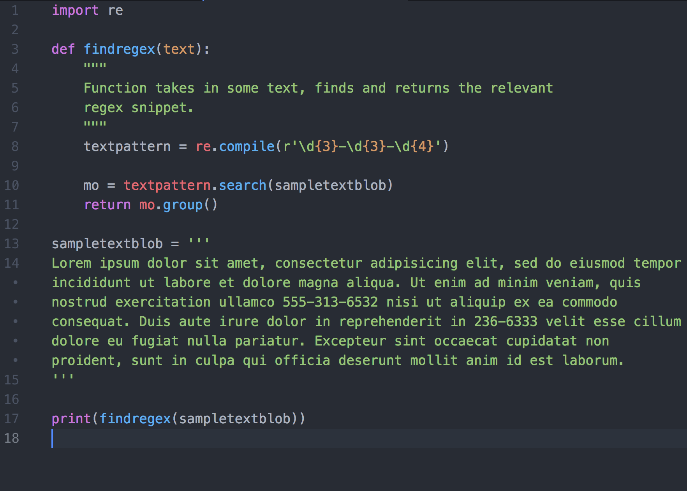

The next step in my data processing project is to find strings matching certain patterns in the PDF data. Today I worked my way through the relevant chapter ([#7](https://automatetheboringstuff.com/chapter7/)) of Al Sweigart's excellent / useful [Automate the Boring Stuff with Python](https://www.amazon.com/gp/product/1593275994/ref=as_li_tl?linkId=HDM7V3T6RHC5VVN4&linkCode=as2&creativeASIN=1593275994&creative=9325&tag=soumet-20&camp=1789&ie=UTF8).

I've left some sample code above as a reminder (mainly for myself) of the basic pattern / syntax that you can use. I saw a slightly more concise pattern for running the search in [Data Wrangling with Python](https://www.amazon.com/Data-Wrangling-Python-Tools-Easier/dp/1491948817/ref=sr_1_2?ie=UTF8&sr=1-2&s=books&keywords=data%2Bwrangling%2Bwith%2Bpython&tag=soumet-20&qid=1531068429); I may experiment with that in the future. That has you running something like:

I guess one of them will have a speed advantage, especially when multiplied over hundreds of thousands of pieces of text.

The next step with this project will be to connect this regex function with the splitting file. That way when I split the file, I can rename the file at the same time with a string that I've extracted using a regex search.

If you've reached this far and you don't know what I'm talking about, there's [an interesting article](https://www.theguardian.com/technology/2012/dec/04/ict-teach-kids-regular-expressions) by Cory Doctorow where he argues that regular expressions should probably be taught as a foundational skill to children:

> Knowing regexp can mean the difference between solving a problem in three steps and solving it in 3,000 steps. When you're a nerd, you forget that the problems you solve with a couple keystrokes can take other people days of tedious, error-prone work to slog through.
