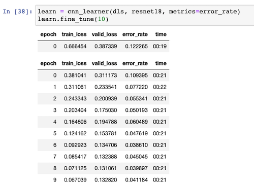

---
aliases:
- /computervision/datalabelling/fastai/redactionmodel/2021/09/06/redaction-classification-chapter-2
author: Alex Strick van Linschoten
categories:
- fastai
- redactionmodel
- computervision
- datalabelling
date: '2021-09-06'
description: How I trained a model to detect redactions in FOIA requests, using Prodigy
  for data labelling and the fastai library for model training
image: redacted_section.png
layout: post
title: Training a classifier to detect redacted documents with fastai
toc: true

---

I am working my way through [the fastai course](https://course.fast.ai) as part of an [online meetup group](https://www.meetup.com/delft-fast-ai-study-group) I host.[^1]

This week we finished the first and second chapters of the book, during which you train a model that can recognise if an image contains a cat or a dog. Later on, you train another model that distinguishes between different types of bears ('grizzly', 'black' and 'teddy').

[Jeremy Howard](https://twitter.com/jeremyphoward), who is teaching the course, then prompts you to take what you learned and apply it to something that has meaning for you. (This is something that most of those who've found any success with the course [emphasise repeatedly](https://sanyambhutani.com/how-not-to-do-fast-ai--or-any-ml-mooc-/).)

I decided to work on something adjacent to my previous life / work, where I knew there was some real-world value to be gained from such a model. I chose to train an image classifier model which would classify whether a particular image was redacted or not.

## The Problem Domain: Image Redaction

Under the [Freedom of Information Act](<https://en.wikipedia.org/wiki/Freedom_of_Information_Act_(United_States)>) (FOIA), individuals can request records and information from the US government.[^2] This is [one collection](https://www.esd.whs.mil/FOIA/Reading-Room/Reading-Room-List_2/) of some of the responses to this requests, sorted into various categories. You can read, for example, responses relating to UFOs and alien visits [here](https://www.esd.whs.mil/FOIA/Reading-Room/Reading-Room-List/UFO/).

Quite often, however, these images are censored or redacted.


Knowing that this practice exists, I thought it might be interesting to train a model that could recognise whether a particular page contained some kind of redaction. This wasn't completely in line with what we covered during the first two chapters; I wasn't sure if the pre-trained model we used would work for this data set and use case.

It could be useful to have such a tool, because FOIA responses can sometimes contain lots of data. In order to prepare a request for more data, you might want to be able to show that even though you were sent thousands of pages, most of those pages contained redactions and so were effectively useless.

In the ideal vision of this tool and how it would work, you could run a programme out of a particular directory and it would tell you how many pages (and what proportion) of your PDF files were redacted.

## Getting the Data

The first thing I did to gather my data was to download the PDF documents available on [this site](https://www.esd.whs.mil/FOIA/Reading-Room/Reading-Room-List_2/). I knew that they contained examples of redactions in FOIA documents. I used [Automator](https://support.apple.com/en-gb/guide/automator/welcome/mac) to split the PDF files up into individual images.[^3] My Automator script did some downsampling of the images as part of the process, so the images were resized to something that wasn't prohibitively large to use for training.

Note that this stage and the next was done on my local machine. A CPU was enough for my purposes at this point, though probably I'll want to eventually port the entire process over to a single cloud machine to handle things end-to-end.

At the end of the splitting-and-resizing process, I had a little over 67,000 images (of individual pages) to train with.

## Labelling the images with Prodigy

I had used Explosion.ai's [Prodigy data labelling tool](https://prodi.gy) in the past and so already had a license. The interface is clean and everything works pretty much as you'd hope. I had some teething issues getting it all working, but [Prodigy co-creator Ines](https://twitter.com/_inesmontani) helped me [work through those queries](https://support.prodi.gy/t/labelling-a-set-of-images-classification/4608/1) and I was up and running pretty quickly.


It took about three hours to annotate some 4600+ images. Then I could export a `.jsonl` file that contained the individual annotations for whether a particular image contained a redaction or not:


From that point it was pretty trivial to parse the file (using the [`json-lines` package](https://pypi.org/project/json-lines/)), and to resize the images down further in order to separate redacted from unredacted:

```python
import json_lines
from PIL import Image
from pathlib import Path

def save_resized_image_file(location_path):
    basewidth = 800
    img = Image.open(record['image'])
    wpercent = (basewidth / float(img.size[0]))
    hsize = int((float(img.size[1]) * float(wpercent)))
    img = img.resize((basewidth, hsize), Image.ANTIALIAS)
    img.save(location_path)

path = '/my_projects_directory/redaction-model'

redacted_path = path + "/redaction_training_data/" + "redacted"
unredacted_path = path + "/redaction_training_data/" + "unredacted"

with open(path + "/" + "annotations.jsonl", "rb") as f:
    for record in json_lines.reader(f):
        if record["answer"] == "accept":
            save_resized_image_file(Path(redacted_path + "/" + record['meta']['file']))
        else:
            save_resized_image_file(Path(unredacted_path + "/" + record['meta']['file']))
```

## Transferring the data to Paperspace with `magic-wormhole`

Once I had the two directories filled with the two sets of images, I zipped them up since I knew I'd want to use them on a GPU-enabled computer.

I used [`magic-wormhole`](https://magic-wormhole.readthedocs.io) to transfer the files over to my [Paperspace Gradient](https://gradient.paperspace.com) machine. The files were only about 400MB in size so it took less than a minute to transfer the data.

Again, ideally I wouldn't have this step of doing things locally first. I could certainly have done everything on the Paperspace machine from the very start, but it would have taken a bit of extra time to figure out how to process the data programatically. Moreover if I was using JupyterLab I could then [use Prodigy from within my notebooks](https://prodi.gy/docs/install#jupyterlab).

## Using the labelled data in our training

The process of ingesting all our data (labels and raw images) is pretty easy thanks to the fastai library's convenience classes and layered structure. We're using the `DataBlock` class instead of `ImageDataLoaders` for extra flexibility.

```python
path = Path('redaction_training_data')

foia_documents = DataBlock(
    blocks=(ImageBlock, CategoryBlock),
    get_items=get_image_files,
    splitter=RandomSplitter(valid_pct=0.2, seed=42),
    get_y=parent_label,
    item_tfms=Resize(224))

dls = foia_documents.dataloaders(path)

foia_documents = foia_documents.new(
    item_tfms=Resize(224, method='pad', pad_mode='reflection'),
    batch_tfms=aug_transforms(max_zoom=1))
dls = foia_documents.dataloaders(path)

learn = cnn_learner(dls, resnet18, metrics=error_rate)
learn.fine_tune(10)
```

The images get resized to 224x224 pixels, since this is the size that the `resnet` architecture expects. Since we have a good deal of labelled data, I'm comfortable using 80% of that data to train the model and the remaining 20% against which to validate.

I train it for 10 epochs as I don't appear to reach a point where I'm overfitting. As you can see from this image, we reach an accuracy of around 96%.



## Experimenting with augmentations

Initially I had been using the `RandomResizedCrop` transformation on the data, but I was reminded by someone in our group ([Jason](http://fabacademy.org/2021/labs/ulb/students/jason-pettiaux/fastai/)) that cropping or zooming our images wouldn't be useful since it is possible that both of those transformations would remove the small part of the image where a redaction was to be found.

In the end, I went with some settings that made sure we weren't zooming into images or rotating them such that parts would be missing. I think there's probably more I could squeeze out of [the documentation](https://docs.fast.ai/vision.augment.html#Resize) here, particularly so that I'm not limiting myself too much in the arguments that I'm passing in.

I chose the `pad` method with the `reflection` mode since this seemed to give the best results. The `zeros` mode was too close to an actual redaction (i.e. a black box on the image) so I ruled that out pretty early on.

## Experimenting with different architectures

The course mentions that architectures with more layers do exist. I saw that the next step up from `resnet18` was `resnet50`. I'm certainly in the territory where I'm just turning knobs in the hope of seeing some kind of result, but I thought it was maybe worth a comparison.

The danger with having more layers (and thus more parameters) is that the model is more likely to overfit. The training process also takes much longer to execute: 44 seconds per epoch compared to 21 seconds with `resnet18`. It didn't seem to measurably improve the accuracy. The best results I was able to get were still around 95%, give or take a percent or two. It seems that the real improvements are to be found in the pre-processing or augmentation stage, rather than from choosing an architecture with more layers.

## Hosting the model with MyBinder

Chapter two of the course book goes into a decent amount of detail of some of the tradeoffs and issues around model deployment. Part of the exercise is to not only train a model on your own data, but go through the steps to get the model hosted online.

Using [MyBinder](https://mybinder.org) and the [`voila` library](https://voila.readthedocs.io), alongside instructions from the book and the forums, I managed to get my model deployed. If you visit [this address](https://hub.gke2.mybinder.org/user/strickvl-binder-redaction-s1nr4p8k/voila/render/binder-redaction-classifier.ipynb?token=kReM2K-iSkmSjud5N28o8Q) you'll see an interface where you should first upload an image — i.e. a screenshot of a document. When you click 'classify', you'll then see a prediction of whether the image is redacted or not, as well as the confidence/probability that that prediction is true.


## Next steps

I'm at the point in the course where I know enough to be dangerous (i.e. train models), but I don't know how to improve them from here. Some ideas I had for ways to improve the model's accuracy:

- better augmentation choices — it's possible that I've misconfigured some argument or made the wrong choices in which augmentations should be applied.
- more labelled data — this one is pretty easy to fix, but I probably shouldn't continue down this route unless I know it's really going to help. I'm not in a position right now to be able to judge how much it'd help me.
- different redaction types — currently I have a single 'redacted' vs 'unredacted' category choice, but in reality there are several different types of redaction in the data set: some have handwritten redactions, others are square computerised boxes, and there are a couple of other types as well. I wonder whether I should train the model to recognise the different types, and then to combine those together as a 'redacted' set of categories. (I may be thinking about this wrong).

Otherwise and for now, I'm happy with where I managed to reach with this model. I have some other ideas for how to keep going with exploring this data set. For example, even better than a slightly dumb classification model would be to have a segmentation model that was able to determine what percentage of the pixels or total area of the page that were redacted. With a reasonably accurate segmentation model of that kind, we'd then be able to provide really interesting metrics on what percentage of the information provided was redacted.

I will probably also want to go back and add in the earlier processing steps into the notebook so that things are much closer to being an 'end-to-end' solution.

## Footnotes

[^1]: You can find our thread in the fastai forum [here](https://forums.fast.ai/t/virtual-study-group-delft-the-netherlands-europe-time-zone/90521).
[^2]: Other countries have variations of this law, like [this](https://www.gov.uk/make-a-freedom-of-information-request) from the United Kingdom.
[^3]: I realise that there is a programatic way to do this. At this early stage in the project, I was more eager to get going with the labelling, so I took the easy path by using Automator.
