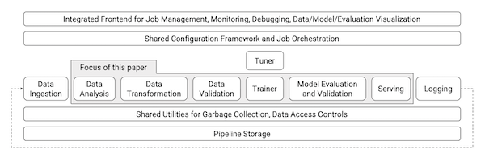

---
aliases:
- /tfx/tensorflow/google/mlops/papers-i-read/2021/09/11/tfx-paper
author: Alex Strick van Linschoten
categories:
- tfx
- tensorflow
- google
- mlops
- papers-i-read
date: '2021-09-11'
description: I extracted the core problems that TensorFlow Extended (TFX) was looking
  to solve from its 2017 public launch paper.
image: tensorflow-extended-tfx-logo-social.png
layout: post
title: Six problems TFX was trying to solve in 2017
toc: true

---

[TensorFlow Extended](https://www.tensorflow.org/tfx) or TFX is a platform for machine learning that claims to handle pretty much everything you'd need for end-to-end model training, deployment and retraining. It was developed for Google, the successor to [Sibyl](https://www.kdnuggets.com/2014/08/sibyl-google-system-large-scale-machine-learning.html), and released in public in 2017. I read [the original paper](https://www.kdd.org/kdd2017/papers/view/tfx-a-tensorflow-based-production-scale-machine-learning-platform) that accompanied its release to understand the problems it was trying to solve, as well as to get a handle on the specific context in which it was developed. (It's worth being wary about tools developed at places like Google; after all, [hardly any of us](https://blog.bradfieldcs.com/you-are-not-google-84912cf44afb) are operating at Google-scale).

## 'A TensorFlow-based general-purpose machine learning platform'

The engineers wanted a general-purpose tool, one that could serve many different use cases. I haven't yet read [the subsequent paper](https://arxiv.org/abs/2010.02013) on the history of TFX, but from what I do know already there were other in-house solutions that existed before. Machine learning model training at scale, deployment and the general full-cycle behaviours are pretty involved and challenging, and it often seems like the needs of particular scenarios demand different approaches. This is as much true now as it was back int 2017, I imagine, though perhaps now we have some ideas of the broad pieces that make up the whole picture that needs to be addressed.

The problem here is that you might have certain parts that either are very compute intensive, or require special distributed computing setups, or where the models need to be trained off streaming data rather than from static stores. So with TFX they tried to make the tool sufficiently abstract that they could handle most cases someone would want to use it for. (They say at the end that there were some parts that they hadn't anticipated, specifically sequence-to-sequence language models used in machine translation).

## An end-to-end platform

The ambition for the platform and software tooling was not just to handle the smaller pieces of the training and deployment cycle, but rather to tackle the big overarching abstractions in a single approach. This of course contained some baked-in assumptions about how users would use TFX as well as what I'd say were quasi-philosophical positions on how best to approach these various parts. The paper characterises these as 'best practices', but certainly there hasn't been uniform acceptance of these.

I imagine the end-to-end part was as much an attempt to encourage engineers to think of the problem in this exact way. If you are handling all the pieces of the training cycle, it's easier to be fast and iterate and do all the things we expect of a more agile process.

## Continuous training and serving

TFX was built to handle the kinds of models where the use cases demanded the ability to continuously retrain models using large quantities of streaming data. This is almost certainly not the norm, but for a company like Google I can understand that this would have been a key consideration if they wanted adoption of the tool across different teams.

In this way, certain scenarios (for example the Google Play Store case study outlined in the paper) saw a continuous retraining of models as more users used the service as well as new apps continued to be uploaded to the Play Store. If you have this kind of engineering need, and if you need to keep latency to certain boundaries (in the tens of milliseconds), it makes complete sense to have this whole structure that allows this to take place. Reading the specific example, it's a pretty amazing feat, handling all that complexity underneath the surface. There must be many hundreds of other such services which similar levels of complexity concealed beneath the surface.

# Reduce technical debt accrued via duplicated or ad hoc solutions

Prior to TFX and Sybil, it seems that there were many different approaches within Google, all addressing the same problem but in slightly different ways.

Having a series of best-practices built in to the service means that everyone can communicate about problems and about their issues using a shared language. It means that solutions discovered by one team can help other future teams. There's a lot to be said for finding a solution that is sufficiently abstracted to work for many people.

Indeed, it seems this is the work of the MLOps community right now: find ways to abstract away problems that we all face, and to find the best abstractions that fit within the mental models we all have in our heads. The fact that there hasn't been a grand convergence on a single solution indicates to me (at this current moment) that we haven't found the right abstractions or flexibility within those abstractions. All the end-to-end tools handle much of the same stages of the model training and deployment process, but they each have opinions about the best practices to be employed along the way. (At least, that's my current take on things).

## Reliable serving models at scale

If you're Google, you need to make sure that you aren't serving garbage models to your users, or that inconsistencies in the input data aren't polluting your retraining processes. At scale, even small mistakes compound really easily.

In the paper, two specific improvements are mentioned, tackling the challenges of low latency and high efficiency. The high efficiency example wasn't entirely comprehensible for me, but what was clear was that they had very high expectations for how fast they wanted to make all parts of the pipelines and process. As above, the challenges of making it easy and fast to serve models — all of which had to happen in a reliable manner — was something that could be reused elsewhere in the company. [TensorFlow Serving](https://www.tensorflow.org/tfx/guide/serving) is what we get from their efforts in this regard.

## Fast retraining with 'warm-starting'

For the specific challenge of retraining models with streaming data, engineers were finding that they couldn't retrain the entire model from scratch, particularly with the scale of the training data that they had. Instead, they leveraged transfer learning (reframed here as 'warm-starting') to take all the hard work that had already been done, and adapting this pre-existing model with the new data. This makes a lot of sense, though the reframing with the new term is a bit less comprehensible to me.

## Missing pieces

There are various pieces of what I think of as the machine learning workflow (as of 2021) which seem to be missing when I read this paper. Explainability or governance of models seems somewhat of an afterthought, if it is raised at all. I think the authors might argue that many of the checks and balances are made on the data ingestion phase, and that if all that checks out then this tackles a large piece of the problem surface area.

Similarly, there is relatively little said about model versioning and data versioning. Maybe coming at this from the present moment, where it seems obvious (with tools like [DVC](https://dvc.org)) that data versioning is a thing you'd want to care about.

As a general response, it seems clear that if you use [TensorFlow](https://www.tensorflow.org) to train your models, TFX might well be a pretty neat solution that handles many of your needs, particularly if you're operating at serious scale. If you're a researcher (perhaps using [PyTorch](https://pytorch.org)) with less of those specific contextual needs, it seems less than certain that TFX would suit your purposes.

A couple of other interesting observations. The data observability and validation stage seemed to place a lot of emphasis on the automation of how pre-defined schemas might get updated. I'd be interested to see how that worked in practice. I understood the challenge that if there are too many error messages about dodgy data inputs, engineers are likely to grow inured to those alerts and maybe just ignore them. But at scale, I wonder about the risks of allowing automatic updates to those schema boundaries.

Again on the validation point, I found it interesting how the authors of the paper said that users of TFX internal to Google found the option to enable this was actually a hard sell unless or until the team had experienced some kind of failure connected to poor data validation. The TFX team ended up turning on the validation parts of the pipeline by default instead of assuming that users would choose to do so manually.

I wasn't active in the field in 2017, so it's hard for me to be able to reconstruct exactly how prescient or not this paper was in some of its diagnoses of the problem. It doesn't seem that TFX was the total solution that perhaps it was pitched as being, but nonetheless it seems an important engineering achievement for Google.
