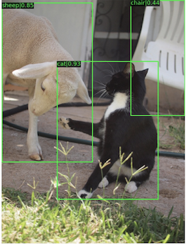

---
aliases:
- /computervision/redactionmodel/2021/11/30/vfnet-basics
author: Alex Strick van Linschoten
categories:
- redactionmodel
- computervision
date: '2021-11-30'
description: Some basics I learned about the object detection model `vfnet`.
image: vfnet.png
layout: post
title: What is VFNet?
toc: false

---

VFNet is short for VariFocalNet. This method of object detection was first released in 2008 and it scored 55.1 on the COCO test-dev benchmark, state-of-the-art at the time. There have since been [other improvements](https://paperswithcode.com/sota/object-detection-on-coco).

The original paper is [here](https://arxiv.org/abs/2008.13367v2). The implementation of this model is [here](https://github.com/hyz-xmaster/VarifocalNet).

The problem it solves is that when we're training a model, we have a large number of possible options for objects detected in an image. What we need to do is rank these options in order of likelihood of being a correct bounding of a box.

It is based on and draws on [the MMDetection model/toolbox](https://github.com/open-mmlab/mmdetection). MMDetection is a Pytorch library for object detection. It is modular, allowing for greater customisability.

## Other resources

[Airctic Presentation on VFNet](https://www.youtube.com/watch?v=wdlrK-D5K_4)
