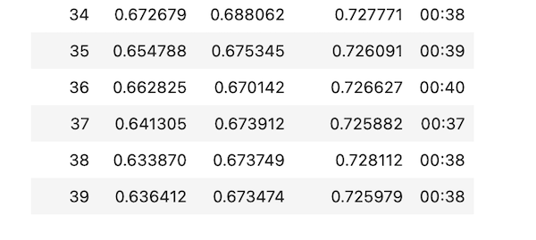
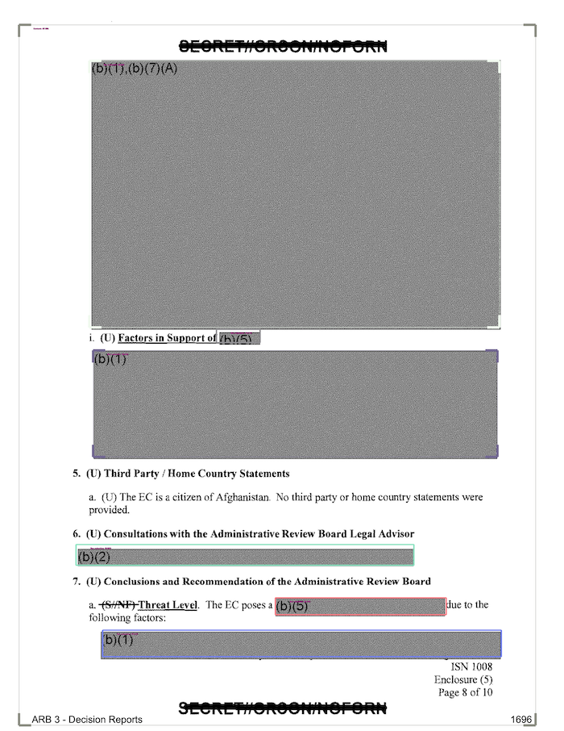
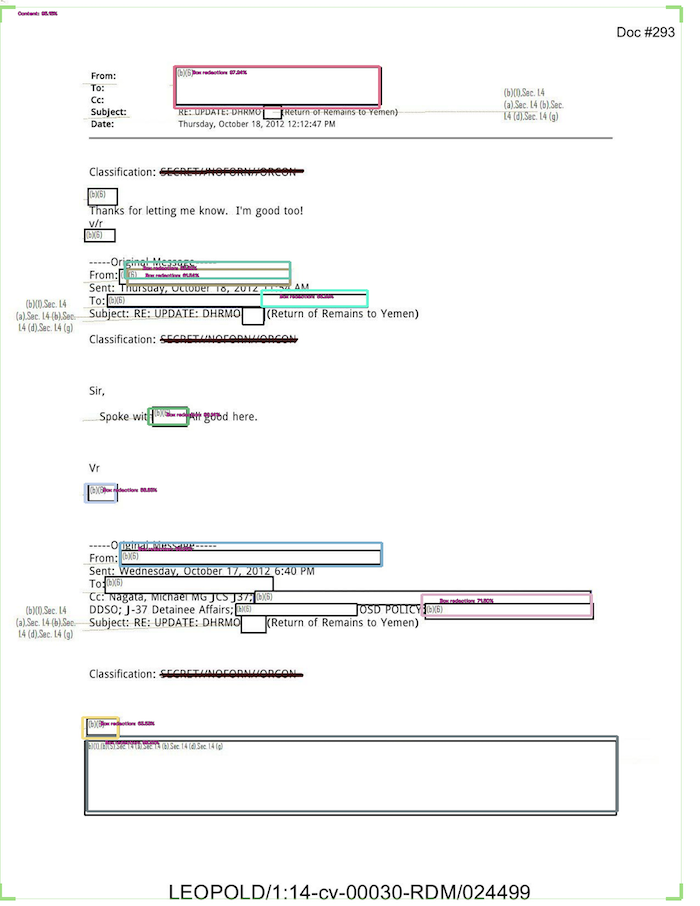

---
aliases:
- /computervision/progressreport/redactionmodel/2021/12/11/redaction-progress-week-one
author: Alex Strick van Linschoten
categories:
- redactionmodel
- computervision
- progressreport
date: '2021-12-11'
description: I made some progress on my redaction model.
image: redaction-progress-week-one/redaction_sample_3-small.png
layout: post
title: 73% accuracy for redaction object detection
toc: true

---

Last time I wrote about my redaction model training project, [I explained how I used Prodigy](https://mlops.systems/redactionmodel/computervision/datalabelling/2021/11/29/prodigy-object-detection-training.html) to annotate and label a bunch of images. I subsequently spent a long evening going through the process, getting to know my data. I managed to make 663 annotations, though quite a few of those were negative annotations: I was stating that a certain document contained no redactions at all.

Once I had my redactions, I needed to convert the files from a Prodigy format into a `.coco` annotation format. I am using [IceVision](https://airctic.com/), a really useful computer vision library, for which it is easier if I pass in the annotations in the `.coco` format.

From that point, it was fairly easy to follow the steps of [the object detection tutorial](https://airctic.com/0.11.0/getting_started_object_detection/) outlined in the IceVision documentation. I ran into some problems with [Paperspace Gradient](https://gradient.run/) not easily installing and importing IceVision. For some reason files don't get unzipped on Paperspace, but it's possible to just do this manually:

- Do the basic install, including the import of `icevision.all`. Wait for the error to get raised, then open up a terminal and enter:

```bash
cd /root/.icevision/mmdetection_configs/
rm v2.16.0.zip
wget https://github.com/airctic/mmdetection_configs/archive/refs/tags/v2.16.0.zip
unzip v2.16.0.zip
```

Then run it again as normal. Later on, another error will get raised. Fix it with this (again in the terminal):

```bash
jupyter nbextension enable --py widgetsnbextension
```

This enables ipywidgets in the notebook, I think.

Once through all of that, I was able to fine-tune a model based on the annotations which I currently have. I selected [VFNet](https://mlops.systems/redactionmodel/computervision/2021/11/30/vfnet-basics.html) as the model I wanted to use as the pertained model. After training for 40 epochs, I reached an accuracy of 73%:



If we look at some of the results (using `model_type.show_results()`) we can get a sense of the parts it found easy and the parts which it found hard. (All the boxes below are what it as predicted, not the ground truth annotations.) Some identification of boxes went as you might expect:



I was surprised that something like this worked as well as it did:



It wasn't perfect, but I don't remember having annotated too many of this specific redaction type, so I'm fairly happy with how it worked out. You can see it still makes a number of mistakes and isn't always precise about where the boxes should go. I hope that'll improve as I add more examples of this type of redaction.

My next steps for this project include the following:

- create synthetic data. The redactions are probably easy enough to mimic where we'll get a lot of value from the use of synthetic data (fake redactions on not-real document backgrounds). It'll be an easy way to boost my training data set by a good amount, hopefully leading to big improvements in my model accuracy.
- potentially add in either active learning (to help speed up my annotation process) or self-training (using the model to make annotation suggestions on unlabelled data and using only the suggestions with really high confidence estimates).
- think through the augmentations that I use as part of my workflow. I basically want augmentations that are similar to however the production use case will be: i.e. the kinds of redacted images that it might see when being given real-world data at inference time post-training.
- add in experiment tracking. I've never used something like Weights & Biases, so I'm excited to try that out and have a real process for tracking my progress throughout this project.
- cleaning up and refactoring (a bit) my repository where the code lives for processing the input data. It's starting to get a bit unwieldy and I'm worried I'll start to forget the order things were done and some of those small details.
