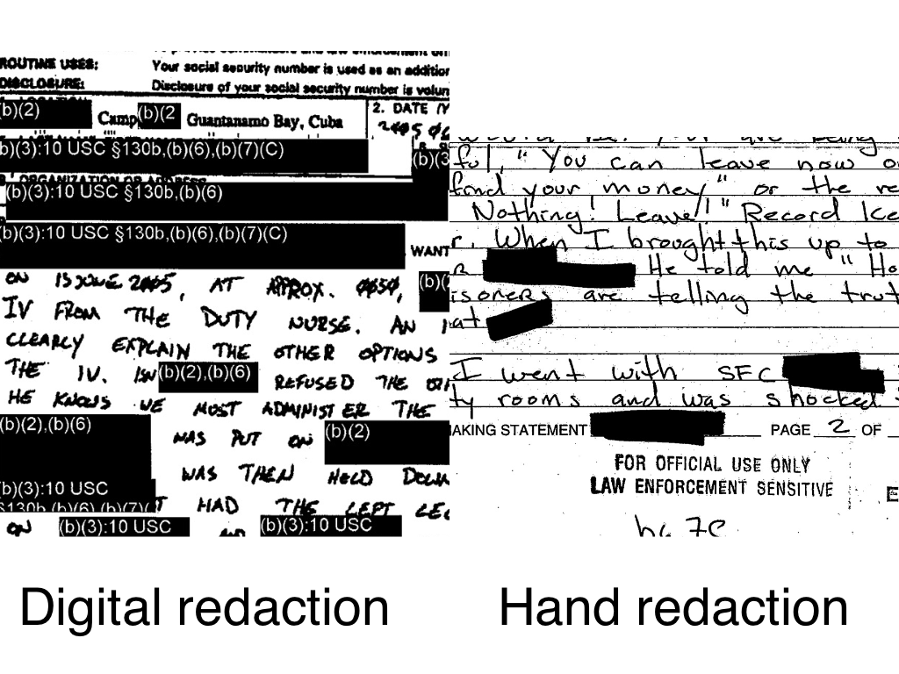
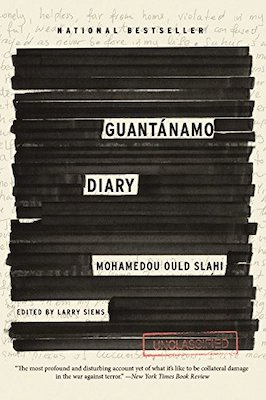
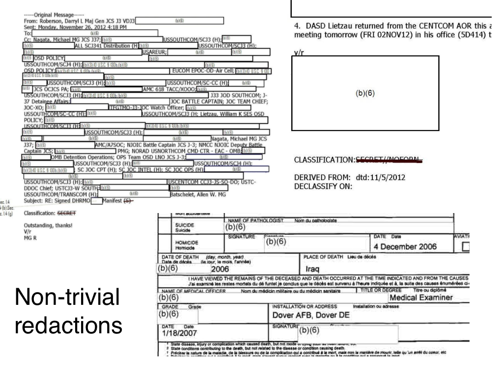

---
aliases:
- /redactionmodel/2021/12/15/redaction-taxonomy.html
author: Alex Strick van Linschoten
categories:
- redactionmodel
date: '2021-12-15'
description: A brief analysis of some of the types of redactions that are commonly
  found in FOIA documents. I use these as the dataset used to train an object detection
  model for redactions.
image: redaction-taxonomy/cover-image.jpg
layout: post
title: A Taxonomy of Redaction
toc: true

---

One of the things that makes it hard to train a model to detect redactions in documents is the fact that there are lots of kinds of redactions. Not only were different tools or methods used at different times, but even organisations and agencies from the same country or government didn't always share redaction practices.

I took a bit of time to try to understand the different kinds of redactions in my (pretty huge) data set. I didn't have any special process for selecting these images; I randomly sorted the immediate ~70,000 images I have collected and looked through to try to identify some patterns.

Taking a close look at the actual parts of images that contain redactions gives me a better sense of the challenges involved in detecting those redactions. As I iterate through my collection of images, I can start to build up an intuitive sense of where class imbalances might exist. Among the images that contain redactions, for example, which ones are most represented and which contain fewer examples? In general, where do I need to focus my efforts when it comes to improving my model?

The first easy distinction to draw is that between digital and hand-applied redactions. 

It seems that the trend in this is towards digital redactions. Perhaps it is seen as less reliable, or perhaps it's more time consuming to attach the reasons for redactions having happened. Perhaps, too, there are some legal reasons why each redaction needed to start having a specific reason applied to it.

At first glance, no pun intended, it would appear that digital redactions are much easier to recognise. They're often uniform in how they are applied and are usually pretty blunt in their appearance. There are some non-redaction uses for totally black or grey boxes laid on top of text, but they aren't common and it's a pretty strong feature to have to predict.

Handwritten redactions are also easy to recognise, but potentially the borders are harder to make out. Sometimes having a thinner pen with which redactions are applied might make it slightly less accurate.

It is more practically important to distinguish between redactions that are easy to recognise vs ones that take some time to notice. I can use my own speed at noticing the redaction on a page as a gauge. It's not a perfect analogy, but Jeremy Howard's adage that if a human can reliably do some kind of classification or object detection, then probably a computer can as well. I guess the inverse is also true: if a human will find it hard to recognise a particular feature in an image, then a computer will probably also find it hard.

There isn't much point spending too long with the 'easy' redactions. These are usually whatever is boxy and blunt. It's the stereotype of a redacted document, one like what was used as the cover art on the (much-censored) [Guantánamo Diary](https://www.amazon.com/gp/product/B00KAEXM1K/ref=dbs_a_def_rwt_hsch_vapi_tkin_p1_i0?tag=soumet-20) by Mohamedou Ould Slahi.

Sometimes you see that the entire page has been redacted with some kind of a coloured box. Other times entire columns of information has been redacted from a table. These definitely feel like they are the more recent types of redactions.

One thing that makes detecting redactions hard, on the other hand, is if the number of redactions is small. It stands to reason that lots of small redactions can stand out at first glance, whereas a single small redaction on one corner of the page is maybe harder to notice.

The hardest of redactions seems like it is in examples like this:

A white box on top of other white boxes! I often have to look quite closely at these to distinguish what is normal text and what is a redaction box. Some of them have a faint thin grey boundary box around them, which I guess ends up being pretty useful as a way to make that distinction. Surprisingly, the model that I've trained so far is not terrible at making these kinds of distinctions.

I have a few hundred annotated images so far, but I now have an intuitive sense of the hard parts of the object detection test. I also have a sense of how represented I feel like those hard parts are — not very.

As I wrote in [my previous update](https://mlops.systems/redactionmodel/computervision/progressreport/2021/12/11/redaction-progress-week-one.html) on my progress in this project, the next step is very much to find ways to increase the volume of good training data that I'm using to train my model. Part of that will involve creating synthetic data, part of that will be using self-training to speed up my annotation, and of course another part will just be doing more manual annotation. I've already started work on creating the synthetic data. More on that next time!
