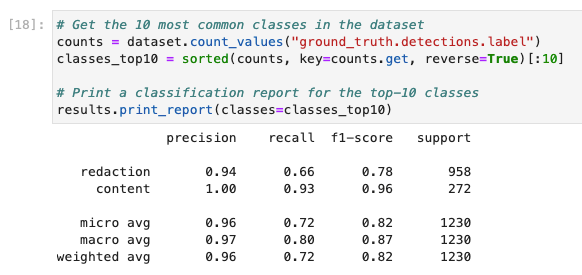
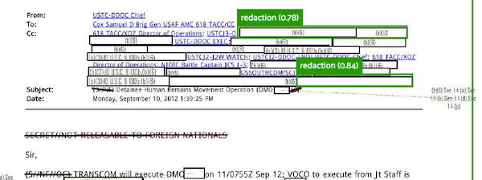
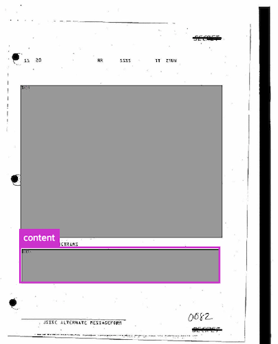

---
aliases:
- /computervision/debugging/jupyter/redactionmodel/tools/2022/03/12/fiftyone-computervision
author: Alex Strick van Linschoten
categories:
- redactionmodel
- computervision
- tools
- debugging
- jupyter
date: '2022-03-12'
description: I used the under-appreciated tool FiftyOne to analyse the ways that my
  object detection model is underperforming. For computer vision problems, it's really
  useful to have visual debugging aids and FiftyOne is a well-documented and solid
  tool to help with that.
image: fiftyone-computervision/fiftyone-overview.png
layout: post
title: Figuring out why my object detection model is underperforming with FiftyOne,
  a great tool you probably haven't heard of
toc: true

---

*(This is part of a series of blog posts documenting my work to train a model that detects redactions in documents. To read other posts, check out [the `redactionmodel` taglist](https://mlops.systems/categories/#redactionmodel).)*

So you've trained a computer vision model, but you think it could do better. What do you do next? This is a common scenario, especially for computer vision problems where fine-tuning someone else's pre-trained model is a pretty normal initial step that gets taken. You emerge with a decent score on whatever metric you care about, but it also isn't great.

One part of the solution is certainly 'more data'. This approach was recently highlighted by Boris Dayma on Twitter:



In my case, I currently have a little over 1200 images that have been annotated, but of those some 600 of them don't contain any redactions at all (i.e. they just have content boxes). I did mention that I was using a similar approach early on, where I'd use the model to help pre-annotate images, but I haven't been using that recently.

I'm realising that more important than pure volume of data is to annotate types of images that are the hardest for the model to learn. So what I really want to know at this point is where I should place my focus when it comes to supplementing the training data. My images aren't currently divided into separate classes, but I have a proxy (the filename) which will be really helpful once I've identified which types I need to supplement.

When seeking to improve computer vision models with error analysis, some kind of visual inspection is essential. `fastai` had [a number of utility methods](https://docs.fast.ai/interpret.html) that helped in the interpretation of where a model was underperforming, but for object detection I think you do need something that was built to purpose, where you can really dive into the specific ways each object was or wasn't detected.

Enter [FiftyOne](https://voxel51.com/docs/fiftyone/). 

[FiftyOne](https://voxel51.com/docs/fiftyone/) is an open-source tool built specifically to support the curation and creation of datasets for computer vision models. It is almost two years old in its open-source incarnation, and (or but?) it feels very solid and robust in its implementation. [Voxel51](https://voxel51.com), the company behind it, has taken great pains to write excellent documentation and guides, and they have [a supportive community](https://join.slack.com/t/fiftyone-users/shared_invite/zt-gtpmm76o-9AjvzNPBOzevBySKzt02gg) behind the scenes, too.

# FiftyOne Basics

FiftyOne is a Python library that offers a visual interface to your data. For my redaction model, the base interface looks something like this:


You need to convert your dataset such that FiftyOne can interpret the structure of where images are stored as well as the annotations themselves, but many commonly-used formats are supported. In my case, COCO annotations are supported out of the box, so it was trivial to import the data to generate the above visualisation.

You can use the FiftyOne application inside a Jupyter Notebook, or you can have it open in a separate tab. A separate tab is my preference as it allows for a larger interface. (There is also a completely separate Desktop app interface you can use, but I think not all functionality works there so you might want to stick to a separate tab).

Luckily for me, my computer vision framework of choice is IceVision, and [they recently integrated](https://airctic.com/0.12.0/using_fiftyone_in_icevision/) with FiftyOne which makes creating datasets a breeze.

So how did FiftyOne help me understand how my model was performing? (Note: the sections that follow were significantly helped by following [this](https://voxel51.com/docs/fiftyone/tutorials/evaluate_detections.html), [this](https://voxel51.com/docs/fiftyone/tutorials/uniqueness.html) and [this](https://voxel51.com/docs/fiftyone/tutorials/detection_mistakes.html) part of the [FiftyOne docs](https://voxel51.com/docs/fiftyone/).)

# Comparing ground truth with predictions

The first thing I did was visualise the ground truth annotations alongside the predictions of my model. (This is the model mentioned in [my last blogpost](https://mlops.systems/redactionmodel/computervision/tools/2022/03/03/model-improvements.html), which had a COCO score of almost 80%.)

This requires performing inference on a slice of our images. Unfortunately, I had to do that inference on my local (CPU) machine because FiftyOne doesn't work on Paperspace cloud machines on account of port forwarding choices that Paperspace make. This makes for a slightly slower iteration cycle, but once the inference is done you don't have to do it again.


You can see here that it's possible to selectively turn off and on the various overlaid annotations. If you want to compare how redactions are detected (and not see the content box), then this is an easy way to toggle between.

## Viewing only high-confidence predictions

Not all predictions are created equal, too, so it would be useful to view only those predictions where the confidence was higher than 75%. FiftyOne makes this kind of conditional view easy. You can do it in code, as in the following snippet, or you can do it via the GUI inside the app.

```python
from fiftyone import ViewField as F

# Only contains detections with confidence >= 0.75
# `dataset` is the FiftyOne core object that was created before
high_conf_view = dataset.filter_labels("prediction", F("confidence") > 0.75)
```


## 'Patches': detailed views for detected objects

For a more fine-grained understanding on the ways our model is predicting redactions, we can create what are called 'patches' to view and scroll through prediction-by-prediction.


This is an excellent way to view things through the eyes of your model. These are all the objects it considers to be redactions. We'll get to finding the ones where it doesn't do as well in a bit, but this view allows us to immerse ourselves in the reality of how our model is predicting redaction boxes. We can see that certain types of boxes are well-represented in our dataset: coloured or shaded rectangles in particular.

# Understanding how our model performs for separate classes

We only have two classes in our training data: redaction and content, so doing a class analysis doesn't help us too much for this problem, but using the mean average precision (MAP) calculation we can see the difference between how well our model does on redactions vs content:



We can also easily plot an interactive chart that quite clearly displays these differences:


# Viewing the false positives and false negatives

The previous calculations also added some metadata to each image, denoting whether it was considered a true positive, false positive or false negative. It's really useful to be able to easily switch between these views, and identifying the images with the largest numbers of false positives and false negatives will help appreciate what our model struggles with.

This view is sorted by total number of false positives in an image. False positives are where the model confidently has predicted something to be a redaction box, for example, that is not actually a redaction box. 


In this image you can see that the model predicts a redaction box with 82% confidence that is clearly not a redaction. Note, too, how the smaller redactions to the right and the large partial redaction to the left were not detected.

False negatives are where there were some redactions to be predicted, but our model never made those predictions (or was very unconfident in doing so).



In this image excerpt, you can see that some predictions were made, but many were also missed. This image shows the ground truth reality of what should have been predicted:


Scrolling through the examples with high numbers of false positives and false negatives gives me a really useful indication of which kinds of redactions with which I need to annotate and supplement my training data. I already had a sense of this from my own intuition, but it's excellent to see this confirmed in the data.

# Finding detection mistakes with FiftyOne Brain's `mistakenness` calculation

FiftyOne is not only the visual interface, but it also has something called the FiftyOne [`brain`](https://voxel51.com/docs/fiftyone/user_guide/brain.html). 



The brain allows you to perform various calculations on your dataset to determine (among other things):

- visual similarity
- uniqueness
- mistakenness
- hardness

(You can also [visualise embeddings](https://voxel51.com/docs/fiftyone/user_guide/brain.html#brain-embeddings-visualization) to cluster image or annotation types, but I haven't used that feature yet so can't comment as its effectiveness.)

For my dataset, visualising similarity and uniqueness revealed what I already knew: that lots of the images were similar. Knowing the context of the documents well means I'm familiar with how a lot of the documents look the same. Not much of a revelation there.

The mistakenness calculation is useful, however. It compares between the ground truth and the predictions to get a sense of which images it believes contains annotations that might be wrong. I can filter these such that we only show images where it is more than 80% confident mistakes have been made. Instantly it reveals a few examples where there have been annotation mistakes. To take one example, here you can see the ground truth annotations:



And here you can see what was predicted:


In this example, it was even clear from the beginning that redactions had been missed, and that the single annotation that had been made (a content box) was incorrect.

# Finding missing annotations

We can also view images that the FiftyOne brain tagged as containing missing annotations:

```python
session.view = dataset.match(F("possible_missing") > 0)
```


Unfortunately the [`compute_hardness`](https://voxel51.com/docs/fiftyone/user_guide/brain.html#brain-sample-hardness) method only works for classification models currently, but regardless I think we have a lot to work with already.

# Conclusions and Next Steps

I hope this practical introduction to FiftyOne has given you a high-level overview of the ways the tool can be useful in evaluating your computer vision models.

For my redaction project, I'm taking some clear action steps I need to work on as a result of some of this analysis.

- I need do annotate more of the kinds of images it struggles with. Specifically, this means images containing redactions that are just white boxes, with a bonus for those white redaction boxes being superimposed on top of a page filed with white boxes (i.e. some sort of table or form).
- I need to remove some of the bad/false ground truth annotations that the FiftyOne brain helpfully identified.
- I will probably want to repeat this process together in a model that was trained together with the synthetic data to see what differences can be observed.
- As a general point, I probably want to incorporate visual inspection of the data at various points in the training pipeline, not just after the model has been trained.

If you know any other tools that help with this kind of visual analysis of model performance and how to improve in a data-driven approach, please do [let me know](https://twitter.com/strickvl)!
