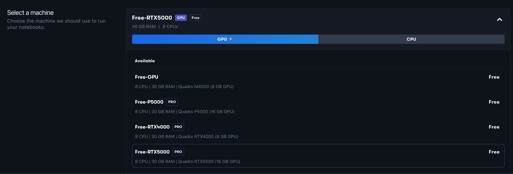
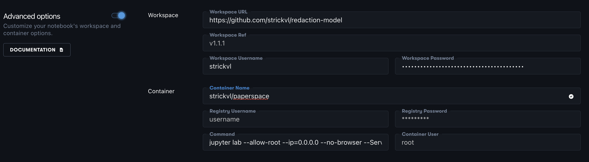

---
aliases:
- /tools/docker/computervision/2022/03/25/paperspace-docker-icevision.html
author: Alex Strick van Linschoten
categories:
- tools
- docker
- computervision
date: '2022-03-25'
description: I setup a new Paperspace project that uses a custom Docker image to provision
  its environment, saving me a bunch of initial installation time and dependency bug
  pain. A huge productivity win!
image: paperspace-docker-icevision/docker-image-cover.png
layout: post
title: Building my own image to use IceVision with Paperspace
toc: true

---

I've been using [Paperspace](https://www.paperspace.com/) right to fuel my ML/Deep Learning experimentation since more or less the beginning. It was one of the recommended platforms that offered GPUs for the [fastai](https://www.fast.ai/) course and when I started working on [my redaction project](https://mlops.systems/categories/#redactionmodel) I chose to keep going since I had little reason to change.

Fast-forward a few months, and I've had a few issues along the way. Paperspace works by provisioning a Docker image, connecting it to a fixed filesystem / storage backend and then serving this up to you in a web interface as a Jupyter notebook. I found that sometimes there were issues with dependencies breaking, or special `pip install` magic I had to include in my notebook so that things would work again.

Included in this is the reality that a full install of IceVision — an amazing library for computer vision that handles a lot of the pain around integrating various libraries and use cases — simply takes a while as it has to download and setup some pretty hefty dependencies. I had found that going from zero to working on the day's specific issue took around 20 minutes when you factored in all the setup, updates from the Github repo, syncing data and so on.

Inspired by [my reading and study of Docker](https://mlops.systems/tools/dockerinamonthoflunches/books-i-read/2022/03/21/docker-in-a-month.html) — and with [a tip from a Paperspace engineer](https://github.com/joshua-paperspace/python-runtime/blob/main/Dockerfile) about how I could get started — I set out to build a custom image that handled most of the setup upfront and automatically updated with the latest changes and data.

Amazingly, it worked more or less immediately! I created [a new Dockerfile](https://gist.github.com/strickvl/956f233ab53b3b56d463aebb95d7104c) based of the original suggestion and the core additions were the following:

```
RUN wget https://raw.githubusercontent.com/airctic/icevision/master/icevision_install.sh && bash icevision_install.sh cuda11 && rm icevision_install.sh

RUN pip install torchtext==0.11.0 --upgrade
RUN pip install opencv-python ipywidgets icevision-dashboards
RUN apt update && apt install -y libsm6 libxext6
RUN apt-get install -y libxrender-dev

CMD make lfs && git lfs pull
```

In order to set this up with Paperspace, you first have to go to your notebooks inside a project and click to create a new Paperspace notebook. 


Once there, you can ignore the suggestion to "select a runtime", but rather select your machine from the available GPUs. I usually choose the RTX5000 and set it up for an auto-shutdown after 6 hours. 



Then you want to click the 'Advanced Options' toggle so you can add in all the details of the image being used.



This is what worked for me. In order to use [JupyterLab](https://jupyter.org/), the container command should be:

```
jupyter lab --allow-root --ip=0.0.0.0 --no-browser --ServerApp.trust_xheaders=True --ServerApp.disable_check_xsrf=False --ServerApp.allow_remote_access=True --ServerApp.allow_origin='*' --ServerApp.allow_credentials=True
```

I enter my private GitHub repo (along with my username and a custom token generated to allow Paperspace to download the repo) in the 'Workspace' section.

Then when I click 'Start Notebook', it works! No more hanging around for IceVision to install. My Docker image already has this!

I realise that I'm probably a little late to the party in terms of using Docker and seeing how it can bring some real improvements in terms of reproducibility of environments as well as these little quality-of-life perks like not hanging around to install everything each time you want to use it. This was a really useful experience for me to learn from, and I'll certainly be using this going forward in other projects I work on.
