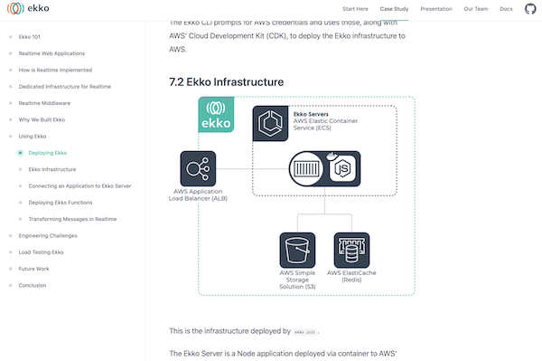

---
aliases:
- /computervision/skillbuilding/2022/04/04/ml-portfolio-best-practices.html
author: Alex Strick van Linschoten
categories:
- computervision
- skillbuilding
date: '2022-04-04'
description: I wrote about some of the things that go into creating a really great
  portfolio project for machine learning. For this post I'm less interested in the
  technical achievements than I am in how it is presented.
image: ml-portfolio-best-practices/healthsea.png
layout: post
title: Some characteristics of best-in-class ML portfolio projects
toc: false

---

[Ekko](https://ekko-realtime.com) was the last time I worked on a big project that would be presented publicly. An open-source framework that provided realtime infrastructure and
in-transit message processing for web applications was a group project that I worked on together with three other colleagues, and we took the time to really make the *how* and the *why* really explicit. We made animations, diagrams, charts, and I learned a lot about what's hard when explaining technical projects, even when the audience is expected to be (mostly) technically literate.

I've been working on [my redaction project](https://mlops.systems/categories/#redactionmodel) since December and slowly but surely I'm tying the ends together and getting ready for it to come to a close. As part of the final touches, I want to offer something equivalent to how we presented [Ekko](https://ekko-realtime.com). From reading around and exposure to various projects over the years, it seems to me that machine learning projects sometimes have different emphases and conventions. This blog post is my attempt to list some of the characteristics of really great ML portfolio projects, with an emphasis on how the project is presented.

## Some top projects

- [Healthsea](https://explosion.ai/blog/healthsea) by Edward Schmuhl ([@aestheticedwar1](https://twitter.com/aestheticedwar1)) is my current favourite project writeup, blending amazing visuals, full explanation and a clear overview
- [This project](https://www.ahmedbesbes.com/blog/end-to-end-machine-learning) (by [@ahmed_besbes_](https://twitter.com/ahmed_besbes_)) was recommended to me and although it's more of a step-through of how the project works and was created, it also is clearly presented and very visual.
- For computer vision projects, [Hugging Face Spaces](https://huggingface.co/spaces) is a great place to find interesting Gradio demos, though after a while they blend into each other a little. HF Spaces also doesn't seem like it gets used for full project explanation that often.

## Characteristics of top projects

Some things I think make a great portfolio project stand out:

- visual design — looks count for a lot, for better or for worse.
- interactivity — if there is some kind of a demo or application that I can play around with in order to relate to concepts being written about, that'd be great.
- visual explanations alongside pure text — a diagram or animation can really help bring explanations to life.
- a clear overview — the structure of the writeup should be clear and readers should be able to get a high-level overview first without necessarily needing to read through every last detail.
- explain what problem you're solving — spend (probably) more time than you think is necessary to explain what problem you're solving and set up the context for the work you did.
- code snippets are ok, but don't just dump your source code.
- present your dead ends — don't just present the happy path; feel free to present things that didn't work out as well. Readers will want to know that you encountered difficulties and there are benefits from seeing how you made decisions along the way.
- present further work and next steps — offer hints at what other work could be done on the project, even if you're done with it for now.
- don't lose track of the use case — show that you thought about the specific problem you were solving and not just as a technical problem in a void. (Real-world use cases have constraints, and your solution should live within a universe where those constraints directed you).
- Feel free to link out — you can easily link to other places where you've gone into the details about a particular problem you encountered. No need to cram every single last detail into the project portfolio.
- Don't forget the purpose of the portfolio — it doesn't need to be an exhaustive catalogue of every last detail; it just needs to offer a compelling overview that is understandable as an independent entity.

There are other aspects which are more table stakes for anything you write online — no typos, clear writing and so on.

I took the time to step back from the project to write this down as I move into a phase where I'll increasingly focus on the full writeup and I wanted to have a list to remind me of the things I valued in these kinds of projects.

If you have good examples of ML portfolio projects (or really great blog write-ups with interactivity and so on), please let me know in the comments!
