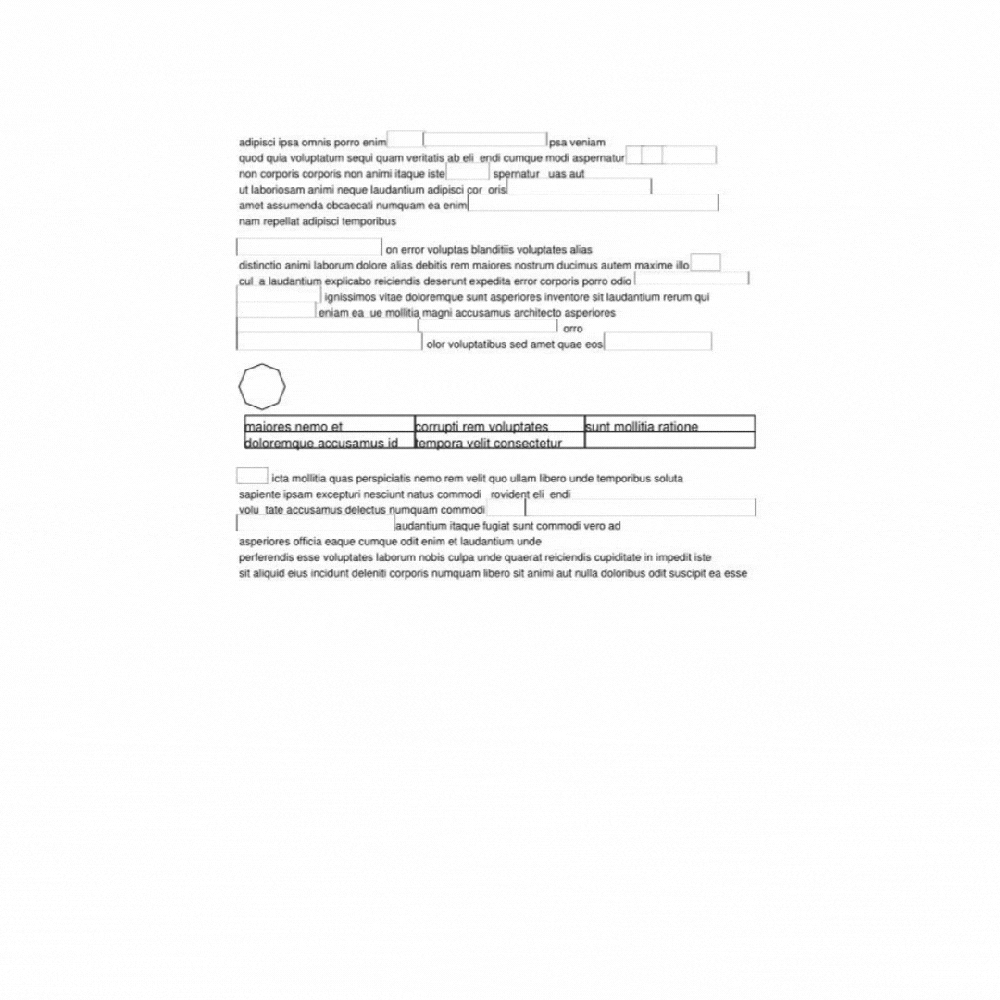

---
aliases:
- /tools/redactionmodel/computervision/2022/04/06/synthetic-data-results.html
author: Alex Strick van Linschoten
categories:
- tools
- redactionmodel
- computervision
date: '2022-04-06'
description: I show how adding synthetic data has improved my redaction model's performance.
  Once I trained with the synthetic images added, I realised a more targeted approach
  would do even better.
image: synthetic-data-results/hard-synthetic-performance-boost.png
layout: post
title: "'I guess this is what data-centric AI is!': Performance boosts after training with synthetic data"
toc: true

---

_(This is part of a series of blog posts documenting my work to train a model
that detects redactions in documents. To read other posts, check out
[the `redactionmodel` taglist](https://mlops.systems/#category=redactionmodel).)_

A clean and focused dataset is probably at the top of the list of things that
would be nice to have when starting to tackle a machine learning problem. For
object detection, there are some
[useful starting points](https://huggingface.co/datasets?task_categories=task_categories:object-detection&sort=downloads),
but for many use cases you're probably going to have to start from scratch. This
is what I've been doing
[for the past few months](https://mlops.systems/#category=redactionmodel):
working to bootstrap my way into a dataset that allows me to get decent
performance training a model that can recognise redactions made on documents.

As part of that journey so far, some of the big things that I've taken time to
do include:

- [manually annotating](https://mlops.systems/redactionmodel/computervision/datalabelling/2021/11/29/prodigy-object-detection-training.html)
  1000+ images
- using a model-in-the-loop to help bootstrap that annotation process by
  [pre-filling annotation suggestions](https://mlops.systems/python/fastai/tools/redactionmodel/2022/01/16/midway-report-redaction-project.html)
  on an image that I could then correct
- [creating synthetic images](https://mlops.systems/redactionmodel/computervision/python/tools/2022/02/10/synthetic-image-data.html)
  to increase the size of my dataset used in training
- spending time
  [looking at what the model found difficult](https://mlops.systems/redactionmodel/computervision/tools/debugging/jupyter/2022/03/12/fiftyone-computervision.html),
  or what it got wrong

At the end of my synthetic data creation blogpost, I mentioned that the next
step would be to test the effect of adding in the new synthetic examples. Well…
the results are in!

## A failed attempt to train with synthetic data

I wasn't sure exactly how much synthetic data would be appropriate or performant
to use, so created a loose experiment where I started with 20% of the total
images and increasing up until I reached 50%. (I figured that more than 50%
synthetic data probably wasn't a great idea and would probably not help my model
perform out in the real world.)

As you can see above: my initial experiment did not show great results. In fact,
in several places, if I added synthetic data my model actually performed
_worse_. This was a strong repudiation of my intuition of what would happen.
After all, the whole point of adding the synthetic data was to get the model
more of a chance to learn / train and thus improve its ability to recognise
redaction object in documents.

I dug into the data that I'd generated and the data I'd been using to train, and
discovered a nasty bug which was tanking the performance. A week of debugging
mislabelled bounding boxes in evenings after work and I was back with results that
finally made sense.

## Performance boosts after adding synthetic data

In this chart, at the bottom you can see how training the model without the
synthetic data (`no-synthetic-batch16`) performed. Ok, not great. Then the next
best performing (`combined-75real-25synthetic-randomsplit`)was when 25% of the
total number of images was synthetic, and the rest were real manually annotated
images. At the top, with around an 81% COCO score, was the model where I used
50% synthetic and 50% real images. This seemed to fit what my intuition said
would happen.

More synthetic data helped. I guessed that if I had millions of labelled images
then the synthetic data would perhaps have been less useful, but starting from
scratch it was really supporting the process.

I was curious what would happen when I returned to [FiftyOne](https://voxel51.com) to carry out some
error analysis on the new model's performance. Even before I had reached those
results, I had a hunch that the synthetic images I'd created were perhaps too
generic. I think they probably were helping boost some baseline performance of
my model, but I knew they weren't helping with the hard parts of detecting
redactions.

## 'Hard examples': creating targeted synthetic data

As a reminder, this is the kind of image that is 'hard' for my model (or even a
human) to be able to identify all the redactions:

The [FiftyOne](https://voxel51.com) visualisations of what was and wasn't working validated my hunch:
yes, synthetic data helped somewhat, but the model's low performance seemed much
more vulnerable to misrecognition of the hard examples. Even with a 50/50 split
between synthetic data and real manually annotated data, the hard examples were
still hard! (And the converse was also true: the model was _already_ pretty good
at identifying 'easy' redactions (e.g. of the black box type).

If we look back at the example of a 'hard' redaction above, two things stood
out:

1. They're hard, even for a human! This was borne out in the way I needed to
   take special care not to forget or mislabel when I was adding manual
   annotations.
2. There are _lots_ of redactions on a single page/image.

The second point was probably important, not only in the sense that there were
more chances of getting something wrong on a single page, but also in the sense
that the redactions were (relatively) small. The detection of small objects is
almost its own field in the world of computer vision and I don't know too much
about it, but I do know it's somewhat an unsolved problem. That said, finding a
way to boost the performance of the models on these 'hard' examples (there were
a few other types of hard image) seemed like it might tackle a significant
shortcoming of my model.

I decided to try creating a separate batch of synthetic image data, this time
fully tailored to tackling some of the hardness mentioned above: it would have
many small redactions on a single page, they would all be white boxes and there
might also be things like tables with white box-like shapes coexisting next to
redactions.

Luckily, the work I'd done previously on creating synthetic data helped me get
started quickly. I returned to [`borb`](https://borbpdf.com), an open-source
tool for quickly creating PDF documents that allows for a pretty flexible
prototyping of layouts with all sorts of bells and whistles added. These were
some of the documents I generated:

The hard images were hard, and I had created some synthetic chimeras that (I
believed) approximated some of the features of the original hard images. I did
not want to overbalance my training data, however, and took care not to create
too many of this type of image.

My script — as with
[the previous synthetic data](https://mlops.systems/redactionmodel/computervision/python/tools/2022/02/10/synthetic-image-data.html)
— also required me to create the annotation files at the same time as creating
the document. With `borb` it was _relatively_ trivial to get the bounding box
data for objects created, and there was even in-built functionality to create
and apply redactions onto a document. (I'm moving fairly quickly over the
mechanics of how this all worked, but it's not too far distant from how I
described it in my previous post so I'd refer you there
[for more details](https://mlops.systems/redactionmodel/computervision/python/tools/2022/02/10/synthetic-image-data.html)).

Once the images were created and added to my datasets, it was time to retrain
the model and see what benefit it brought.

As you can see, the model jumped up from around 80.5 to 84% when I aded the hard
synthetic examples in. That's a pretty nice jump as far as I'm concerned,
especially given that I only added in 300 images to the training data. I still
had a little over a thousand of the original basic synthetic images that I was
using, but this result showed me that tackling the badly performing parts of the
model head-on seemed to have a positive outcome.

At this point, I did some more experiments around the edges, applying other
things I knew would probably boost the performance even more, notably first
checking what would happen if I increased the image size from 512 to 640. I got
up to an 86% COCO score with that improvement alone.

In a final twist, I second-guessed myself and wondered whether the original
synthetic data was even helping at all… I removed the thousand or so 'basic'
synthetic images from the data and retrained the model. To my surprise, I
achieved more or less the same COCO score as I had *with* the basic synthetic
images. I'm taking this as a strong suggestion that my basic synthetic images
aren't actually helping as much as I'd thought, and that probably a smaller
number of them as a % of the total would be beneficial.

## Reflections on experimenting with synthetic data

So, what can I conclude from this whole excursion into the world of synthetic
image creation as a way of boosting model performance?

- adding synthetic data really can help!
- the world of synthetic data creation is a *huge* rabbit hole and potentially you
  can get lost trying to create the perfect synthetic versions of your original
  data. (I mean this both in the sense of 'there's lots to learn' as well as
  'you can spend or lose a *ton* of time here'.)
- Targeted synthetic data designed to clear up issues where the model has been
  identified as underperforming is probably best. (Conversely, and I'll be
  careful how much I generalise here, middle-of-the-road synthetic data that
  doesn't resemble the original dataset may not be worth your time.)
- Knowing your original data and domain really well helps. A lot. My intuition
  about what things the model would stumble on was fuelled by this knowledge of
  the documents and the domain, as well as by the experience of having done
  manual annotations for many hours.

There are probably many (many) more things I can do to continually tinker away
at this model to improve it:

- continue down the path of more error analysis, which would fuel more targeted
  addition of annotations, and so on.
- create better versions of synthetic data with more variation to encompass the
  various kinds of documents out in the real world.
- more self-training with the model in the loop to fuel my manual annotation
  process.
- further increases to the image size (perhaps in conjunction with progressive
  resizing).
- increasing the backbone from `resnet50` to `resnet101`.

In general, improving the quality of the data used to train my model seems to
have been (by far) the best way to improve my model performance. Hyper-parameter
tuning of the sort that is often referenced in courses or in blog posts does not
seem to have had much of a benefit.

It is probably (mostly) good enough for my use case and for where I want to be
heading with this project. There are other things that need addressing around
the edges, notably parts of the project that could be made more robust and
'production-ready'. More about that in due course, but for now please do comment
below if you have suggestions for things that I haven't thought of that might
improve my model performance!
