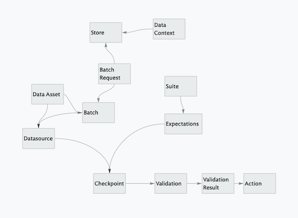

---
aliases:
- /tools/redactionmodel/computervision/datavalidation/2022/04/19/data-validation-great-expectations-part-1
author: Alex Strick van Linschoten
categories:
- tools
- redactionmodel
- computervision
- datavalidation
date: '2022-04-19'
description: An overview of the problem that data validation seeks to solve, explored
  through the lens of an object detection problem and some of the tradeoffs that such
  an approach might bring. I introduce and simplify the high-level concepts you need
  to use the Great Expectations library.
image: great_expectations/g_e_logo.jpeg
layout: post
title: 'How to trust the data you feed your model: data validation with Great Expectations
  in a computer vision context (part 1)'
toc: true

---

_(This is part of a series of blog posts documenting my work to train a model that detects redactions in documents. To read other posts, check out [the `redactionmodel` taglist](https://mlops.systems/categories/#redactionmodel).)_

**Data validation is a process of verifying that data is accurate and consistent. It plays a crucial role in end-to-end machine learning pipelines.**

**There is a lack of validation tools in Computer Vision (CV) due the complexity of the data used by the domain.**

**In this series of articles, I will show you how to leverage the [Great Expectations](https://greatexpectations.io) open-source library to validate object detection data. This will help you to feed your model with data less prone to break your model performance.**

When something goes wrong with a newly trained or newly deployed version of your model, where do you look first? Where does your gut tell you the bug or issue is likely to be found? For me, knee deep into my redaction model project, I immediately think of my data. For sure, I could probably have more in the way of testing to be sure my code is working how I expect it to work, but issues with the data are far more likely to be silent killers. Issues with data are unlikely to raise a loud exception and suddenly bring my training to a stop. Instead, my training will continue, but I'll either get really unsatisfactory results or I'll get results that are underperforming the real potential of the data I'm feeding into my model. That's the scary part: I most likely won't even know that my data is broken or faulty.

<iframe src="https://giphy.com/embed/YTJXDIivNMPuNSMgc0" width="442" height="480" frameBorder="0" class="giphy-embed" allowFullScreen></iframe>

For software engineers, testing your code is a tried-and-tested way to find some confidence in what you're trying to accomplish. (I am exploring some of these best practices in [my review series](https://mlops.systems/categories/#robustpython) about Patrick Viafore's excellent [*Robust Python* ](https://www.amazon.com/Robust-Python-Patrick-Viafore-ebook-dp-B09982C9FX/dp/B09982C9FX/ref=mt_other?qid=&me=&tag=soumet-20&_encoding=UTF8)book, which covers testing along with typing and various other patterns.) For critical systems, testing is one of the things that allows you to sleep soundly. For those living in the world of machine learning or data science, data validation is like writing tests for your data. You can be confident that your data looks and has the shape of what you feel it should when you address the data quality issue head-on.

If you think of your model training workflow as a pipeline, there are certain places where it makes sense to do some kind of data validation:

- at the very beginning, when you're seeing your data for the first time: a lot of exploration and basic analysis really helps at this point. It will help you build up intuition for the general patterns and boundaries of the data you're going to use to train your model.
- any time you do some kind of conversion: perhaps you have to — as I do with my project — convert from one image annotation format into another and you're juggling x and y coordinates constantly, or maybe you're using different image formats at different points?
- prior to training your model: 'garbage in, garbage out' as the saying goes… You probably want to make sure that you only have high quality data passing through into your model training pipeline step.
- as part of a continuous training loop: perhaps you've trained and deployed a model, but now a few months have passed, you have more data and you want to retrain your model. Are you confident that the new data retains the same characteristics and qualities of your original data?

As you can see, there are many different approaches that you might take. To discuss where you might want to validate your data is to discuss where your processes might be flawed in some way. For most projects of any size or significance, you probably will find that taking the care with your data inputs will pay dividends.

# Data validation and computer vision

It often seems like computer vision exists in a world unto its own, particularly when it comes to the data used to train models. These idiosyncrasies amount to a strong case for some kind of data validation:

- image data isn't always easily introspectable, especially on the aggregate level (i.e. what is the 'average' of a series of images, or how to think of the standard deviation of your images?)
- for something like object detection, the annotations are stored in a separate location from the images to which they correspond, leaving the door open for a creeping data drift between the original image locations and what is listed in the annotations.
- For massive data sets, the original data will likely not be stored in the environment where you're doing some fine-tuning with new data.
- Different model architectures require different kinds of pre-processing for your data and sometimes annotations need converting into slightly different formats (perhaps for your evaluation metric)
- The pure images (or image-adjacent objects like medical scans) contain a lot of sub-surface metadata that isn't easily accessed and isn't automatically used as criteria for comparison or error detection.

In short, there are lots of ways that training a computer vision model can go wrong, and implementing even basic safeguards against this can give you confidence in the data you're using. Unfortunately, the landscape of tooling for data validation in the computer vision space feels like it's lagging behind what exists for tabular data, for example, but that's almost certainly because it's just a harder problem. The big data validation libraries don't really cater towards computer vision as a core domain, and (as you'll see below) you'll probably have to crowbar your data into the formats they expect.

# Big picture: what might this look like for my project?

As I outlined above, there are lots of different places where you might want to use some kind of data validation strategy. At the level of code, you might want to make your input and output validation a bit more solid by using type annotations and a type checker like `mypy`. You can add tests to ensure that edge cases are being handled, and that your assumptions about your code behaviour are proven. You also have your tests to ensure that changes in one function or area of your codebase don't break something somewhere else.

At the level of your data, you can of course use simple `assert` statements within the functional meat of your codebase. For example, at the point where you're ingesting data pre-training you could assert that each image is of a certain format and size, and perhaps even that annotations associated with that image 'make sense' as per the context of whatever problem you're solving. You can handle some of these assertions and checks with simple conditionals, perhaps, earlier on in the process when you are ingesting or pre-processing your data.

A significant benefit of having these simple assertions inside your core functions is that you are handling the ways things can go wrong at the same time as you're writing the functionality itself. A disadvantage is that your code can easily become cluttered with all this non-core behaviour. It feels a little like the validation can become an afterthought in this scenario. For this reason, it seems to make sense to me that you'd want to have one or more dedicated checkpoints where your data undergoes some kind of validation process. In the context of a pipeline, this means you probably will want one or more steps where this happens.

# Tradeoffs 

For tiny throwaway projects, or for proof-of-concept experimentation, it might not make sense to start off by working up a massive data validation suite. A really rigorous validation process early on might slow you down more than is useful. Instead, simple `assert` statements coupled with type annotations on your functions might be the way to go for safeguards and will-this-be-readable-in-the-future sanity checks.

Ideally, you'll want to create some kind of end-to-end pipeline or workflow at the beginning of your process, since this will allow you to iterate faster in a manner that's meaningful for whatever you're trying to solve. With a basic pipeline in place, data validation can be added as a stage of its own without too much disruption once you have an initial working prototype. As with most things in life, investing for the longer term is going to take a bit more upfront effort but that shouldn't be too much an issue as long as your project has that kind of a horizon to it.

# What kind of validation does Great Expectations offer?

[Great Expectations](https://greatexpectations.io) is an open-source data validation tool. It is somewhat agnostic as to what specific use case you have, but I don't think it'd be wrong to say that it isn't primarily developed for those working on computer vision problems; tabular data seems to be a much cosier fit.

I stated above that Great Expectations could be used as if you were adding tests for your data. At a very high level, you can think of it as a fancier way of adding assertions about your data. The 'expectations' in the title are like those assertion statements, only in this case there are dozens of different pre-made 'expectations' you can choose from. For example, you could assert that you expect that the values of a particular column of a Pandas DataFrame be between 0 and 100, and that if they exceeded those boundaries then it would be only a very small proportion that did so.

Your expectations make up a 'suite', and you run your suite of expectations against a batch or data asset. There are another 10 or 20 concepts or terms that I'd need to define and connect together in a mental map before we covered everything about how Great Expectations works. Unfortunately, this is one of the things I found most confusing about getting to know the library through its documentation. From the outside, it appears that they had one set of terminology, but now it's partially changed to a different set of terms or abstractions. Presumably for reasons of backwards compatibility, some of the old abstractions remain in the documentation and explanations, which makes it not always clear to understand how the various pieces fit together.



You can read [the glossary](https://docs.greatexpectations.io/docs/glossary) over at their documentation site if you want to learn more, but for now everything I explained above should suffice.

There seem to be two main ways of setting up and using Great Expectations. One is heavily interactive and driven by executing cells in a series of notebooks. The other is as you'd expect — code-based using a Python library, backed by some external configuration files and templates. I didn't find the notebook-based configuration and setup very compelling, but it is the one emphasised in the documentation and in online materials, so I will give it due attention in the next part of this blog series. For now, it might suffice to show a very simple version of how the code-based use works:

# A simple example of using Great Expectations for data validation

The first thing I did was to convert my annotations data into a Pandas DataFrame. You can use Pandas, SQL and Apache Spark as sources for your data to be validated through Great Expectations, and luckily my COCO annotations file was just a JSON file so it was easily converted. While doing the conversion, I made sure to add some extra metadata along the way: a column noting whether an image or a redaction was horizontal or vertical in its orientation, for example, or splitting the `bbox` array into its four constituent parts.

```python
import great_expectations as ge

annotations_df = ge.from_pandas(pd.DataFrame(annotations))

feature_columns = ['area', 'iscrowd', 'image_id', 'category_id', 'id', 'synthetically_generated', 'category_name']
for col in feature_columns:
    annotations_df.expect_column_to_exist(col)
    
annotations_df.expect_column_values_to_be_in_set(
    "category_name",
    ["content", "redaction"]
)
```

Great Expectations wraps the Pandas library, so importing the data was easy. Then adding the expectations (methods beginning with `expect…`) was trivial. Below you can see the result from the second of the expectations. All of the column values were in that set, so the test passed.

```json
{
  "success": true,
  "result": {
    "element_count": 6984,
    "missing_count": 0,
    "missing_percent": 0.0,
    "unexpected_count": 0,
    "unexpected_percent": 0.0,
    "unexpected_percent_total": 0.0,
    "unexpected_percent_nonmissing": 0.0,
    "partial_unexpected_list": []
  },
  "meta": {},
  "exception_info": {
    "raised_exception": false,
    "exception_traceback": null,
    "exception_message": null
  }
}
```

In the second part of this series, I'll explore how the interactive way of using Great Expectations works, and I'll also show the web results interface for your expectations suite. It's much fancier than the dictionary / object that was output above, and what's even better is that you can have Great Expectations make some of its own guesses about what the right expectations for your particular dataset might be.

I hope for now that I've made the case for why data validation is probably worth doing, and started you thinking about how that might apply to a computer vision use case.
